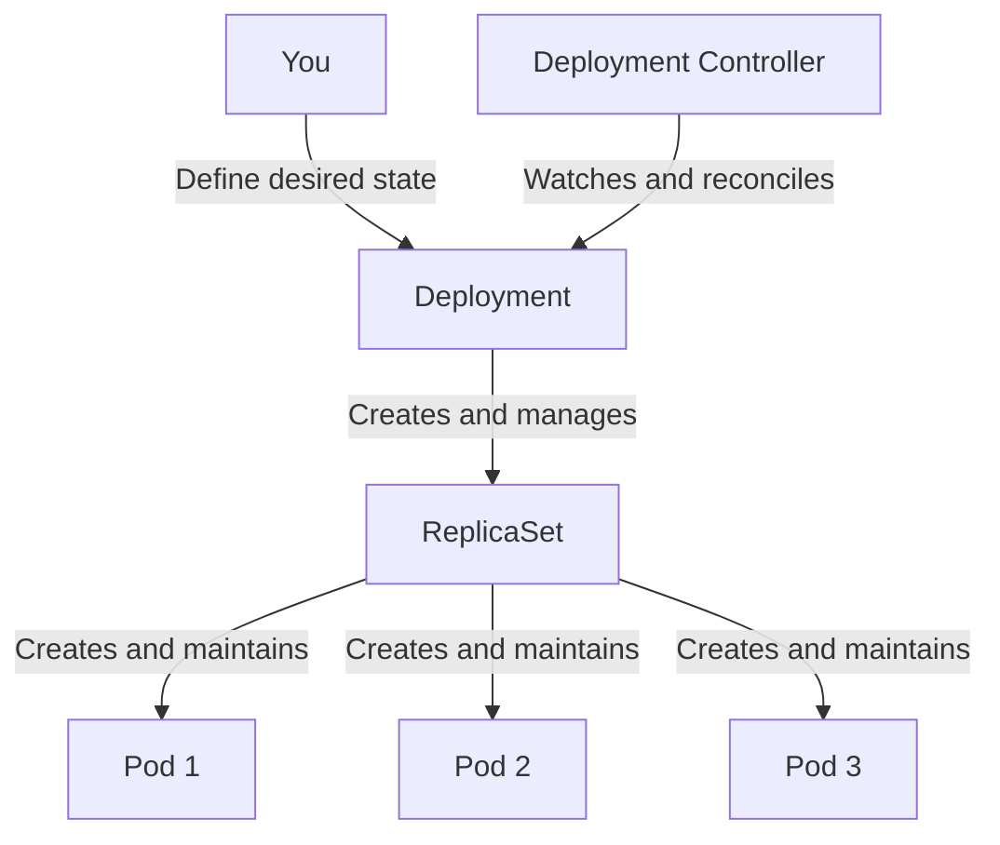

# Qu'est-ce qu'un Deployment ?

Lorsque vous exécutez des applications dans Kubernetes, vous avez besoin d'un moyen de garantir qu'elles continuent de fonctionner, peuvent être mises à jour en douceur et peuvent être mises à l'échelle pour gérer le trafic. C'est exactement ce qu'un Deployment fait.

Tout comme un chef d'orchestre ne joue pas directement des instruments mais coordonne les musiciens pour créer la symphonie souhaitée, un Deployment n'exécute pas directement les conteneurs. Au lieu de cela, il gère les ReplicaSets, qui à leur tour gèrent les Pods qui exécutent réellement votre application.

## État souhaité vs État actuel

Kubernetes fonctionne sur un principe puissant : vous décrivez ce que vous voulez (l'**état souhaité**), et Kubernetes travaille continuellement pour le réaliser (l'**état actuel**).

Lorsque vous créez un Deployment, vous dites à Kubernetes : "Je veux 3 copies de mon serveur web qui fonctionnent en permanence." Le contrôleur de Deployment surveille ensuite le cluster et prend des mesures chaque fois que l'état actuel diffère de votre état souhaité. Si un Pod plante, il en crée un nouveau. Si vous changez le nombre de répliques, il s'ajuste en conséquence.

## La hiérarchie des Deployments

Un Deployment crée automatiquement un ReplicaSet, et le ReplicaSet crée les Pods. Cette hiérarchie existe pour de bonnes raisons :

- **Deployment** : Gère les préoccupations de haut niveau comme les mises à jour progressives et les retours en arrière
- **ReplicaSet** : Garantit que le bon nombre de répliques de Pods fonctionnent
- **Pods** : Exécutent réellement vos conteneurs d'application

Lorsque vous mettez à jour un Deployment (comme changer l'image du conteneur), il crée un nouveau ReplicaSet avec la nouvelle configuration tout en réduisant progressivement l'ancien. Cela permet des mises à jour progressives en douceur.

## Le label pod-template-hash

Kubernetes ajoute automatiquement un label `pod-template-hash` à chaque ReplicaSet et Pod créé par un Deployment. Ce hash est généré à partir de la spécification du modèle de Pod et garantit que chaque ReplicaSet gère uniquement ses propres Pods. Vous verrez des noms comme `nginx-deployment-75675f5897` où le suffixe est ce hash.

## Quand utiliser les Deployments

Les Deployments sont idéaux pour les **applications sans état** où n'importe quel Pod peut gérer n'importe quelle requête :

- Serveurs web et APIs
- Microservices
- Processus de travail
- Applications frontend

Pour les applications avec état qui ont besoin d'une identité réseau stable ou d'un stockage persistant, envisagez d'utiliser des StatefulSets à la place.

:::info
Les Deployments sont la méthode recommandée pour déployer des applications dans Kubernetes. Ils gèrent le cycle de vie des Pods, la mise à l'échelle, les mises à jour et l'auto-guérison automatiquement, les rendant adaptés à la plupart des charges de travail de production.
:::

:::warning
Ne modifiez jamais manuellement ou ne supprimez pas les ReplicaSets qui appartiennent à un Deployment. Le contrôleur de Deployment les gère automatiquement, et les modifications manuelles seront écrasées ou causeront un comportement inattendu.
:::
