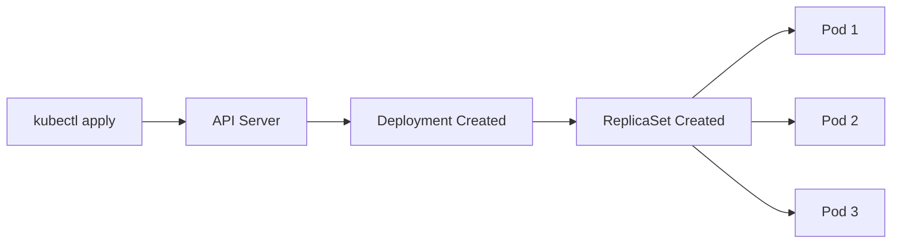

# Creating a Deployment

Now that you understand what a Deployment is, let's create one. You'll define your desired state in a YAML manifest, and Kubernetes will make it happen.

## The Deployment Manifest

Here's a complete Deployment manifest that runs three replicas of an nginx web server:

```yaml
apiVersion: apps/v1
kind: Deployment
metadata:
  name: nginx-deployment
  labels:
    app: nginx
spec:
  replicas: 3
  selector:
    matchLabels:
      app: nginx
  template:
    metadata:
      labels:
        app: nginx
    spec:
      containers:
      - name: nginx
        image: nginx:1.14.2
        ports:
        - containerPort: 80
```

## Understanding Each Field

Let's break down the key fields:

- **apiVersion: apps/v1** - Deployments belong to the `apps` API group, version `v1`
- **kind: Deployment** - The type of Kubernetes object we're creating
- **metadata.name** - A unique name for your Deployment (becomes the basis for ReplicaSet and Pod names)
- **spec.replicas** - How many Pod copies you want running (defaults to 1 if not specified)
- **spec.selector** - How the Deployment finds which Pods to manage
- **spec.template** - The blueprint used to create new Pods

The **selector** and **template labels** must match. Think of it like this: the selector is how the Deployment asks "which Pods belong to me?" and the template labels are how new Pods answer "I belong to you!"

:::info
The selector is immutable after creation. Once you create a Deployment, you cannot change its `spec.selector`. Plan your labels carefully before deploying.
:::

## What Happens When You Create a Deployment



When you apply the manifest, Kubernetes:
1. Validates your YAML and stores the Deployment in etcd
2. The Deployment controller notices the new Deployment and creates a ReplicaSet
3. The ReplicaSet controller creates the specified number of Pods
4. The scheduler assigns each Pod to a node
5. The kubelet on each node pulls the image and starts the container

:::command
Create the Deployment by applying your manifest:

```bash
kubectl apply -f nginx-deployment.yaml
```

<a target="_blank" href="https://kubernetes.io/docs/reference/kubectl/generated/kubectl_apply/">Learn more about kubectl apply</a>
:::

## Verifying Your Deployment

After creating the Deployment, check its status:

:::command
View your Deployments and their status:

```bash
kubectl get deployments
```
:::

The output shows important columns:
- **READY** - How many replicas are ready vs desired (e.g., `3/3`)
- **UP-TO-DATE** - Replicas updated to the latest Pod template
- **AVAILABLE** - Replicas available to serve traffic
- **AGE** - How long the Deployment has existed

:::command
See the ReplicaSet created by your Deployment:

```bash
kubectl get rs
```
:::

Notice the ReplicaSet name follows the pattern `[DEPLOYMENT-NAME]-[HASH]`. This hash comes from the Pod template and ensures each ReplicaSet manages only Pods matching its specific configuration.
