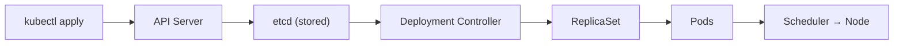

# Creating a Deployment

Now that you understand what a Deployment is, it is time to create one. The process is straightforward: you write a YAML manifest that describes your desired state, and you hand it to Kubernetes with `kubectl apply`. From that single action, an entire chain of events unfolds — a Deployment is born, a ReplicaSet appears, and Pods start running on your cluster.

## From Manifest to Running Pods

When you run `kubectl apply -f`, your manifest travels through a well-defined pipeline. Understanding this flow helps you troubleshoot when things do not go as expected.



1. **kubectl** sends your manifest to the **API server**, which validates it and stores the Deployment object in **etcd**.
2. The **Deployment controller** detects the new object and creates a **ReplicaSet** to match the desired state.
3. The **ReplicaSet controller** notices it has zero Pods but needs three, so it creates Pod objects.
4. The **scheduler** assigns each Pod to a suitable node based on available resources.
5. The **kubelet** on each node pulls the container image and starts the containers.

All of this happens automatically. Your job is to write a correct manifest and apply it.

## Writing the Manifest

Here is a complete Deployment manifest. Take a moment to read through it — every field matters.

```yaml
apiVersion: apps/v1
kind: Deployment
metadata:
  name: nginx-deployment
  labels:
    app: nginx
spec:
  replicas: 3
  selector:
    matchLabels:
      app: nginx
  template:
    metadata:
      labels:
        app: nginx
    spec:
      containers:
        - name: nginx
          image: nginx:1.14.2
          ports:
            - containerPort: 80
```

Three fields deserve special attention:

- **`spec.replicas`** — how many identical Pods you want. Here, three.
- **`spec.selector.matchLabels`** — the label query the Deployment uses to find *its* Pods. Think of it as the Deployment's way of saying "these Pods belong to me."
- **`spec.template`** — the Pod blueprint. Every Pod created by this Deployment will be stamped from this template.

The **selector labels and the template labels must match**. If `selector.matchLabels` says `app: nginx`, the template must carry the label `app: nginx`. This is how the Deployment knows which Pods it owns.

:::warning
The selector (`spec.selector`) is **immutable** after creation. Once you create a Deployment, you cannot change which labels it selects. Plan your labeling strategy carefully before your first `kubectl apply`.
:::

## Applying and Verifying

Save the manifest to a file (e.g., `nginx-deployment.yaml`) and apply it:

```bash
kubectl apply -f nginx-deployment.yaml
```

Then verify that everything came up correctly:

```bash
kubectl get deployments
```

You should see output like:

```
NAME               READY   UP-TO-DATE   AVAILABLE   AGE
nginx-deployment   3/3     3            3           12s
```

- **READY** — `3/3` means all three desired Pods are running and ready.
- **UP-TO-DATE** — the number of Pods that match the latest template.
- **AVAILABLE** — the number of Pods available to serve traffic.

You can also inspect the ReplicaSet that the Deployment created:

```bash
kubectl get rs
```

Notice how the ReplicaSet name includes a hash suffix (e.g., `nginx-deployment-6b474476c4`). That hash is derived from the Pod template. It is how Kubernetes ties each ReplicaSet to a specific version of your configuration.

## Troubleshooting Common Issues

Even with a correct manifest, things can go wrong at the infrastructure level. Here are the most common issues you may encounter:

**Pods stuck in `Pending`** — The scheduler cannot find a node with enough CPU or memory. Run `kubectl describe pod <pod-name>` and look at the Events section for scheduling errors. You may need to free resources or add nodes.

**`ImagePullBackOff` or `ErrImagePull`** — Kubernetes cannot pull the container image. Double-check the image name, tag, and registry. If using a private registry, ensure the correct `imagePullSecrets` are configured.

**Selector mismatch error** — The labels in `spec.selector.matchLabels` do not match the labels in `spec.template.metadata.labels`. Kubernetes will reject the manifest outright. Align them and reapply.

:::info
When a Deployment is not behaving as expected, `kubectl describe deployment <name>` is your best diagnostic tool. The Events section at the bottom shows exactly what the controller has been doing — and what went wrong.
:::

## Wrapping Up

Creating a Deployment is a three-step process: write the manifest, apply it with `kubectl apply -f`, and verify the result. Behind the scenes, Kubernetes orchestrates a chain from API server to etcd, through the Deployment and ReplicaSet controllers, all the way to running containers on nodes. The key rule to remember is that selector labels must match template labels, and the selector is locked in after creation. With your Deployment running, the next step is learning how to scale it up and down.
