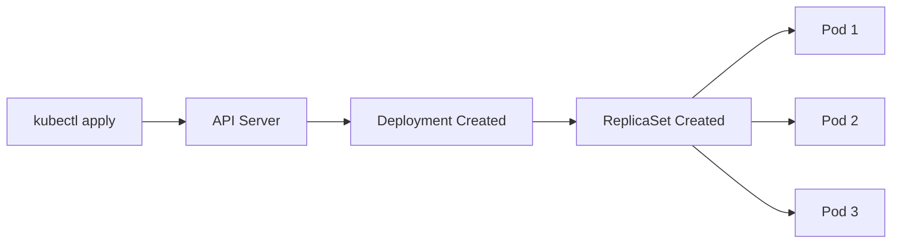

# Créer un Deployment

Maintenant que vous comprenez ce qu'est un Deployment, créons-en un. Vous définirez votre état souhaité dans un manifest YAML, et Kubernetes le réalisera.

## Le manifest de Deployment

Voici un manifest de Deployment complet qui exécute trois répliques d'un serveur web nginx :

```yaml
apiVersion: apps/v1
kind: Deployment
metadata:
  name: nginx-deployment
  labels:
    app: nginx
spec:
  replicas: 3
  selector:
    matchLabels:
      app: nginx
  template:
    metadata:
      labels:
        app: nginx
    spec:
      containers:
      - name: nginx
        image: nginx:1.14.2
        ports:
        - containerPort: 80
```

## Comprendre chaque champ

Décomposons les champs clés :

- **apiVersion: apps/v1** - Les Deployments appartiennent au groupe API `apps`, version `v1`
- **kind: Deployment** - Le type d'objet Kubernetes que nous créons
- **metadata.name** - Un nom unique pour votre Deployment (devient la base pour les noms de ReplicaSet et Pod)
- **spec.replicas** - Combien de copies de Pods vous voulez en cours d'exécution (par défaut 1 si non spécifié)
- **spec.selector** - Comment le Deployment trouve quels Pods gérer
- **spec.template** - Le modèle utilisé pour créer de nouveaux Pods

Le **selector** et les **labels du template** doivent correspondre. Pensez-y ainsi : le selector est la façon dont le Deployment demande "quels Pods m'appartiennent ?" et les labels du template sont la façon dont les nouveaux Pods répondent "Je vous appartiens !"

:::info
Le selector est immuable après création. Une fois que vous créez un Deployment, vous ne pouvez pas changer son `spec.selector`. Planifiez vos labels soigneusement avant de déployer.
:::

## Ce qui se passe lorsque vous créez un Deployment



Lorsque vous appliquez le manifest, Kubernetes :
1. Valide votre YAML et stocke le Deployment dans etcd
2. Le contrôleur de Deployment remarque le nouveau Deployment et crée un ReplicaSet
3. Le contrôleur de ReplicaSet crée le nombre spécifié de Pods
4. Le scheduler assigne chaque Pod à un nœud
5. Le kubelet sur chaque nœud récupère l'image et démarre le conteneur

Créez le Deployment en appliquant votre manifest :

```bash
kubectl apply -f nginx-deployment.yaml
```

## Vérifier votre Deployment

Après avoir créé le Deployment, vérifiez son statut :

Visualisez vos Deployments et leur statut :

```bash
kubectl get deployments
```

La sortie montre des colonnes importantes :
- **READY** - Combien de répliques sont prêtes vs souhaitées (par ex., `3/3`)
- **UP-TO-DATE** - Répliques mises à jour vers le dernier modèle de Pod
- **AVAILABLE** - Répliques disponibles pour servir le trafic
- **AGE** - Depuis combien de temps le Deployment existe

Voyez le ReplicaSet créé par votre Deployment :

```bash
kubectl get rs
```

Remarquez que le nom du ReplicaSet suit le modèle `[DEPLOYMENT-NAME]-[HASH]`. Ce hash vient du modèle de Pod et garantit que chaque ReplicaSet gère uniquement les Pods correspondant à sa configuration spécifique.
