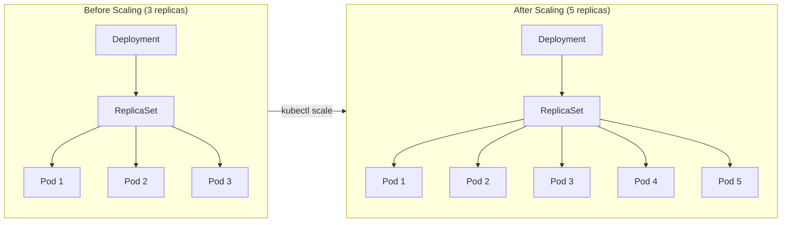

# Scaling a Deployment

One of the most powerful features of Deployments is the ability to scale your application up or down with a single command. When traffic increases, add more replicas. When it decreases, reduce them to save resources.

## The Restaurant Analogy

Think of scaling like managing waiters in a restaurant. During lunch rush, you need more waiters to serve customers quickly. During slow hours, you can send some home. Kubernetes does the same with your Pods: it adds or removes replicas based on your instructions, ensuring your application can handle the current demand.



## Scaling with kubectl

The fastest way to scale is using the `kubectl scale` command:

Scale your Deployment to 5 replicas:

```bash
kubectl scale deployment/nginx-deployment --replicas=5
```

You can also use different syntax variations:
- `kubectl scale deployment nginx-deployment --replicas=5`
- `kubectl scale deploy/nginx-deployment --replicas=5`

## How Scaling Works

When you scale a Deployment:

1. The Deployment controller updates the ReplicaSet's desired replica count
2. The ReplicaSet controller notices the difference between desired and actual Pods
3. If scaling up: new Pods are created from the Pod template
4. If scaling down: excess Pods are selected and terminated

The process is gradual to maintain service availability. Kubernetes doesn't terminate all Pods at once when scaling down.

Check the current state of your Deployment after scaling:

```bash
kubectl get deployment nginx-deployment
```

The `READY` column shows `5/5` once all new replicas are running.

## Alternative Scaling Methods

Besides `kubectl scale`, you can also:

**Edit the Deployment directly:**
```bash
kubectl edit deployment nginx-deployment
```
Then modify the `spec.replicas` field and save.

**Update the manifest and reapply:**
Change the `replicas` value in your YAML file and run `kubectl apply -f nginx-deployment.yaml`.

:::warning
If you scale manually with `kubectl scale` and later run `kubectl apply` with a manifest that has a different replica count, the manifest value will overwrite your manual change. For consistent management, choose one method and stick with it.
:::

## Automatic Scaling

For production workloads, you might not want to scale manually. Kubernetes offers the **Horizontal Pod Autoscaler (HPA)** that automatically adjusts replicas based on CPU usage, memory, or custom metrics. This is covered in a later chapter.

:::info
When using an HPA, don't set `spec.replicas` in your Deployment manifest. Let the autoscaler manage the replica count automatically based on actual demand.
:::
