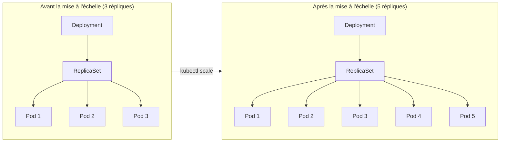

# Mettre à l'échelle un Deployment

L'une des fonctionnalités les plus puissantes des Deployments est la capacité de mettre à l'échelle votre application vers le haut ou vers le bas avec une seule commande. Lorsque le trafic augmente, ajoutez plus de répliques. Lorsqu'il diminue, réduisez-les pour économiser des ressources.

## L'analogie du restaurant

Pensez à la mise à l'échelle comme à la gestion des serveurs dans un restaurant. Pendant l'heure de pointe du déjeuner, vous avez besoin de plus de serveurs pour servir les clients rapidement. Pendant les heures creuses, vous pouvez en renvoyer certains à la maison. Kubernetes fait la même chose avec vos Pods : il ajoute ou supprime des répliques selon vos instructions, garantissant que votre application peut gérer la demande actuelle.



## Mise à l'échelle avec kubectl

Le moyen le plus rapide de mettre à l'échelle est d'utiliser la commande `kubectl scale` :

Mettez à l'échelle votre Deployment à 5 répliques :

```bash
kubectl scale deployment/nginx-deployment --replicas=5
```

Vous pouvez également utiliser différentes variations de syntaxe :
- `kubectl scale deployment nginx-deployment --replicas=5`
- `kubectl scale deploy/nginx-deployment --replicas=5`

## Comment fonctionne la mise à l'échelle

Lorsque vous mettez à l'échelle un Deployment :

1. Le contrôleur de Deployment met à jour le nombre de répliques souhaité du ReplicaSet
2. Le contrôleur de ReplicaSet remarque la différence entre les Pods souhaités et actuels
3. Si mise à l'échelle vers le haut : de nouveaux Pods sont créés à partir du modèle de Pod
4. Si mise à l'échelle vers le bas : les Pods en excès sont sélectionnés et terminés

Le processus est progressif pour maintenir la disponibilité du service. Kubernetes ne termine pas tous les Pods en même temps lors de la mise à l'échelle vers le bas.

Vérifiez l'état actuel de votre Deployment après la mise à l'échelle :

```bash
kubectl get deployment nginx-deployment
```

La colonne `READY` affiche `5/5` une fois que toutes les nouvelles répliques fonctionnent.

## Méthodes alternatives de mise à l'échelle

En plus de `kubectl scale`, vous pouvez également :

**Modifier le Deployment directement :**
```bash
kubectl edit deployment nginx-deployment
```
Ensuite, modifiez le champ `spec.replicas` et sauvegardez.

**Mettre à jour le manifest et réappliquer :**
Changez la valeur `replicas` dans votre fichier YAML et exécutez `kubectl apply -f nginx-deployment.yaml`.

:::warning
Si vous mettez à l'échelle manuellement avec `kubectl scale` et que vous exécutez ensuite `kubectl apply` avec un manifest qui a un nombre de répliques différent, la valeur du manifest écrasera votre modification manuelle. Pour une gestion cohérente, choisissez une méthode et tenez-vous-y.
:::

## Mise à l'échelle automatique

Pour les charges de travail de production, vous pourriez ne pas vouloir mettre à l'échelle manuellement. Kubernetes offre le **Horizontal Pod Autoscaler (HPA)** qui ajuste automatiquement les répliques en fonction de l'utilisation du CPU, de la mémoire ou de métriques personnalisées. Cela est couvert dans un chapitre ultérieur.

:::info
Lors de l'utilisation d'un HPA, ne définissez pas `spec.replicas` dans votre manifest de Deployment. Laissez l'autoscaler gérer le nombre de répliques automatiquement en fonction de la demande réelle.
:::
