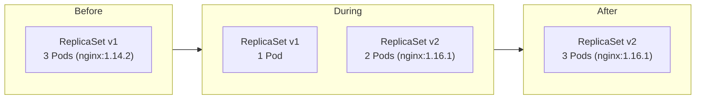

# Updating a Deployment

You understand the theory behind rolling updates. Now it is time to get your hands dirty and actually update a running Deployment. Whether you are shipping a bug fix, deploying a new feature, or upgrading a dependency, the workflow is the same: change the Pod template, and let the Deployment controller handle the rest.

## The Golden Rule

Before diving into commands, commit this to memory:

**Only changes to `.spec.template` trigger a rollout.** Modifying the replica count, updating Deployment-level labels, or changing the strategy configuration — none of these create a new ReplicaSet. Only when the Pod blueprint changes does Kubernetes say "time to roll out a new version."

:::info
Think of the Pod template as your application's blueprint. The Deployment only redeploys when the blueprint itself changes — not when you adjust how many copies to print.
:::

## Three Ways to Update

Kubernetes gives you multiple paths to update a Deployment. Each has its place depending on the situation.

### Method 1: `kubectl set image`

The fastest way to change a container image. Perfect for quick updates during development or incident response:

```bash
kubectl set image deployment/nginx-deployment nginx=nginx:1.16.1
```

This command tells Kubernetes: "In the Deployment `nginx-deployment`, update the container named `nginx` to use the image `nginx:1.16.1`." A rollout begins immediately.

### Method 2: `kubectl edit`

Opens the live Deployment object in your terminal editor, letting you modify any field:

```bash
kubectl edit deployment/nginx-deployment
```

Find the `spec.template.spec.containers` section, change the `image` field from `nginx:1.14.2` to `nginx:1.16.1`, save, and close. The rollout starts as soon as you save.

This method is useful when you need to change multiple template fields at once — for example, updating an image *and* adding an environment variable in the same operation.

### Method 3: Edit the manifest and `kubectl apply`

The most production-friendly approach. Update your YAML file in version control, then apply:

```yaml
spec:
  template:
    spec:
      containers:
        - name: nginx
          image: nginx:1.16.1
          ports:
            - containerPort: 80
```

```bash
kubectl apply -f nginx-deployment.yaml
```

This is the declarative workflow — your Git repository becomes the source of truth, and every change is tracked, reviewed, and auditable.

## What Happens Behind the Scenes

When the Pod template changes, the Deployment controller:

1. Generates a new `pod-template-hash` from the updated template.
2. Creates a **new ReplicaSet** with that hash.
3. Begins scaling the new ReplicaSet **up** and the old ReplicaSet **down**, following the rolling update strategy.
4. Continues until all Pods run the new template and the old ReplicaSet has zero replicas.



The old ReplicaSet is not deleted — it is scaled to zero and kept in the cluster history. This is what makes rollbacks possible, as you will see in a later lesson.

## Verifying the Update

After triggering a rollout, monitor its progress:

```bash
kubectl rollout status deployment/nginx-deployment
```

This command blocks until the rollout succeeds or fails. For a more detailed view:

```bash
kubectl get replicasets
```

You should see two ReplicaSets — the new one with your desired replica count and the old one scaled to zero:

```
NAME                          DESIRED   CURRENT   READY   AGE
nginx-deployment-6b474476c4   3         3         3       30s
nginx-deployment-d4f9bdc7c    0         0         0       5m
```

To inspect the full state and event history:

```bash
kubectl describe deployment nginx-deployment
```

The Events section at the bottom shows exactly what happened during the rollout — which ReplicaSets were scaled up or down and when.

## Troubleshooting Failed Updates

Not every update goes smoothly. Here are the most common issues and how to address them:

**`ImagePullBackOff`** — Kubernetes cannot pull the new image. This usually means a typo in the image name or tag, or missing registry credentials. Verify the image exists and check `imagePullSecrets` if using a private registry.

**Rollout stalled** — New Pods are created but never become ready. This often points to failing readiness probes, insufficient resources, or a crash loop. Inspect the Pods directly:

```bash
kubectl describe pod <pod-name>
kubectl logs <pod-name>
```

**Need to revert immediately** — If the new version is broken and you need to go back:

```bash
kubectl rollout undo deployment/nginx-deployment
```

This reverts to the previous ReplicaSet, which Kubernetes conveniently kept around.

:::warning
Updating multiple containers in a multi-container Pod triggers a single rollout — all containers are updated together. There is no way to roll out changes to one container independently. If you need independent update lifecycles, consider splitting containers into separate Deployments.
:::

## Wrapping Up

Updating a Deployment means changing the Pod template — and nothing else triggers a rollout. You can update with `kubectl set image` for quick changes, `kubectl edit` for interactive modifications, or `kubectl apply` for the recommended declarative workflow. Behind the scenes, Kubernetes creates a new ReplicaSet and performs a rolling update while keeping the old ReplicaSet for potential rollback. In the next lesson, you will learn how to monitor rollout progress and interpret the status columns that tell you exactly what your Deployment is doing.
