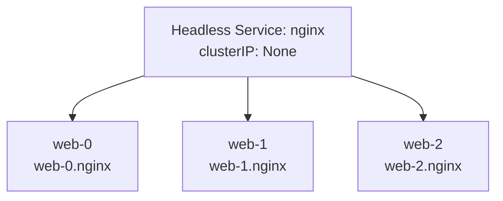

# StatefulSet Basics

## Building on Stable Ground

In the previous lesson, you learned **why** StatefulSets exist — to give Pods stable identity, ordered lifecycle, and persistent storage. Now let's focus on the **how**: the concrete building blocks that make a StatefulSet work in practice.

At the center of every StatefulSet are two collaborating resources: the **Headless Service** that provides DNS-based identity, and the **StatefulSet itself** that orchestrates Pod creation, scaling, and storage. Understanding how these two pieces connect is essential before you start deploying stateful workloads.

## The Headless Service: Your Pods' Phone Book

A regular Kubernetes Service acts like a receptionist: requests come in, and the Service forwards them to whichever Pod happens to be available. The caller never knows (or cares) which specific Pod answered.

A **Headless Service** works differently. By setting `clusterIP: None`, you tell Kubernetes: "Don't assign a virtual IP. Instead, let DNS return the individual Pod addresses directly." It's less like a receptionist and more like a **phone book** — each Pod gets its own listed entry that callers can look up by name.

Here's what a Headless Service looks like:

```yaml
apiVersion: v1
kind: Service
metadata:
  name: nginx
spec:
  clusterIP: None
  selector:
    app: nginx
  ports:
    - port: 80
```

The critical detail is `clusterIP: None`. Everything else — the selector, the ports — works exactly like a normal Service. But the DNS behavior changes completely.

:::info
A Headless Service doesn't load-balance traffic. Instead, it enables **direct Pod discovery** through DNS, which is exactly what stateful applications need to find and communicate with specific peers.
:::

## Connecting the StatefulSet to Its Service

The StatefulSet must declare which Headless Service it belongs to through the `serviceName` field. This field is what links the StatefulSet's Pods to their DNS identities.

Here's a complete example — the Headless Service followed by the StatefulSet that uses it:

```yaml
apiVersion: v1
kind: Service
metadata:
  name: nginx
spec:
  clusterIP: None
  selector:
    app: nginx
  ports:
    - port: 80
---
apiVersion: apps/v1
kind: StatefulSet
metadata:
  name: web
spec:
  serviceName: nginx
  replicas: 3
  selector:
    matchLabels:
      app: nginx
  template:
    metadata:
      labels:
        app: nginx
    spec:
      containers:
        - name: nginx
          image: nginx:1.21
```

When you apply this manifest, the following happens in sequence:

1. The Headless Service `nginx` is created.
2. The StatefulSet controller creates `web-0` and waits for it to become Ready.
3. Once `web-0` is Ready, `web-1` is created.
4. Once `web-1` is Ready, `web-2` is created.

Each Pod receives a stable DNS name that combines the Pod name, the Service name, and the namespace:

```
web-0.nginx.default.svc.cluster.local
web-1.nginx.default.svc.cluster.local
web-2.nginx.default.svc.cluster.local
```

Any Pod in the cluster can reach a specific StatefulSet member by using its DNS name — making peer-to-peer communication reliable and predictable.



:::warning
The `serviceName` field in the StatefulSet **must exactly match** the name of the Headless Service. A mismatch will silently break DNS identity — Pods will run, but they won't be discoverable by their stable hostnames.
:::

## Ordered Lifecycle in Practice

The sequential creation isn't just a cosmetic detail — it solves real problems. Consider a database cluster where `web-0` is the primary node. Replicas `web-1` and `web-2` need to connect to the primary during initialization to sync data. If all three started simultaneously, replicas would fail to find a primary that doesn't exist yet.

The same logic applies when scaling down. Kubernetes removes Pods in **reverse order** — `web-2` first, then `web-1`, and `web-0` last. This predictability allows distributed systems to perform graceful handoffs. A replica can transfer its responsibilities before shutting down, and the primary (ordinal 0) is always the last to go.

Let's see the lifecycle in action. After applying the manifest above:

```bash
kubectl get pods -l app=nginx -w
```

You'll see Pods appear one by one:

```
NAME    READY   STATUS    AGE
web-0   1/1     Running   10s
web-1   1/1     Running   6s
web-2   1/1     Running   2s
```

If you then scale down:

```bash
kubectl scale statefulset web --replicas=1
```

Pods are removed in reverse: `web-2` terminates first, then `web-1`. Only `web-0` remains.

## Verifying Your StatefulSet

After deploying, a quick verification workflow ensures everything is connected properly:

```bash
kubectl get statefulset web
kubectl get pods -l app=nginx
kubectl get svc nginx
```

Check that:
- The StatefulSet shows the correct number of ready replicas.
- Pod names follow the `<statefulset-name>-<ordinal>` pattern.
- The Service has `CLUSTER-IP` set to `None`.

You can also test DNS resolution from inside the cluster. Spin up a temporary Pod and look up a StatefulSet member:

```bash
kubectl run dns-test --image=busybox:1.36 --rm -it --restart=Never -- nslookup web-0.nginx
```

If the DNS lookup returns the Pod's IP, your Headless Service and StatefulSet are correctly linked.

## Common Pitfalls

A few issues come up regularly when working with StatefulSets for the first time:

- **Forgetting to create the Headless Service first.** The StatefulSet will create Pods, but without the Service, DNS identity won't work. Always apply the Service before the StatefulSet.
- **Using a regular Service instead of Headless.** If the Service has a `clusterIP` assigned (anything other than `None`), DNS will return the Service's virtual IP instead of individual Pod IPs. StatefulSet identity depends on Headless behavior.
- **Mismatching `serviceName`.** The StatefulSet's `serviceName` field must be the exact name of the Headless Service. A typo here is easy to miss and hard to debug.
- **Expecting fast scale-down.** Because Pods are removed one at a time in reverse order, scaling down a large StatefulSet takes longer than scaling down a Deployment of the same size. This is by design — it protects data integrity.

## Wrapping Up

The Headless Service and the StatefulSet work as a pair. The Service provides `clusterIP: None` to enable per-Pod DNS discovery. The StatefulSet declares `serviceName` to link itself to that Service, then creates Pods sequentially — `web-0`, `web-1`, `web-2` — each with a stable DNS name like `web-0.nginx`. Scaling down happens in reverse order to protect stateful workloads.

These two resources form the foundation of every stateful deployment in Kubernetes. With this foundation in place, you're ready to explore **volumeClaimTemplates** — the mechanism that gives each StatefulSet Pod its own dedicated persistent storage.
