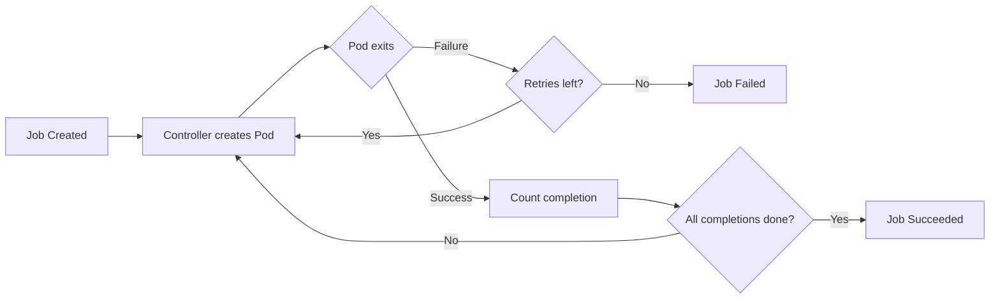

# What Is a Job?

## Not Everything Runs Forever

So far, you have been working with Deployments and ReplicaSets — workloads designed to keep Pods running indefinitely. They act like permanent staff members: always on duty, always replaced when they clock out unexpectedly.

But what about tasks that are **meant to finish**? Think about a database migration, a nightly report, or a data import. These are more like hiring a specialist contractor: they come in, do their work, and leave once the job is done. That is exactly the role a **Job** fills in Kubernetes.

A Job creates one or more Pods and ensures that a specified number of them **successfully terminate**. Once the required completions are reached, the Job is considered done. No restarts, no replacements — mission accomplished.

## Why Do We Need Jobs?

Imagine you tell a Deployment to run a database migration script. The script completes and the container exits with code 0 (success). What does the Deployment do? It sees a missing Pod and **immediately creates a new one**, running the migration again. And again. And again. That is clearly not what you want.

Jobs solve this problem by introducing **completion-aware orchestration**. The Job controller:

1. Creates Pods from a template you define
2. Tracks how many Pods have completed **successfully**
3. Optionally retries on failure (up to a configurable limit)
4. Stops once the target number of completions is reached

This makes Jobs ideal for:

- **Batch processing** — crunching through a dataset in parallel
- **Database migrations** — running schema changes exactly once
- **Data imports/exports** — loading data from external sources
- **Backups** — creating a snapshot and exiting
- **One-off administrative tasks** — any work that has a clear end

## How Jobs Work Under the Hood

The **Job controller** watches for Job objects in the cluster. When it finds one, it reads the Pod template from the Job's spec and creates Pods accordingly. It then monitors those Pods:

- If a Pod **succeeds** (exits with code 0), the controller counts it toward the required completions.
- If a Pod **fails**, the controller may retry by creating a new Pod, depending on the `backoffLimit` setting.
- Once the target completions are reached, the Job transitions to **Succeeded**.
- If too many failures accumulate, the Job transitions to **Failed**.



:::info
Completed Pods are **retained by default** after a Job finishes. This lets you inspect their logs and status for debugging. To clean them up automatically, set the `ttlSecondsAfterFinished` field — we will cover this in the lifecycle lesson.
:::

One important rule distinguishes Job Pods from other workloads: the Pod template **must** set `restartPolicy` to either `Never` or `OnFailure`. The default value of `Always` is not allowed because it contradicts the entire purpose of a Job — running to completion, not running forever.

## Your First Job

Let's create a Job that computes 2,000 digits of Pi using Perl. It is a classic Kubernetes example that demonstrates a finite computation:

```yaml
apiVersion: batch/v1
kind: Job
metadata:
  name: pi
spec:
  template:
    spec:
      containers:
        - name: pi
          image: perl:5.34
          command: ["perl", "-Mbignum=bpi", "-wle", "print bpi(2000)"]
      restartPolicy: Never
  backoffLimit: 4
```

Apply it to your cluster, and the Job will create a Pod that runs to completion. You will see `COMPLETIONS` progress from `0/1` to `1/1`. The Pod's status will show `Completed` — not `Running`. Use `kubectl logs job/pi` to see the output, and `kubectl describe job pi` for the full event timeline.

:::warning
If you forget to set `restartPolicy` (or leave it as `Always`), Kubernetes will **reject** the Job with a validation error. Jobs require `Never` or `OnFailure` — always double-check your Pod template.
:::

## Common Pitfalls to Watch For

As you start working with Jobs, keep these points in mind:

- **Forgetting `restartPolicy`** is the most common mistake. The Job will fail to create, and the error message can be confusing if you are not expecting it.
- **Setting `backoffLimit` too high** with a Pod that keeps failing can result in dozens of failed Pods cluttering your cluster. Start with a reasonable limit (4–6) and adjust as needed.
- **Leaving completed Jobs around** — without `ttlSecondsAfterFinished`, completed Jobs and their Pods stay in the cluster indefinitely. This is fine for debugging, but in production you will want an automatic cleanup strategy.

---

## Hands-On Practice

### Step 1: Check the Batch API Group

```bash
kubectl api-resources | grep -E "job|batch"
```

You see `jobs` in the `batch` group, confirming the Job API is available in your cluster.

### Step 2: Create and Run a Job

Save the Pi Job YAML from above into `pi-job.yaml`, then:

```bash
kubectl apply -f pi-job.yaml
kubectl get jobs
kubectl get pods -l job-name=pi
```

Watch `COMPLETIONS` go from `0/1` to `1/1`. The Pod status shows `Completed`.

### Step 3: Read the Output

```bash
kubectl logs job/pi
```

### Step 4: Clean Up

```bash
kubectl delete job pi
```

---

## Wrapping Up

A Job is Kubernetes' answer to **finite workloads** — tasks that need to run, succeed, and stop. Unlike Deployments that keep Pods alive indefinitely, Jobs track completions and stop creating Pods once the work is done. The Pod template must use `restartPolicy: Never` or `OnFailure`, and you can control retries with `backoffLimit`.

You now understand *why* Jobs exist and *what* they do. In the next lesson, we will dive into the **Job specification** — the fields that let you control parallelism, completion counts, deadlines, and more.
