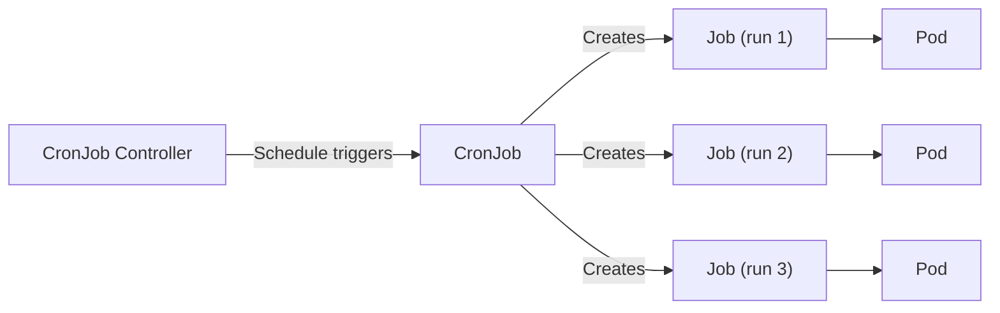

# What Is a CronJob?

If you have ever set an alarm clock to wake you up every weekday at 7 AM, you already understand the idea behind a CronJob. It is Kubernetes' built-in scheduler — a way to tell your cluster "run this task at this time, on this schedule, automatically."

In the previous lessons, you learned how **Jobs** execute a task once and then stop. CronJobs build on that foundation by wrapping a Job inside a recurring schedule. Instead of manually creating a Job every night at 2 AM for your database backup, you define the schedule once and let Kubernetes handle the rest.

## Why CronJobs Matter

Every production environment has work that needs to happen on a regular cadence: nightly database backups, hourly report generation, daily log cleanup, periodic data synchronization between services. On a traditional server, you would configure the operating system's **cron daemon** to handle these tasks. But in a Kubernetes cluster, Pods are ephemeral — they come and go. You cannot rely on a single machine's crontab.

CronJobs solve this by lifting scheduled work into the cluster itself. They are first-class Kubernetes objects, which means they benefit from the same self-healing, declarative management, and observability you already know from Deployments and Services.

## How a CronJob Works

The lifecycle is straightforward:

1. You create a CronJob object with a **schedule** and a **jobTemplate**.
2. The CronJob controller (running inside `kube-controller-manager`) continuously watches the clock.
3. When the current time matches the schedule, the controller creates a new **Job** from the template.
4. That Job creates one or more **Pods**, which execute the task and terminate.

Think of it as an assembly line with a timer: every time the timer goes off, a new Job rolls off the line, does its work, and finishes.



Each run is an independent Job. If one run fails, it does not prevent the next scheduled run from being created.

## Understanding the Cron Schedule

The `schedule` field uses the classic **five-field cron format**:

```
┌───────────── minute (0–59)
│ ┌───────────── hour (0–23)
│ │ ┌───────────── day of month (1–31)
│ │ │ ┌───────────── month (1–12)
│ │ │ │ ┌───────────── day of week (0–6, Sunday=0)
│ │ │ │ │
* * * * *
```

Here are a few common examples:

| Schedule | Meaning |
|---|---|
| `0 * * * *` | Every hour, at minute 0 |
| `0 2 * * *` | Every day at 2:00 AM |
| `*/5 * * * *` | Every 5 minutes |
| `0 9 * * 1-5` | Weekdays at 9:00 AM |

:::info
If you are not comfortable writing cron expressions by hand, tools like <a target="_blank" href="https://crontab.guru/">crontab.guru</a> let you build and validate schedules interactively.
:::

## Your First CronJob

Let's put this into practice. The following manifest creates a CronJob that prints a message every hour:

```yaml
apiVersion: batch/v1
kind: CronJob
metadata:
  name: hello
spec:
  schedule: "0 * * * *"
  jobTemplate:
    spec:
      template:
        spec:
          containers:
            - name: hello
              image: busybox
              command: ["echo", "Hello from CronJob"]
          restartPolicy: OnFailure
```

Notice the structure: the **CronJob** wraps a **jobTemplate**, which itself contains a **Pod template** — exactly the same nesting you saw with Jobs. The `restartPolicy` must be either `Never` or `OnFailure`, just like a regular Job.

Apply it and observe:

```bash
# Create the CronJob
kubectl apply -f cronjob-hello.yaml

# Check the CronJob status
kubectl get cronjobs

# After the first scheduled run, list the Jobs it created
kubectl get jobs --selector=job-name

# Inspect logs from the most recent run
kubectl logs job/hello-<timestamp>
```

The `LAST SCHEDULE` column in `kubectl get cronjobs` tells you when the last Job was triggered. If you do not see any Jobs being created, verify that the `kube-controller-manager` is running and that your schedule syntax is correct.

:::warning
By default, CronJobs interpret the schedule using the **kube-controller-manager's local time**, which is typically UTC. If your cluster runs in UTC and you write `0 9 * * *` expecting 9 AM in your local time zone, the Job will actually run at 9 AM UTC. Starting with Kubernetes 1.27, you can set the `timeZone` field to control this — we will cover that in a later lesson.
:::

## When to Use CronJobs

CronJobs are ideal for any task that is:

- **Periodic** — it needs to happen on a regular schedule.
- **Independent** — each run can complete on its own without depending on the previous one.
- **Short-lived** — it starts, does its work, and finishes (as opposed to a long-running server).

Common real-world use cases include database backups, certificate renewal checks, cache warming, report generation, and stale-data cleanup.

If your task needs to run **once** rather than on a schedule, use a plain Job instead. If it needs to run **continuously**, a Deployment or DaemonSet is the better fit.

## Wrapping Up

A CronJob is Kubernetes' answer to the traditional cron daemon — it creates Jobs automatically based on a five-field cron schedule. The CronJob controller watches the clock and spawns a new Job each time the schedule matches. Each Job then creates Pods that execute the task and terminate. In the next lesson, you will explore the CronJob specification in more detail, including how to control what happens when runs overlap and how many completed Jobs to keep around.
