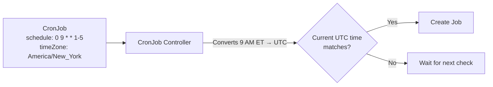

# Suspend and Time Zone

You now know how to create CronJobs and fine-tune their concurrency and history. But production environments bring two more practical needs: the ability to **pause** a CronJob without deleting it, and the ability to make a schedule run in a **specific time zone** rather than whatever clock the controller happens to use.

This lesson covers both capabilities — the `suspend` field and the `timeZone` field — and shows you when and how to use each.

## Suspending a CronJob

Think of the `suspend` field as a pause button on a music player. The playlist (your CronJob definition) stays intact, the current song (any running Job) keeps playing, but no new songs start until you press play again.

Setting `suspend: true` tells the CronJob controller to stop creating new Jobs at scheduled times. Any Jobs that are **already running** continue to completion — suspend does not kill them. When you are ready to resume, set `suspend: false` and the CronJob picks up from the next scheduled time.

### When Suspension Is Useful

- **Maintenance windows** — you are upgrading the database and want to pause backups temporarily.
- **Incident response** — a scheduled cleanup Job is causing unexpected load; you need to stop new runs while you investigate.
- **Staged rollouts** — you create the CronJob in a suspended state, review it, then enable it when ready.

### Suspending in Practice

You can set suspend directly in the manifest:

```yaml
apiVersion: batch/v1
kind: CronJob
metadata:
  name: db-backup
spec:
  schedule: "0 2 * * *"
  suspend: true
  jobTemplate:
    spec:
      template:
        spec:
          containers:
            - name: backup
              image: backup-tool:1.4
              command: ["/bin/sh", "-c", "backup-database.sh"]
          restartPolicy: OnFailure
```

Or toggle it on the fly with `kubectl patch` to set `suspend` to `true` or `false`. The change takes effect immediately — the controller picks it up on its next reconciliation loop.

:::warning
Suspending a CronJob does **not** stop Jobs that are already running. If you need to halt an in-progress Job, you must delete that Job (or its Pods) separately. Always verify with `kubectl get jobs` after suspending to confirm no active Jobs remain if that is your goal.
:::

## The Time Zone Challenge

By default, the CronJob controller interprets your schedule using its own local clock — which, on most Kubernetes clusters, is **UTC**. This creates a subtle but real problem: if you write `schedule: "0 9 * * 1-5"` intending "9 AM on weekdays in New York," the Job actually runs at 9 AM UTC, which is 4 AM or 5 AM Eastern depending on daylight saving time.

For teams operating across time zones, or for schedules tied to business hours in a specific region, relying on UTC requires constant mental math — and mental math is where bugs hide.

## The `timeZone` Field

Starting with **Kubernetes 1.27**, the CronJob spec supports a `timeZone` field that accepts <a target="_blank" href="https://en.wikipedia.org/wiki/List_of_tz_database_time_zones">IANA time zone names</a>. When set, the schedule is interpreted in that time zone, including automatic handling of daylight saving time transitions.

```yaml
apiVersion: batch/v1
kind: CronJob
metadata:
  name: morning-report
spec:
  schedule: "0 9 * * 1-5"
  timeZone: "America/New_York"
  jobTemplate:
    spec:
      template:
        spec:
          containers:
            - name: report
              image: report-gen:2.1
              command: ["/bin/sh", "-c", "generate-report.sh"]
          restartPolicy: OnFailure
```

With this configuration, the report runs at **9 AM Eastern Time** every weekday — whether that is UTC-5 in winter or UTC-4 during daylight saving time. You do not need to adjust the schedule twice a year.



:::info
The `timeZone` field uses IANA identifiers like `Europe/Paris`, `Asia/Tokyo`, or `America/Los_Angeles`. These are the same identifiers used by most programming languages and operating systems. Abbreviations like `EST` or `CET` are **not** valid values.
:::

## Combining Suspend and Time Zone

These two fields work together naturally. A common pattern is to create a CronJob in a **suspended state** with the time zone already configured, then enable it after review:

```yaml
spec:
  schedule: "30 18 * * 5"
  timeZone: "Europe/Paris"
  suspend: true
```

This CronJob is configured to run every Friday at 6:30 PM Paris time — but it will not fire until someone sets `suspend: false`. This is a clean way to prepare scheduled work ahead of time in a controlled manner.

## Verification and Troubleshooting

After configuring suspend and time zone, use `kubectl describe cronjob <name>` for a full overview and `kubectl get jobs -w` to watch for the next Job creation.

If Jobs are not being created at the expected times, work through this checklist:

1. **Is the CronJob suspended?** — check `spec.suspend`.
2. **Is the time zone valid?** — a typo in the IANA name (e.g., `America/NewYork` instead of `America/New_York`) can cause the CronJob to silently fail. Describe the CronJob and look for warning events.
3. **Is the cluster running Kubernetes 1.27+?** — on older versions, the `timeZone` field is ignored and the schedule falls back to the controller's local time.
4. **Is the schedule correct?** — test with a short interval like `*/2 * * * *` (every 2 minutes) to confirm the CronJob fires before committing to a daily or weekly schedule.

:::warning
On Kubernetes versions older than 1.27, the `timeZone` field is silently ignored — no error is raised. The schedule will be interpreted in the controller's local time (usually UTC). Always verify your cluster version with `kubectl version` before relying on this feature.
:::

---

## Hands-On Practice

### Step 1: Create a CronJob

```bash
cat <<EOF | kubectl apply -f -
apiVersion: batch/v1
kind: CronJob
metadata:
  name: suspend-demo
spec:
  schedule: "*/1 * * * *"
  jobTemplate:
    spec:
      template:
        spec:
          containers:
            - name: hello
              image: busybox
              command: ["echo", "Hello"]
          restartPolicy: OnFailure
EOF
```

### Step 2: Suspend the CronJob

```bash
kubectl patch cronjob suspend-demo -p '{"spec":{"suspend":true}}'
```

The CronJob stops creating new Jobs at each scheduled time.

### Step 3: Verify It Is Suspended

```bash
kubectl get cronjob suspend-demo -o jsonpath='{.spec.suspend}'
```

The output confirms `true`. No new Jobs are created until you resume.

### Step 4: Resume and Clean Up

```bash
kubectl patch cronjob suspend-demo -p '{"spec":{"suspend":false}}'
kubectl delete cronjob suspend-demo
```

---

## Wrapping Up

The `suspend` field gives you a safe pause button for any CronJob — new Jobs stop being created while existing ones finish normally. The `timeZone` field, available since Kubernetes 1.27, lets you anchor schedules to a specific region using IANA time zone names, eliminating the guesswork of UTC offsets and daylight saving transitions. Together, these fields make CronJobs practical and predictable for real-world operations. With this lesson, you have covered everything you need to schedule, configure, and manage CronJobs in Kubernetes.
