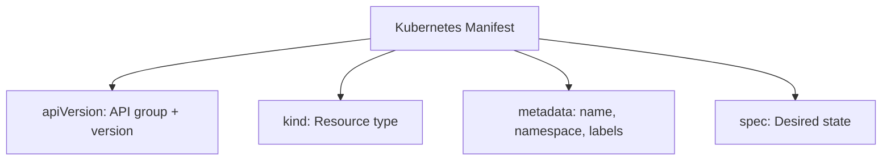

# The Kubernetes Object Model

When you start working with Kubernetes, one of the first things you need to internalize is a simple but powerful idea: **everything in Kubernetes is an object**. Pods, Services, Deployments, ConfigMaps, Namespaces , they are all objects. And every one of these objects is a persistent record stored in the cluster's database, a key-value store called **etcd**. Understanding this model is the foundation for everything else you will do in Kubernetes.

## Objects as Declarations of Intent

Think of a Kubernetes object like a form you fill out at a government office. You write down exactly what you want , say, "I would like three copies of my web application running at all times, using the nginx container image." You hand in that form, and the office (the Kubernetes control plane) takes responsibility for making your request a reality. The form is stored in the filing cabinet (etcd), and the staff (controllers and the scheduler) work continuously to ensure the world matches what your form describes.

This is fundamentally different from manually running commands to start containers. You are not telling Kubernetes _how_ to do something; you are declaring _what_ you want. Kubernetes figures out the how. This is called **declarative configuration**, and it is one of the most important ideas in the entire ecosystem.

:::info
Objects are persistent. When you create an object, it stays in etcd until you explicitly delete it. Even if your application crashes or a node goes down, the object , and the intent it represents , remains, and Kubernetes will work to restore the desired state.
:::

Objects describe three broad categories of information:

- What containerized applications are running and on which nodes
- What resources (CPU, memory, storage) those applications are allowed to use
- What policies govern their behavior , how they should restart, who can access them, and so on

## The Four Required Fields

Every Kubernetes manifest, whether YAML or JSON, must contain exactly four top-level fields, regardless of the object type.

### `apiVersion`

This field tells Kubernetes which version of the API to use when interpreting your manifest. Kubernetes has a large and evolving API surface, and different resource types belong to different **API groups**. For example, the core, foundational resources like Pods and Services belong to the core group, which is simply written as `v1`. More complex resources like Deployments belong to named groups , in this case `apps/v1`. CustomResourceDefinitions belong to `apiextensions.k8s.io/v1`. The version part (such as `v1`, `v1beta1`, or `v1alpha1`) also signals how stable the API is. Alpha APIs may change or be removed; stable `v1` APIs are here to stay.

### `kind`

This field specifies the type of object you want to create. `Pod`, `Deployment`, `Service`, `ConfigMap`, `Secret`, `Namespace` , there are dozens of built-in kinds, and you can even define your own with Custom Resource Definitions. The `kind` field works hand-in-hand with `apiVersion`: together they tell Kubernetes exactly what resource type you are talking about and which part of the API to use to validate and process it.

### `metadata`

The `metadata` field is where you give your object an identity and context. At minimum, it must contain a `name`. Most objects also live within a `namespace`, which provides a logical boundary for grouping resources. Beyond name and namespace, `metadata` supports two key maps:

- **Labels** Short key-value pairs for identification and selection (e.g. `env: production`, `app: web`). Services use label selectors to find the right Pods to route traffic to.
- **Annotations** Arbitrary non-identifying metadata: tool-specific information, documentation links, build timestamps, and so on.

### `spec`

The `spec` field is where you describe the **desired state:** what you actually want this object to do or be. For a Deployment, `spec` might say: "I want three replicas of a container running nginx:1.28." For a Service, `spec` might say: "I want to expose port 80 and route traffic to Pods with the label `app: web`." The `spec` schema varies considerably from object to object, because a Pod has very different needs from, say, a PersistentVolume.

:::warning
There is a fifth top-level field you will encounter called `status`. Unlike the other four, you should **never** write `status` yourself. It is managed entirely by Kubernetes to reflect the current state of the object. Writing it manually has no effect and can cause confusion.
:::

## A Complete Example

Here is a real Deployment manifest that puts all four fields together:

```yaml
apiVersion: apps/v1
kind: Deployment
metadata:
  name: web-app
  namespace: default
  labels:
    app: web
spec:
  replicas: 3
  selector:
    matchLabels:
      app: web
  template:
    metadata:
      labels:
        app: web
    spec:
      containers:
        - name: web
          image: nginx:1.28
```

Reading this from top to bottom, you can trace the four required fields clearly: the API group and version (`apps/v1`), the object type (`Deployment`), its identity (`name: web-app` in `namespace: default` with a label), and finally the desired state in `spec` , three replicas of a Pod running the `nginx:1.28` container image.



## How Kubernetes Processes an Object

When you run `kubectl apply -f manifest.yaml`, here is what happens behind the scenes. The `kubectl` tool reads your file and sends it to the **API server** over HTTPS. The API server validates the manifest , it checks that the `apiVersion` and `kind` are known, that the `spec` fields match the expected schema, and that you have permission to create this object. If everything checks out, the object is stored in etcd.

From that point on, the relevant **controller:** a background process that watches for objects of a certain kind , sees the new object and starts working to make reality match the spec. For a Deployment, the Deployment controller creates a ReplicaSet, which in turn ensures the right number of Pods exist. The whole system is continuously comparing what is in etcd (your intent) with what is actually running in the cluster, and nudging things toward alignment. This loop never stops.

## Hands-On Practice

Let's explore the object model directly in the cluster. Open your terminal on the right panel and follow along.

**1. List all objects of a given kind across all namespaces:**

```bash
kubectl get pods --all-namespaces
kubectl get deployments --all-namespaces
```

**2. Inspect a manifest in full , see all four fields live:**

```bash
kubectl get deployment -n kube-system coredns -o yaml
```

Scroll through the output. Notice `apiVersion`, `kind`, `metadata`, and `spec`. Also notice the `status` field at the bottom , that's Kubernetes talking back to you about reality.

**3. Create a simple Deployment using a manifest:**

Save the following to a file called `web-app.yaml`:

```bash
nano web-app.yaml
```

Copy and paste the following content into the file:

```yaml
# web-app.yaml
apiVersion: apps/v1
kind: Deployment
metadata:
  name: web-app
  namespace: default
  labels:
    app: web
spec:
  replicas: 2
  selector:
    matchLabels:
      app: web
  template:
    metadata:
      labels:
        app: web
    spec:
      containers:
        - name: web
          image: nginx:1.28
```

Then apply it (watch the visualizer to see the deployment appear):

```bash
kubectl apply -f web-app.yaml
```

**4. Observe the object that was created:**

```bash
kubectl get deployment web-app
kubectl get deployment web-app -o yaml
kubectl describe deployment web-app
```

Pay attention to how the `spec` you wrote is reflected back, and how `status` has been filled in by Kubernetes with information about ready replicas and conditions.

**5. Clean up:**

```bash
kubectl delete -f web-app.yaml
```

You now have a solid understanding of what a Kubernetes object is, why all manifests share the same four-field structure, and how the cluster processes your declarations. This mental model will serve you in every lesson that follows.
