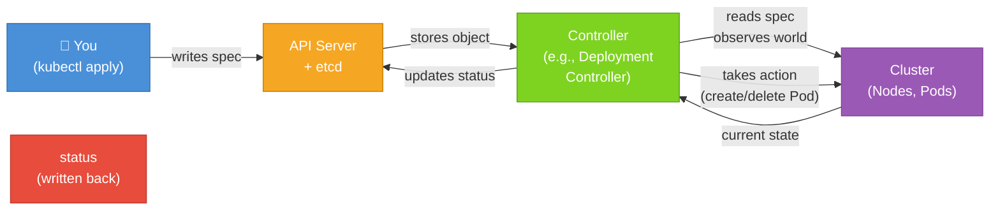

# Spec and Status: Desired State vs. Current State

One of the most elegant ideas in Kubernetes is also one of the simplest to understand once you have the right analogy. Every Kubernetes object has two distinct sections that reflect two different perspectives on the world: **`spec`**, which is what *you* want, and **`status`**, which is what *currently exists*. Mastering this distinction will transform how you think about debugging, troubleshooting, and managing applications in the cluster.

## The Thermostat Analogy

Imagine a thermostat in your home. You walk up to it and dial in 22°C. That number , the temperature you *want* , is the `spec`. It is your declaration of intent, your desired state. The actual temperature in the room right now is the `status`. Maybe it's 18°C because the heating system hasn't caught up yet. Maybe a window is open, and the room keeps drifting away from your target despite the heater running.

The thermostat doesn't give up after one attempt. It continuously checks: "Is the current temperature equal to the desired temperature? If not, turn on the heat. Check again. Still not there? Keep heating. Now it's 22°C? Great , hold steady. Oh, it dropped again? Heat more." This loop runs forever, never stopping, always comparing intent against reality.

Kubernetes works in exactly the same way. Your `spec` is the thermostat setting. The `status` is the room temperature. And the **controller** is the thermostat's heating system , a software process that runs continuously to bring reality into alignment with your intent.

## What `spec` Contains

The `spec` field is yours to write. When you create or update a manifest, you describe what you want the object to be. For a Deployment, this might look like:

```yaml
spec:
  replicas: 3
  selector:
    matchLabels:
      app: web
  template:
    metadata:
      labels:
        app: web
    spec:
      containers:
        - name: web
          image: nginx:1.25
          ports:
            - containerPort: 80
```

This `spec` says: "I want three Pods, each running the `nginx:1.25` container, listening on port 80." That's it. You are not instructing Kubernetes *how* to achieve this , you are simply stating the desired end result. You don't say "schedule a Pod on node-3" or "pull the image at this exact moment." You declare intent, and the system handles the execution.

:::info
The `spec` schema is different for every kind of object. A Pod's `spec` has `containers`, `volumes`, and `restartPolicy`. A Service's `spec` has `selector`, `ports`, and `type`. Always refer to the Kubernetes API documentation or use `kubectl explain <resource>.spec` in the terminal to explore the available fields for any object.
:::

## What `status` Contains

The `status` field is written and managed entirely by Kubernetes. You never write it yourself. After the cluster has processed your object and worked to satisfy your `spec`, it records the current state of affairs in `status`. For a Deployment, `status` might look like this:

```yaml
status:
  availableReplicas: 3
  readyReplicas: 3
  replicas: 3
  updatedReplicas: 3
  conditions:
    - type: Available
      status: "True"
      reason: MinimumReplicasAvailable
      message: Deployment has minimum availability.
    - type: Progressing
      status: "True"
      reason: NewReplicaSetAvailable
```

This `status` tells you the real-world situation: there are currently three Pods running, all three are ready, and the Deployment is healthy. If something went wrong , say, one Pod couldn't be scheduled because the cluster ran out of CPU , the `status` would reflect that, perhaps showing `availableReplicas: 2` and a `condition` with a `reason` explaining the problem.

:::warning
Never manually edit the `status` field in a manifest and apply it. It will either be ignored or cause confusing errors. The `status` field is a read-only window into reality , it belongs to Kubernetes, not to you. Even if you delete `status` from an exported YAML before re-applying it, that's fine , Kubernetes will simply repopulate it.
:::

## The Reconciliation Loop

The engine that bridges `spec` and `status` is called the **reconciliation loop** (sometimes called the *control loop*). Every Kubernetes controller , the Deployment controller, the ReplicaSet controller, the StatefulSet controller , runs this loop perpetually. The logic is elegantly simple:

1. **Observe**: Read the current state of the world (the `status` and what's actually running on nodes)
2. **Compare**: Diff the observed state against the desired state (`spec`)
3. **Act**: If there's a difference, take the smallest necessary action to close the gap
4. **Repeat**: Go back to step 1

This loop runs in the background at all times. It's why Kubernetes is described as **self-healing**. If you have a Deployment with `replicas: 3` and a node fails, taking one Pod with it, the ReplicaSet controller will notice that only two Pods are running (observed state) versus the three you requested (desired state), and it will immediately schedule a new Pod somewhere else. You didn't have to do anything.

The diagram below illustrates this loop:



## Reading `status` in Practice

The easiest way to see `status` in action is with `kubectl get` and `kubectl describe`. The `get` command gives you a quick summary, while `describe` gives you a human-readable breakdown of both `spec` and `status` merged together:

```bash
kubectl describe deployment web-app
```

Look for the `Conditions` section in the output , that comes directly from `status.conditions`. Look for `Replicas` and `Available` lines , those come from `status.replicas` and `status.availableReplicas`. When things go wrong, `status.conditions` is often the first place you should look for an explanation.

You can also retrieve the raw YAML and see `status` in its full form:

```bash
kubectl get deployment web-app -o yaml
```

Scroll to the bottom of the output to find the complete `status` block. You'll see things like `observedGeneration` (the generation of the spec the controller has processed) and `conditions` with timestamps and messages explaining the current health.

## Why This Design Matters

The spec/status split isn't just an implementation detail , it's a design philosophy. By separating *what you want* from *what exists*, Kubernetes achieves several important properties. First, it makes the system **declarative**: you write down your goal once, and you don't have to worry about the sequence of steps to get there. Second, it makes the system **resilient**: because controllers always compare spec to reality, any deviation , whether caused by a node crash, a network blip, or an accidental manual change , will automatically be corrected. Third, it makes the system **observable**: the `status` field gives you a standardized, machine-readable way to check whether any object is healthy without having to write custom monitoring logic.

When you understand that your job is to write `spec` and Kubernetes' job is to reconcile reality toward it, a lot of confusing behaviors suddenly make sense. Why does deleting a Pod not "delete" your application? Because the Deployment's spec still says three replicas , the controller just creates a new Pod to replace it. Why does scaling work instantly? Because you just edited the `spec.replicas` field, and the controller noticed the discrepancy within seconds.

## Hands-On Practice

Let's observe the spec/status duality directly.

**1. Create a Deployment:**

```bash
kubectl create deployment demo --image=nginx:1.25 --replicas=3
```

**2. Inspect the live status:**

```bash
kubectl get deployment demo
kubectl describe deployment demo
```

Notice the `Replicas` and `Conditions` sections in the describe output. These reflect `status`.

**3. View the raw spec and status together:**

```bash
kubectl get deployment demo -o yaml
```

Scroll through the output. Find where `spec` ends and `status` begins. Note that you wrote everything in `spec` and Kubernetes wrote everything in `status`.

**4. Observe self-healing in action:**

List the Pods and delete one:

```bash
kubectl get pods -l app=demo
kubectl delete pod <one-of-the-pod-names>
```

Then immediately run:

```bash
kubectl get pods -l app=demo --watch
```

Watch as the deleted Pod disappears and a new one appears within seconds. Press `Ctrl+C` to stop watching. The Deployment's `spec.replicas` said 3 , Kubernetes made it so.

**5. Scale the Deployment and watch status update:**

```bash
kubectl scale deployment demo --replicas=5
kubectl get deployment demo --watch
```

You'll see `READY` and `AVAILABLE` columns tick upward in real time as new Pods become ready. Press `Ctrl+C` when done.

**6. Clean up:**

```bash
kubectl delete deployment demo
```

You now understand the core loop that makes Kubernetes tick: you declare what you want in `spec`, Kubernetes works continuously to make it real, and it reports back through `status`. Everything else in the platform builds on this foundation.
