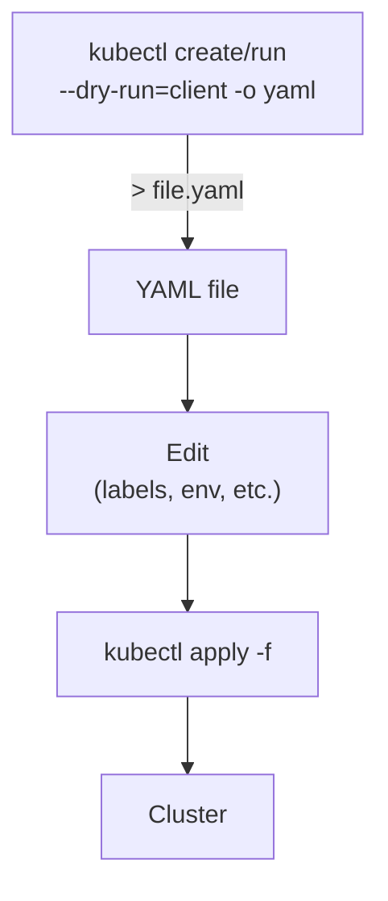

# Generating Manifests from the CLI

Writing Kubernetes manifests by hand is a useful skill, but it can be slow and error-prone, especially when you're just getting started and don't yet have every field memorized. Fortunately, `kubectl` comes with a powerful trick that lets you generate valid, ready-to-use YAML in seconds , without ever actually creating anything in the cluster. Once you discover this technique, you'll wonder how you ever lived without it.

## The `--dry-run=client -o yaml` Trick

The secret is a combination of two flags: `--dry-run=client` and `-o yaml`.

`--dry-run=client` tells `kubectl` to go through all the motions of creating or running a resource , parsing your command, building the object , but to stop just before sending anything to the API server. Nothing gets created. Nothing changes in the cluster. It's a rehearsal, not a performance.

`-o yaml` tells `kubectl` to print the result in YAML format rather than showing the usual success message.

Together, these two flags transform `kubectl` from a command that _does_ things into a command that _shows_ you what it _would_ do. The output is a complete, valid Kubernetes manifest that you can save to a file, edit, and apply later.

:::info
There are two dry-run modes: `--dry-run=client` runs entirely in your local `kubectl` process with no API server contact, and `--dry-run=server` sends the request to the API server for validation but still doesn't persist anything. For generating boilerplate manifests quickly, `--dry-run=client` is the one you want. It's fast, works offline, and produces clean output.
:::

## Generating a Pod Manifest

Let's say you want to create a Pod running the nginx image, but you want a YAML file instead of running an imperative command. Instead of writing the manifest from scratch, you can do this:

```bash
kubectl run mypod --image=nginx --dry-run=client -o yaml
```

This produces output like:

```yaml
apiVersion: v1
kind: Pod
metadata:
  creationTimestamp: null
  labels:
    run: mypod
  name: mypod
spec:
  containers:
    - image: nginx
      name: mypod
      resources: {}
  dnsPolicy: ClusterFirst
  restartPolicy: Always
status: {}
```

You can redirect this output to a file with a simple `>`:

```bash
kubectl run mypod --image=nginx --dry-run=client -o yaml > pod.yaml
```

:::warning
In this simulator, output redirection with `>` is currently partial. It is supported for `kubectl` commands (like this example), but not yet as full shell-wide redirection behavior.
:::

Now you have a file called `pod.yaml` that you can open, clean up, and customize to your needs , adding environment variables, resource requests, labels, or anything else , before applying it to the cluster.

## Generating a Deployment Manifest

The same trick works for Deployments. The `kubectl create deployment` command generates a complete Deployment manifest:

```bash
kubectl create deployment myapp --image=nginx --dry-run=client -o yaml
```

Output:

```yaml
apiVersion: apps/v1
kind: Deployment
metadata:
  creationTimestamp: null
  labels:
    app: myapp
  name: myapp
spec:
  replicas: 1
  selector:
    matchLabels:
      app: myapp
  strategy: {}
  template:
    metadata:
      creationTimestamp: null
      labels:
        app: myapp
    spec:
      containers:
        - image: nginx
          name: nginx
          resources: {}
status: {}
```

Notice that the boilerplate is all there: `apiVersion`, `kind`, `metadata`, `spec`, the `selector`, the Pod `template`. All you might need to add is things like `replicas: 3`, resource limits, or extra labels. The hard scaffolding is done for you.

You can also pass `--replicas` directly on the command line:

```bash
kubectl create deployment myapp --image=nginx --replicas=3 --dry-run=client -o yaml > deployment.yaml
```

## Generating a Service Manifest

Services can also be generated this way. For a ClusterIP service that routes traffic on port 80:

```bash
kubectl create service clusterip mysvc --tcp=80:80 --dry-run=client -o yaml
```

This produces a complete Service manifest with the appropriate `spec.ports` and `spec.type` already filled in. You just need to update the `selector` to match the labels of your target Pods before applying.

:::warning
Always review generated YAML before applying it to your cluster. The `--dry-run=client` output is based on local defaults and may include placeholder values like `resources: {}` or `strategy: {}`. These are valid but often not optimal. Take a few minutes to clean up the output and set meaningful values for resource requests, limits, and any app-specific configuration.
:::

## The Full Workflow

The typical workflow for using this technique looks like this:

1. **Generate** a starter manifest from the CLI
2. **Redirect** the output to a file
3. **Edit** the file to add or tune fields
4. **Apply** the finalized manifest to the cluster



## Why This Is So Useful

The `--dry-run=client -o yaml` combination solves several real problems at once:

- **No memorization required** Instead of memorizing every field, you get a valid, version-correct YAML you can trust as a starting point.
- **Speed** Generating a Deployment manifest in two seconds and editing it is much faster than writing from a blank file, especially during exams or time-limited exercises.
- **Structural correctness** Because `kubectl` generates the manifest from its own API schema, you're guaranteed to start with a structurally valid document.
- **Declarative workflow** You end up with a YAML file that can be committed to version control, reviewed in a pull request, and applied consistently across environments. The generated YAML is your starting point for infrastructure as code.

## A Practical Editing Example

Suppose you generate a Pod manifest and want to add resource limits and an environment variable. Start with:

```bash
kubectl run webserver --image=nginx:1.28 --port=80 --dry-run=client -o yaml > webserver.yaml
```

Then open `webserver.yaml` and edit the container section to look like this:

```yaml
containers:
  - name: webserver
    image: nginx:1.28
    ports:
      - containerPort: 80
    env:
      - name: NGINX_HOST
        value: 'example.com'
    resources:
      requests:
        memory: '64Mi'
        cpu: '100m'
      limits:
        memory: '128Mi'
        cpu: '200m'
```

Now apply it:

```bash
kubectl apply -f webserver.yaml
```

You've gone from zero to a production-quality manifest in a couple of minutes, with no manual scaffolding.

## Other Useful `--dry-run=client` Commands

Here are a few more manifest types you can generate with the same pattern:

```bash
# ConfigMap from a literal value
kubectl create configmap myconfig --from-literal=key=value --dry-run=client -o yaml

# Secret from a literal value
kubectl create secret generic mysecret --from-literal=password=s3cr3t --dry-run=client -o yaml

# ServiceAccount
kubectl create serviceaccount mysa --dry-run=client -o yaml

# Namespace
kubectl create namespace staging --dry-run=client -o yaml
```

Each of these commands generates a proper manifest that you can redirect to a file, review, edit, and apply.

## Hands-On Practice

Let's put this into practice in your terminal.

**1. Generate a Pod manifest and save it:**

```bash
kubectl run mypod --image=nginx:1.28 --port=80 --dry-run=client -o yaml > mypod.yaml
cat mypod.yaml
```

**2. Generate a Deployment manifest with 3 replicas:**

```bash
kubectl create deployment myapp --image=nginx:1.28 --replicas=3 --dry-run=client -o yaml > myapp-deployment.yaml
cat myapp-deployment.yaml
```

**3. Generate a ClusterIP Service:**

```bash
kubectl create service clusterip myapp-svc --tcp=80:80 --dry-run=client -o yaml > myapp-svc.yaml
cat myapp-svc.yaml
```

**4. Edit and apply the Deployment:**

Open `myapp-deployment.yaml`. Add a `resources` block to the container spec:

```yaml
resources:
  requests:
    memory: '64Mi'
    cpu: '100m'
  limits:
    memory: '128Mi'
    cpu: '200m'
```

Then apply:

```bash
kubectl apply -f myapp-deployment.yaml
kubectl get deployment myapp
kubectl get pods
```

**5. Generate a ConfigMap and a Secret:**

```bash
kubectl create configmap app-config --from-literal=LOG_LEVEL=info --dry-run=client -o yaml
kubectl create secret generic app-secret --from-literal=API_KEY=abc123 --dry-run=client -o yaml
```

**6. Clean up:**

```bash
kubectl delete -f myapp-deployment.yaml
```

With this technique in your toolkit, you'll spend far less time wrestling with YAML syntax and far more time actually learning how Kubernetes works. Use it every time you need a starting point for a new manifest.
