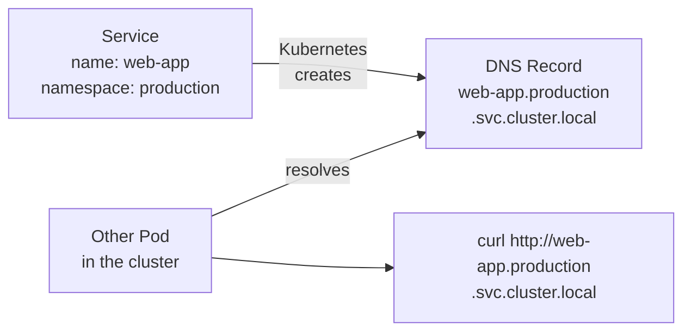

# Object Names, UIDs, and DNS Naming Rules

Names might seem like a trivial detail, after all, you just have to call something _something_, right? But in Kubernetes, names are far more than labels of convenience. They participate directly in networking, access control, and the cluster's internal bookkeeping.

:::info
Kubernetes enforces strict naming rules at the API level, an invalid name like `my_app` is rejected before any object is created. A Service name also becomes a DNS hostname, so the rules aren't just conventions: they have real operational consequences.
:::

## Names: Your Human-Readable Handle

Every Kubernetes object has a `name` field in its `metadata`. Within a given namespace, no two objects of the **same resource type** can share a name. That means you can have a Deployment named `web-app` and a Service named `web-app` in the same namespace simultaneously, they are different resource types, but you cannot have two Deployments both named `web-app` in `default`.

Across namespaces, names can repeat freely. A Deployment named `backend` can exist in both the `production` and `staging` namespaces without any conflict.

The maximum length for an object name is **253 characters**, but in practice you should aim for short, descriptive names. Long names are harder to type, harder to read in `kubectl get` output, and harder to work with in shell scripts.

:::info
For most resource types, names must follow **DNS subdomain** rules, which are strict. Some resources , like ConfigMaps and Secrets , may follow slightly relaxed rules (called DNS label names), but DNS subdomain rules are the safe default to apply universally.
:::

## DNS Subdomain Naming Rules

Most Kubernetes resources , including Pods, Deployments, Services, ConfigMaps, and many others , require their names to be valid **DNS subdomain names**. The rules are:

- Must contain only **lowercase alphanumeric characters** (`a`–`z`, `0`–`9`), **hyphens** (`-`), and **dots** (`.`)
- Must **start with an alphanumeric character**
- Must **end with an alphanumeric character**
- Must be no longer than **253 characters** total

This means several things that trip up newcomers. You cannot use **uppercase letters:** `MyApp` is invalid; `myapp` is correct. You cannot use **underscores:** `my_app` is invalid; `my-app` is correct. You cannot **start with a number** in most contexts (though technically DNS subdomain rules allow it, some Kubernetes validators do not). Stick to lowercase letters and hyphens and you will never go wrong.

Common mistakes and their fixes:

| Invalid name | Problem                     | Fixed name   |
| ------------ | --------------------------- | ------------ |
| `MyWebApp`   | Uppercase letters           | `my-web-app` |
| `my_app`     | Underscore not allowed      | `my-app`     |
| `web app`    | Space not allowed           | `web-app`    |
| `123app`     | Starts with a digit (risky) | `app-123`    |
| `.hidden`    | Starts with dot             | `hidden`     |

## Label Names: A Slightly Different Set of Rules

Label keys follow their own rules, which are a bit different from object names. A label key can optionally have a **prefix** separated from the name by a slash. The name part must be 63 characters or fewer, and it can contain letters, digits, hyphens, underscores, and dots , making it more permissive than DNS subdomain names. The optional prefix must itself be a valid DNS subdomain.

For example, all of these are valid label keys:

```yaml
labels:
  app: web
  app.kubernetes.io/name: web
  team: backend
  version: '2.1.0'
  environment: production
```

Label values have similar rules to label name parts: up to 63 characters, alphanumeric, hyphens, underscores, and dots, must start and end with an alphanumeric character (or be empty).

:::warning
Don't confuse label key rules with object name rules. An object name like `my_app` will be rejected by the Kubernetes API. But a label key like `my_label` (with an underscore) is perfectly valid. They are governed by different specifications.
:::

## UIDs: The Cluster's Internal Identity

While names are your human-readable handle for an object, **UIDs** are Kubernetes' internal, permanent identity. Every object that has ever existed in a cluster , past or present , gets a globally unique UID assigned at creation time. UIDs are UUID v4 strings that look like this:

```
a3b4c5d6-1234-5678-abcd-ef0123456789
```

You generally don't interact with UIDs directly, but they play a crucial role in the cluster's internal bookkeeping. In particular: if you delete an object and create a new one with the same name, the new object gets a **brand new UID**. From Kubernetes' perspective, these are two completely different objects that happen to share a human-readable name. The UID is the true, immutable identity , the name is just a nickname.

This matters for things like owner references and garbage collection. When a ReplicaSet creates Pods, it records its own UID in each Pod's `ownerReferences` field. If the ReplicaSet is deleted and a new one is created with the same name, the new ReplicaSet has a new UID, and the old Pods are not accidentally adopted by it.

To see the UID of any object:

```bash
kubectl get pod mypod -o jsonpath='{.metadata.uid}'
```

Or in the full YAML output:

```bash
kubectl get pod mypod -o yaml | grep uid
```

## How Names Feed Into DNS

This is where naming rules become critically practical. Kubernetes automatically creates **DNS records** for Services, and those DNS records are based directly on the Service's name and namespace. The DNS name for a Service follows this pattern:

```
<service-name>.<namespace>.svc.cluster.local
```

For example, a Service named `web-app` in the `production` namespace gets the DNS entry:

```
web-app.production.svc.cluster.local
```

Since DNS hostnames must follow DNS rules, the Service's name must also be DNS-compliant. An invalid Service name would result in an invalid DNS entry , or more likely, the API server would simply reject the Service before it was ever created.

Pods also get DNS records based on their IP address and namespace, though this is less commonly used for direct addressing. What matters more is that **Services** are the primary way applications find each other by name, so getting Service names right is essential for your app's internal networking.



Within the same namespace, applications can use a short name , just `web-app` , and DNS resolution will automatically expand it to the full form. Across namespaces, you need to use `web-app.production` or the fully qualified form.

## Names and Immutability

One practical constraint worth knowing: **you cannot rename a Kubernetes object after it has been created**. The `name` field in `metadata` is immutable. If you need to rename something , say, you want to change a Deployment from `old-web` to `new-web` , you must create a new Deployment with the new name and delete the old one.

This immutability also affects DNS. If a Service has been running under a given DNS name and other services are connecting to it, renaming it (by deleting and recreating) will break those connections until the clients update their configuration.

:::info
This is one of the reasons why choosing good names upfront matters. It's not just aesthetics , names become part of your infrastructure's DNS topology, and changing them has downstream effects.
:::

## Hands-On Practice

Let's explore naming rules and UIDs in the terminal.

**1. Try creating an object with an invalid name and see what happens:**

```bash
kubectl create deployment My_App --image=nginx --dry-run=server
```

The API server will reject this with a validation error explaining the naming constraint.

**2. Create a valid Deployment and inspect its UID:**

```bash
kubectl create deployment my-app --image=nginx
kubectl get deployment my-app -o jsonpath='{.metadata.uid}'
echo ""
```

Note the UID. It's a UUID assigned at creation time.

**3. Delete and recreate , observe the UID changes:**

```bash
kubectl delete deployment my-app
kubectl create deployment my-app --image=nginx
kubectl get deployment my-app -o jsonpath='{.metadata.uid}'
echo ""
```

Compare the new UID to the previous one. Same name, completely different identity.

**4. Inspect the DNS name for a Service:**

```bash
kubectl create service clusterip my-app --tcp=80:80
kubectl get service my-app
```

The DNS name for this service is `my-app.default.svc.cluster.local`. Any Pod in the cluster can reach it by that name.

**5. List all labels on an object:**

```bash
kubectl get deployment my-app -o jsonpath='{.metadata.labels}'
echo ""
```

**6. Explore name and UID in full YAML:**

```bash
kubectl get deployment my-app -o yaml | grep -E "name:|uid:|namespace:"
```

**7. Clean up:**

```bash
kubectl delete deployment my-app
kubectl delete service my-app
```

Understanding naming constraints is one of those foundational details that pays dividends every day you work with Kubernetes. It prevents frustrating validation errors, keeps your DNS topology clean, and helps you reason about identity and lifecycle when objects are deleted and recreated.
