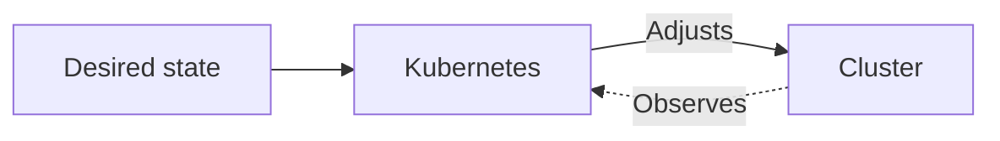
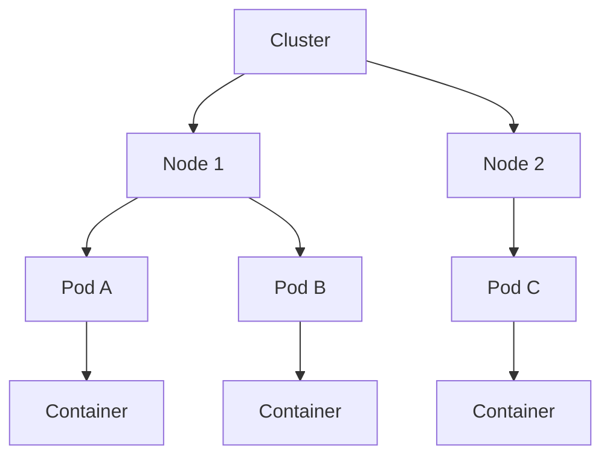
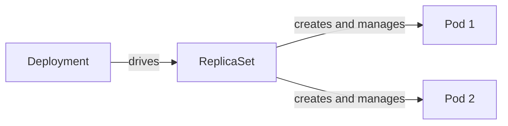

# Introduction to Kubernetes

Hello and welcome to this introductory course. This demo lets you discover Kubernetes in practice: you will explore the basics and create your first objects. Below the terminal you will find the cluster visualizer (telescope icon) and the feedback icon (chat) if something does not work or you have suggestions.

## What is Kubernetes?

Kubernetes is an open-source platform that orchestrates containers: it runs your applications in a cluster of machines and keeps the cluster in the state you described. You declare what you want (for example “an nginx application with two instances”), and Kubernetes handles resource allocation, restart on failure, and overall consistency. You can think of it as a manager that constantly watches your containers and brings the system back to the desired state.



:::info
Kubernetes exposes an HTTP API. Various tools are used to interact with this API and talk to the cluster: kubectl, Helm, GUIs, etc.
:::

## See the cluster

Let’s check that the cluster is responding. Use kubectl, the command-line tool, to list the nodes in the cluster. We’ll come back to what a node is right after. Try this command in the terminal:

```bash
kubectl get nodes
```

You should see something like:

```
NAME           STATUS  ROLES          AGE  VERSION
control-plane  Ready   control-plane  24s  v1.28.0
worker-1       Ready   worker         24s  v1.28.0
worker-2       Ready   worker         24s  v1.28.0
```

If you get the same output, the cluster is up and running.

## Architecture at a glance

A Kubernetes cluster is made of **nodes** (the machines, physical or virtual). On each node, Kubernetes schedules **pods**: the smallest execution unit you create or manage. A pod groups one or more **containers** that share the same network and storage. In practice, a pod often has a single container (your application).



Among the nodes, the **control plane** has a distinct role: it is the brain of the cluster, always present (API, scheduler, etc.). The others are **workers** and run your pods. For high availability, you typically run multiple control plane nodes.

## Create a deployment

Let’s create an application with one command, without a YAML file. This is the imperative approach: you directly request a deployment named `nginx` from the Docker image `nginx`.

```bash
kubectl create deployment nginx --image=nginx
```

Kubernetes then creates a **Deployment**, which creates a **ReplicaSet**, which creates a **Pod**. You get one pod running nginx.

These three are **Kubernetes objects**: entities you or Kubernetes create to describe the desired state of the cluster (for example “I want two instances of nginx”). Each object has a type (Deployment, ReplicaSet, Pod), a name, and a status that Kubernetes keeps updating.

## List pods and the deployment

Check that the pod was created:

```bash
kubectl get pods
```

You should see a pod whose name starts with `nginx-`, with a status like `Running` or `ContainerCreating`. To inspect the deployment:

```bash
kubectl get deployment
```

:::info
Most Kubernetes resources have a shorter alias to save time. Instead of `kubectl get deployment`, you can type `kubectl get deploy`. Same for pods with `po`, services with `svc`, etc.
:::

## From Deployment to Pod

When you create a Deployment, Kubernetes chains several objects: the **Deployment** describes the application and the desired number of replicas; it drives a **ReplicaSet**, which maintains that number of copies; the ReplicaSet creates and manages the actual **Pods**. This chain enables rolling updates, scaling, and self-healing.



## Create a Pod with a YAML file

Besides imperative commands, you can describe your objects in a YAML file (a _manifest_) and apply them to the cluster. Here is a minimal manifest for a Pod that runs nginx:

```yaml
apiVersion: v1
kind: Pod
metadata:
  name: nginx-pod
spec:
  containers:
    - name: nginx
      image: nginx
      ports:
        - containerPort: 80
```

Main fields:

- **apiVersion: v1** – Kubernetes API version used for this object; for a Pod, it is `v1`.
- **kind: Pod** – Type of object to create.
- **metadata.name** – Unique name for the Pod in its namespace (lowercase, alphanumeric, hyphens).
- **spec.containers** – List of containers in the Pod. Here a single container with a **name**, an **image**, and optionally the **ports** it exposes.

Save this to a file (for example `nginx-pod.yaml`) and apply it:

```bash
kubectl apply -f nginx-pod.yaml
```

Kubernetes creates the Pod `nginx-pod`. You can verify with `kubectl get pods`.

:::info
In production, Deployments (or other workload resources) are usually preferred over standalone Pods: they provide scaling, rolling updates, and self-healing. Creating a Pod directly is still useful for learning or debugging.
:::

## Scale (optional)

With a Deployment, you can request multiple replicas in one command:

```bash
kubectl scale deployment nginx --replicas=2
```

Run `kubectl get pods` again and you should see two nginx pods.

## What's next?

You have seen the essentials: what Kubernetes is, the cluster / nodes / pods architecture, creating a deployment and a pod, and a YAML manifest example. To go further (more objects, updates, troubleshooting, best practices), the full course covers the full path.
