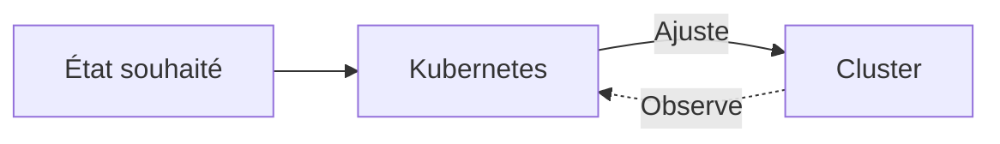
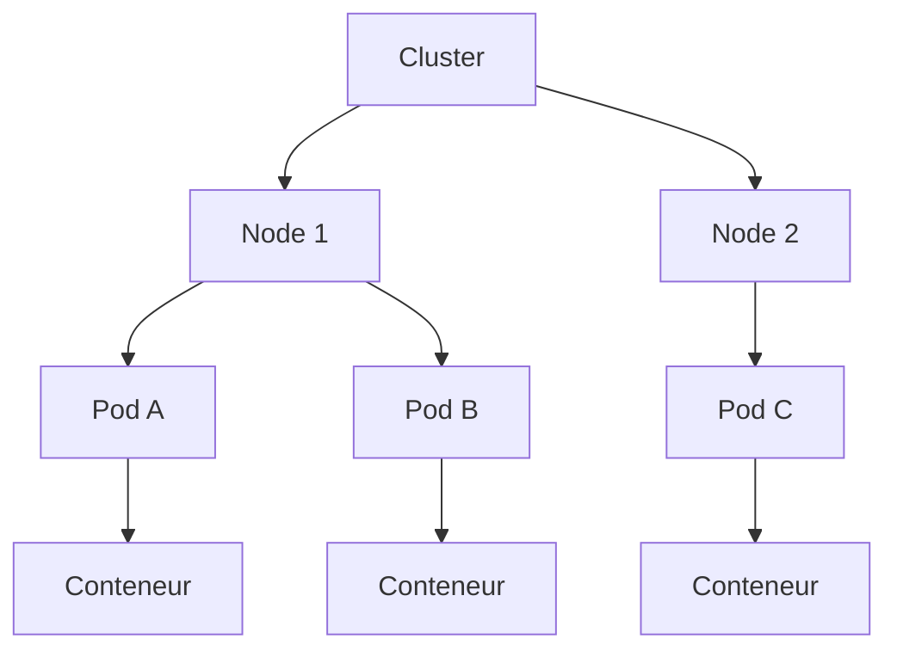
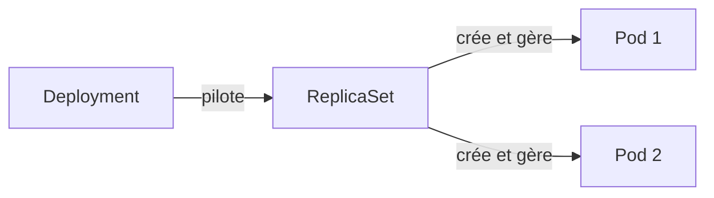

# Introduction à Kubernetes

Bonjour et bienvenue dans ce cours d'introduction. Cette démo vous permet de découvrir Kubernetes en pratique : vous allez en explorer les bases et créer vos premiers objets. Sous le terminal vous trouverez le visualiseur de cluster (icône télescope) et l’icône de retour (chat) si jamais quelque chose ne fonctionne pas ou si vous avez des suggestions.

## Qu’est-ce que Kubernetes ?

Kubernetes est une plateforme open source qui orchestre des conteneurs : elle exécute vos applications dans un cluster de machines (un groupe de machines) et maintient l’état que vous avez décrit. Vous déclarez ce que vous voulez (par exemple « une application nginx avec deux instances »), Kubernetes s’occupe de l’allocation des ressources, du redémarrage en cas de panne et de la cohérence de l’ensemble. On peut le voir comme un gestionnaire qui surveille en permanence vos conteneurs et ramène le système vers l’état désiré.



:::info
Kubernetes expose une API HTTP. On utilise différents outils pour interagir avec cette API et communiquer avec le cluster : kubectl, Helm, GUI, etc.
:::

## Voir le cluster

Vérifions que le cluster répond. Utilisons `kubectl`, l'outil de ligne de commande pour vérifier le nombre de nœuds dans le cluster (node en anglais). On reviendra juste après sur la définition de node. Essayez cette commande dans le terminal :

```bash
kubectl get nodes
```

Vous devriez voir quelque chose comme ça :

```
NAME           STATUS  ROLES          AGE  VERSION
control-plane  Ready   control-plane  24s  v1.28.0
worker-1       Ready   worker         24s  v1.28.0
worker-2       Ready   worker         24s  v1.28.0
```

Si vous avez le même résultat, c'est que le cluster est fonctionnel.

## Architecture en un coup d’œil

Un cluster Kubernetes est donc constitué de **Nodes** (les machines, physiques ou virtuelles). Sur chaque node, Kubernetes planifie des **Pods** : c’est la plus petite unité d’exécution que vous créez ou gérez. Un Pod regroupe un ou plusieurs **conteneurs** qui partagent le même réseau et le même stockage. En pratique, un Pod contient souvent un seul conteneur (votre application).



Parmi les nodes, le **control plane** (plan de contrôle) a un rôle à part : c’est le cerveau du cluster, toujours présent (API, scheduler, etc.). Les autres sont des **workers** et exécutent vos pods. Pour la haute disponibilité, on met en général plusieurs nodes control plane.

## Créer un déploiement

Créons une application en une commande, sans fichier YAML. C’est la façon dite impérative : vous demandez directement la création d’un déploiement nommé `nginx` à partir de l’image Docker `nginx`.

```bash
kubectl create deployment nginx --image=nginx
```

Kubernetes crée alors un **Deployment**, qui crée un **ReplicaSet**, qui crée un **Pod**. Vous obtenez un pod exécutant nginx.

Ces trois éléments sont des **objets Kubernetes** : des entités que vous créez ou que Kubernetes crée pour décrire l’état souhaité du cluster (par exemple « je veux deux instances de nginx »). Chaque objet a un type (Deployment, ReplicaSet, Pod), un nom et un statut que Kubernetes met à jour en continu.

## Lister les pods et le déploiement

Vérifions que le pod a bien été créé :

```bash
kubectl get pods
```

Vous devriez voir un pod dont le nom commence par `nginx-`, avec un statut du type `Running` ou `ContainerCreating`. Pour inspecter le déploiement :

```bash
kubectl get deployment
```

:::info
La plupart des ressources Kubernetes ont un alias plus court pour gagner du temps. Au lieu de `kubectl get deployment`, vous pouvez taper `kubectl get deploy`. Même chose pour les pods avec `po`, les services avec `svc`, etc.
:::

## De Deployment à Pod

Quand vous créez un Deployment, Kubernetes enchaîne plusieurs objets : le **Deployment** décrit l’application et le nombre de réplicas souhaités ; il pilote un **ReplicaSet**, qui assure ce nombre de copies ; le ReplicaSet crée et gère les **Pods** réels. Cette chaîne permet les mises à jour progressives, la mise à l’échelle et l’auto-guérison.



## Créer un Pod avec un fichier YAML

En plus des commandes impératives, vous pouvez décrire vos objets dans un fichier YAML (un _manifest_) et les appliquer au cluster. Voici un manifest minimal pour un Pod qui exécute nginx :

```yaml
apiVersion: v1
kind: Pod
metadata:
  name: nginx-pod
spec:
  containers:
    - name: nginx
      image: nginx
      ports:
        - containerPort: 80
```

Principaux champs :

- **apiVersion: v1** : version de l’API Kubernetes utilisée pour cet objet ; pour un Pod, c’est `v1`.
- **kind: Pod** : type d’objet à créer.
- **metadata.name** : nom unique du Pod dans le namespace (minuscules, alphanumériques, tirets).
- **spec.containers** : liste des conteneurs du Pod. Ici un seul conteneur, avec un **name**, une **image** et éventuellement les **ports** exposés.

Enregistrez ce contenu dans un fichier (par exemple `nginx-pod.yaml`) puis appliquez-le :

```bash
kubectl apply -f nginx-pod.yaml
```

Kubernetes crée le Pod `nginx-pod`. Vous pouvez vérifier avec `kubectl get pods`.

:::info
En production, on privilégie en général les Deployments (ou d’autres ressources de charge de travail) plutôt que des Pods créés seuls : ils offrent la mise à l’échelle, les mises à jour progressives et l’auto-guérison. La création directe d’un Pod reste utile pour l’apprentissage ou le débogage.
:::

## Mettre à l’échelle (optionnel)

Avec un Deployment, vous pouvez demander plusieurs réplicas en une commande :

```bash
kubectl scale deployment nginx --replicas=2
```

En relançant `kubectl get pods`, vous devriez voir deux pods nginx.

## Et après ?

Vous avez vu l’essentiel : ce qu’est Kubernetes, l’architecture cluster / nœuds / pods, la création d’un déploiement et d’un pod, et un exemple de manifest YAML. Pour approfondir (autres objets, mises à jour, dépannage, bonnes pratiques), la formation complète couvre tout le parcours.
