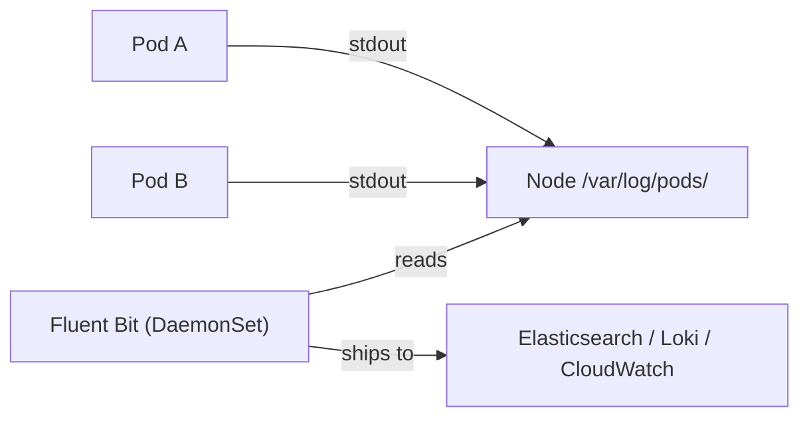

# Log Aggregation Patterns

You now know that container logs live on the node and disappear when Pods move or nodes are replaced. For production, that's not acceptable — you need logs to be durable, searchable, and centralized. That's what log aggregation is about: getting logs off the node and into a system where you can actually use them.

Let's explore the two main patterns for achieving this.

## Pattern 1: The DaemonSet Collector (Most Common)

The most popular approach in Kubernetes is to run a log collector as a **DaemonSet:**  one collector Pod on every node. Each collector reads the log files from the node's filesystem (`/var/log/pods/`) and forwards them to a central backend like Elasticsearch, Loki, or a cloud logging service.

Think of it as having a mail carrier on every street. No matter which house (Pod) produces mail (logs), the carrier picks it up and delivers it to the central post office (your logging backend).



Here's a simplified DaemonSet manifest for <a target="_blank" href="https://fluentbit.io/">Fluent Bit</a>, a lightweight and popular log collector:

```yaml
apiVersion: apps/v1
kind: DaemonSet
metadata:
  name: fluent-bit
  namespace: logging
spec:
  selector:
    matchLabels:
      app: fluent-bit
  template:
    metadata:
      labels:
        app: fluent-bit
    spec:
      serviceAccountName: fluent-bit
      containers:
        - name: fluent-bit
          image: fluent/fluent-bit:latest
          volumeMounts:
            - name: varlog
              mountPath: /var/log
              readOnly: true
      volumes:
        - name: varlog
          hostPath:
            path: /var/log
```

The key detail is the `hostPath` volume: the collector mounts the node's `/var/log` directory to read log files produced by all containers on that node. You configure the backend destination (Elasticsearch URL, Loki endpoint, etc.) through a ConfigMap or environment variables.

:::info
The DaemonSet pattern is the recommended approach for most Kubernetes clusters. It captures logs from all Pods automatically — no changes to your applications needed. Popular collectors include <a target="_blank" href="https://fluentbit.io/">Fluent Bit</a> (lightweight, fast), <a target="_blank" href="https://www.fluentd.org/">Fluentd</a> (more plugins, higher resource use), and <a target="_blank" href="https://vector.dev/">Vector</a> (high performance, Rust-based).
:::

## Pattern 2: Direct Push from Applications

The alternative is to have your applications send logs directly to a logging service — over HTTP, gRPC, or using a logging SDK. Instead of writing to stdout and relying on a collector, the application pushes structured log events to the backend.

This approach is useful when:
- You need application-specific enrichment (adding request IDs, user context, etc.)
- Your logging backend supports direct ingestion well
- The DaemonSet pattern doesn't fit your architecture

The downside? It requires changes to every application, adds network overhead, and means you lose logs if the backend is temporarily unreachable (unless the SDK buffers locally).

For most teams, the DaemonSet pattern is simpler and more reliable. Direct push is better suited as a complement — for specific applications that need richer context — rather than a replacement.

## Structured Logging: Make Your Logs Useful

Regardless of which pattern you choose, one thing makes a huge difference: **structured logging**. Instead of plain text like:

```
Error: failed to connect to database on port 5432
```

Use JSON:

```json
{"level":"error","msg":"failed to connect to database","port":5432,"service":"api","timestamp":"2026-02-16T10:30:00Z"}
```

Structured logs are parseable by machines. Your logging backend can index fields, and you can search for `service=api AND level=error` instead of trying to grep through free-form text across thousands of Pods.

## Verifying Your Log Pipeline

After deploying a log collector, verify it's running on every node and actually forwarding logs:

```bash
# Check the DaemonSet status
kubectl get daemonset fluent-bit -n logging

# Verify collector Pods exist on each node
kubectl get pods -n logging -l app=fluent-bit -o wide

# Check collector logs for errors
kubectl logs -n logging -l app=fluent-bit --tail=50
```

:::warning
If the collector isn't seeing logs, the most common culprit is **wrong volume mount paths**. Different container runtimes (containerd vs Docker) store logs in slightly different locations. Verify the path on your nodes matches what the collector expects.
:::

## Wrapping Up

Log aggregation turns ephemeral node logs into durable, searchable data. The DaemonSet pattern — one collector per node — is the standard approach in Kubernetes, requiring no application changes. Direct push is an alternative for specific needs. Whichever pattern you choose, structured logging (JSON) makes your logs dramatically more useful. With a solid logging pipeline in place, you're ready to tackle the next piece of observability: metrics.
