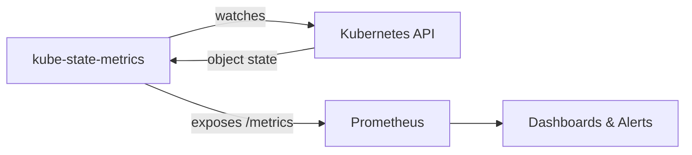

# kube-state-metrics

In the previous lesson, we saw that the metrics-server answers "How much CPU is this Pod using?" That's useful, but it doesn't tell the whole story. What if you need to know "How many Pods are stuck in Pending?" or "Does my Deployment have all the replicas it wants?" That's where **kube-state-metrics** comes in.

## Resource Metrics vs State Metrics

It helps to think of two different perspectives on your cluster:

- **Resource metrics** (from cAdvisor and metrics-server) measure *consumption*: CPU cycles, memory bytes, network packets. They answer "How hard is this thing working?"
- **State metrics** (from kube-state-metrics) measure *status*: Pod phases, Deployment replica counts, node conditions. They answer "Is everything in the state it should be?"

Both are essential. A Deployment might be using very little CPU (resource metric looks fine) but only has 1 of 3 desired replicas running (state metric reveals a problem). You need both perspectives to truly understand your cluster's health.



## What kube-state-metrics Tracks

kube-state-metrics watches the Kubernetes API server and generates Prometheus-format metrics about object state. Here are some of the most useful ones:

- **`kube_pod_status_phase`:**  Is this Pod Running, Pending, Succeeded, or Failed?
- **`kube_deployment_status_replicas_available`:**  How many replicas are actually ready?
- **`kube_deployment_status_replicas_desired`:**  How many replicas should there be?
- **`kube_node_status_condition`:**  Is this node Ready? Under disk pressure? Memory pressure?
- **`kube_pod_container_status_waiting`:**  Are any containers stuck in a Waiting state?

These metrics power some of the most important alerts you can have. For example: "Alert me when a Deployment has fewer available replicas than desired for more than 5 minutes."

:::info
kube-state-metrics does **not** track resource usage (CPU, memory). That's what metrics-server and cAdvisor do. Think of kube-state-metrics as the "inventory checker" — it tells you whether objects are in the state they should be, not how much power they're consuming.
:::

## What the Metrics Look Like

kube-state-metrics exposes data in standard Prometheus format. Here's a sample:

```text
# Pod phase: Running
kube_pod_status_phase{namespace="default",pod="web-0",phase="Running"} 1

# Deployment: 3 desired, 3 available — healthy
kube_deployment_status_replicas_desired{deployment="nginx",namespace="default"} 3
kube_deployment_status_replicas_available{deployment="nginx",namespace="default"} 3

# Node condition: Ready
kube_node_status_condition{node="worker-1",condition="Ready",status="true"} 1
```

Each metric is a time series with labels. Prometheus scrapes these and stores them, letting you query, graph, and alert on any combination.

## Deploying kube-state-metrics

kube-state-metrics runs as a standard Deployment. It needs a ServiceAccount with RBAC permissions to list and watch cluster resources:

```yaml
apiVersion: apps/v1
kind: Deployment
metadata:
  name: kube-state-metrics
  namespace: monitoring
spec:
  replicas: 1
  selector:
    matchLabels:
      app: kube-state-metrics
  template:
    metadata:
      labels:
        app: kube-state-metrics
    spec:
      serviceAccountName: kube-state-metrics
      containers:
        - name: kube-state-metrics
          image: registry.k8s.io/kube-state-metrics/kube-state-metrics:v2.10.0
          ports:
            - containerPort: 8080
              name: http-metrics
```

Expose it via a Service and configure Prometheus to scrape its `/metrics` endpoint. Most Helm-based Prometheus installations include kube-state-metrics automatically.

## Verifying the Setup

Check that kube-state-metrics is running and serving data:

```bash
# Is the Deployment healthy?
kubectl get deployment kube-state-metrics -n monitoring

# Can we reach the metrics endpoint?
kubectl port-forward -n monitoring svc/kube-state-metrics 8080:8080
# Then in another terminal: curl localhost:8080/metrics | head -50
```

:::warning
If no metrics appear, the most common issue is **missing RBAC permissions**. The ServiceAccount used by kube-state-metrics needs `list` and `watch` permissions on the resources it tracks (Pods, Deployments, Nodes, etc.). Check the ClusterRole and ClusterRoleBinding.
:::

---

## Hands-On Practice

### Step 1: Check for kube-state-metrics

```bash
kubectl get pods -n kube-system | grep kube-state
kubectl get pods -A | grep kube-state-metrics
```

If kube-state-metrics is deployed (often by Prometheus Helm charts), it runs in `monitoring` or `kube-system`. Many clusters don't have it by default.

## Wrapping Up

kube-state-metrics complements resource metrics by telling you about *object state* — whether your Deployments are healthy, your Pods are running, and your nodes are ready. Combined with metrics-server (resource usage) and Prometheus (storage and alerting), it forms a complete monitoring picture. In the next lesson, we'll see how Prometheus ties everything together with scraping, storage, and alerting.
