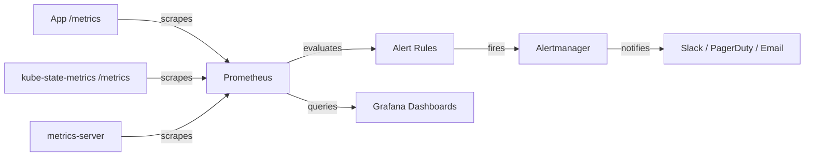

# Prometheus and Alerting

You've seen where metrics come from — cAdvisor for resource usage, kube-state-metrics for object state. But metrics are only useful if you can store them over time, query them, and get alerted when something goes wrong. That's where <a target="_blank" href="https://prometheus.io/">Prometheus</a> comes in.

## How Prometheus Works

Prometheus uses a **pull model**: instead of applications pushing metrics to it, Prometheus reaches out to each target and asks "What are your metrics right now?" It does this at regular intervals (typically every 15-30 seconds), stores the time-series data locally, and evaluates alerting rules against the stored data.

Think of it like a building inspector who visits every apartment on a schedule. Each apartment has a clipboard on the door (the `/metrics` endpoint) showing current readings — temperature, water usage, electricity. The inspector writes everything down, and if any reading crosses a threshold, they file a report.



## Telling Prometheus What to Scrape

Prometheus needs to know which targets to scrape. In Kubernetes, there are two common approaches:

**Pod annotations:** Add annotations to your Pod that tell Prometheus "scrape me":

```yaml
apiVersion: v1
kind: Pod
metadata:
  name: my-app
  annotations:
    prometheus.io/scrape: 'true'
    prometheus.io/port: '8080'
    prometheus.io/path: '/metrics'
spec:
  containers:
    - name: app
      image: myapp
      ports:
        - containerPort: 8080
```

**ServiceMonitor (Prometheus Operator):** If you're using the <a target="_blank" href="https://github.com/prometheus-operator/prometheus-operator">Prometheus Operator</a>, you define ServiceMonitor resources that tell Prometheus which Services to scrape. This is the more structured approach and scales better for large clusters.

:::info
The Prometheus Operator is the most popular way to run Prometheus in Kubernetes. It uses custom resources (Prometheus, ServiceMonitor, AlertmanagerConfig) to manage the entire monitoring stack declaratively. If you're starting fresh, it's worth considering from the start.
:::

## Writing Alert Rules

Alert rules define conditions that, when true for a certain duration, trigger an alert. Here's a practical example:

```yaml
groups:
  - name: kubernetes
    rules:
      - alert: DeploymentReplicasUnavailable
        expr: kube_deployment_status_replicas_available < kube_deployment_status_replicas_desired
        for: 5m
        labels:
          severity: warning
        annotations:
          summary: 'Deployment {{ $labels.deployment }} has fewer replicas than desired'
          description: '{{ $labels.deployment }} in {{ $labels.namespace }} has been missing replicas for 5 minutes.'
```

This rule says: "If any Deployment has fewer available replicas than desired, and this persists for 5 minutes, fire a warning alert." Prometheus evaluates this expression periodically and sends matching alerts to Alertmanager.

**Alertmanager** handles the routing: it decides where to send each alert based on severity, namespace, or custom labels. A critical alert might page someone via PagerDuty, while a warning goes to a Slack channel.

## A Few High-Value Alerts to Start With

Don't try to alert on everything at once — that leads to alert fatigue, where people start ignoring notifications. Start with a few high-signal alerts:

- **Deployment replicas unavailable** (as shown above)
- **Pod stuck in CrashLoopBackOff** for more than 10 minutes
- **Node not Ready** for more than 5 minutes
- **Persistent volume nearly full** (> 85% usage)
- **API server error rate** above threshold

Each alert should have a clear description and ideally a link to a runbook explaining what to do.

:::warning
Alert fatigue is real and dangerous. When people get too many notifications, they start ignoring them — including the critical ones. Focus on actionable alerts first: things that require human intervention. Tune thresholds carefully and add runbooks before expanding your alert coverage.
:::

## Verifying Your Monitoring Stack

After deploying Prometheus (typically via Helm or the Prometheus Operator), verify the core components:

```bash
# Check monitoring Pods
kubectl get pods -n monitoring

# List ServiceMonitors (if using Prometheus Operator)
kubectl get servicemonitor -A

# List Prometheus instances
kubectl get prometheus -A

# Check Alertmanager
kubectl get alertmanager -A
```

You can also port-forward to the Prometheus UI to verify targets and rules:

```bash
kubectl port-forward -n monitoring svc/prometheus 9090:9090
# Open http://localhost:9090/targets in your browser
```

## Wrapping Up

Prometheus is the backbone of Kubernetes observability. It scrapes metrics from your applications and infrastructure, stores time-series data, and evaluates alerting rules. Combined with kube-state-metrics and the metrics-server, it gives you a complete picture of cluster health. Start with a few high-signal alerts, pair them with runbooks, and expand gradually. Your future self — the one debugging a production issue at 2 AM — will thank you.
