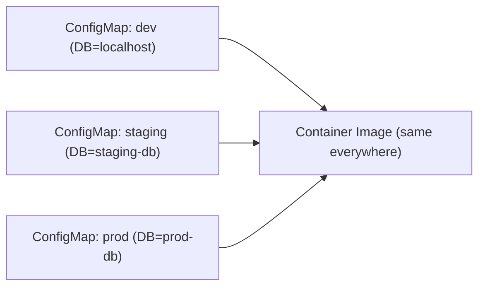

# What Is a ConfigMap?

Every application needs configuration — database URLs, log levels, feature flags, timeouts. But baking these values into your container images creates a problem: you'd need a different image for every environment. Development uses `localhost`, staging uses a staging URL, production uses a production URL. Three environments, three images — for every configuration change.

**ConfigMaps** solve this by separating configuration from code. They're Kubernetes objects that store key-value pairs, injected into your Pods at runtime.

## The Configuration Separation Principle

Think of a ConfigMap as a settings file that lives outside your application. Your container image is the recipe; the ConfigMap is the ingredient list that changes depending on who's cooking.

The same image runs everywhere — only the ConfigMap changes:



## ConfigMap Structure

Unlike most Kubernetes objects that have a `spec`, ConfigMaps have `data` and `binaryData` fields:

```yaml
apiVersion: v1
kind: ConfigMap
metadata:
  name: app-settings
data:
  LOG_LEVEL: "info"
  DATABASE_HOST: "postgres.default.svc.cluster.local"
  FEATURE_NEW_UI: "true"
  config.json: |
    {
      "timeout": 30,
      "retries": 3,
      "cache_ttl": 300
    }
```

The `data` field accepts any UTF-8 string — simple values, JSON, YAML, properties files, even entire configuration files. Keys become environment variable names or filenames, depending on how you consume the ConfigMap.

:::info
Keys must consist of alphanumeric characters, hyphens (`-`), underscores (`_`), or dots (`.`). Each key maps to a value that can be a simple string or an entire file content.
:::

## When to Use ConfigMaps

ConfigMaps are ideal for:
- **Environment-specific settings:**  API URLs, database hostnames, log levels
- **Feature flags:**  Enable/disable features without redeploying
- **Configuration files:**  nginx.conf, application.yaml, properties files
- **Non-sensitive data** that varies between environments

## When NOT to Use ConfigMaps

ConfigMaps are **not encrypted** and should never contain:
- Passwords or API keys
- OAuth tokens or TLS certificates
- Any sensitive credential

Use **Secrets** for those — we'll cover them later in this module.

:::warning
ConfigMaps are stored unencrypted in etcd by default. Anyone with API access can read them. Never put passwords, keys, or tokens in ConfigMaps — use Secrets instead.
:::

## Verifying ConfigMaps

You can verify ConfigMaps using standard kubectl commands. Use `kubectl get configmaps` to list all ConfigMaps in the current namespace, `kubectl get configmap <name> -o yaml` to view the full content including the `data` section, and `kubectl describe configmap <name>` for a quick overview that shows keys but may truncate long values.

## Size Limit

ConfigMaps are stored in etcd, which has a 1 MiB limit per object. For most configuration, this is more than enough. If you need to store larger data, consider using a volume mount with a PVC or an external configuration store.

---

## Hands-On Practice

### Step 1: List existing ConfigMaps

```bash
kubectl get configmaps
```

You'll see ConfigMaps in the current namespace (including built-in ones like `kube-root-ca.crt`). The output shows name, keys count, and age.

### Step 2: Inspect a ConfigMap in YAML

```bash
kubectl get configmap kube-root-ca.crt -o yaml
```

Replace `kube-root-ca.crt` with any ConfigMap name from Step 1. The `-o yaml` format shows the full structure, including the `data` section with key-value pairs.

### Step 3: Describe a ConfigMap

```bash
kubectl describe configmap kube-root-ca.crt
```

The `describe` output gives a readable overview — it shows keys but typically truncates long values for readability.

## Wrapping Up

ConfigMaps decouple configuration from container images, letting you run the same image in any environment with different settings. They store non-sensitive key-value data that Pods consume as environment variables or mounted files. In the next lesson, you'll learn how to create ConfigMaps — from manifests, literal values, and files.
