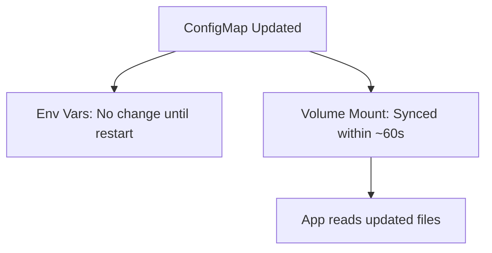

# Using ConfigMaps in Pods

A ConfigMap sitting in Kubernetes does nothing by itself. It becomes useful when a Pod **consumes** it — either as environment variables or as mounted files. Each method has different characteristics, and the right choice depends on how your application reads configuration.

## As Environment Variables

The most straightforward approach. Reference individual keys with `configMapKeyRef`:

```yaml
spec:
  containers:
    - name: app
      image: myapp
      env:
        - name: LOG_LEVEL
          valueFrom:
            configMapKeyRef:
              name: app-settings
              key: LOG_LEVEL
        - name: DB_HOST
          valueFrom:
            configMapKeyRef:
              name: app-settings
              key: DATABASE_HOST
```

Or import all keys at once with `envFrom`:

```yaml
spec:
  containers:
    - name: app
      image: myapp
      envFrom:
        - configMapRef:
            name: app-settings
```

With `envFrom`, every key in the ConfigMap becomes an environment variable. Use `prefix` to avoid naming conflicts when importing from multiple ConfigMaps.

:::info
When using `envFrom`, keys must be valid environment variable names (alphanumeric and underscore). Keys with hyphens or dots are silently skipped. Use `configMapKeyRef` to map specific keys to valid variable names.
:::

## As Volume Mounts

When your application expects configuration files (like `nginx.conf` or `application.yaml`), mount the ConfigMap as a volume:

```yaml
spec:
  containers:
    - name: app
      image: myapp
      volumeMounts:
        - name: config-volume
          mountPath: /etc/config
  volumes:
    - name: config-volume
      configMap:
        name: app-settings
```

Each key becomes a file in the mount directory. A ConfigMap with keys `LOG_LEVEL`, `DATABASE_HOST`, and `config.json` creates three files under `/etc/config/`.

## The Key Difference: Update Behavior

This is the most important distinction between the two methods:

| Method | Updates | When to Use |
|--------|---------|-------------|
| Environment variables | **Fixed at startup:**  changes require Pod restart | Simple values, fast apps |
| Volume mounts | **Synced periodically:**  updates appear without restart | Config files, live reload |

Volume mounts are synced by the kubelet, typically within about a minute. This means you can update a ConfigMap and have running Pods pick up the change — if your application watches for file changes.

Environment variables, on the other hand, are set once when the Pod starts. To pick up ConfigMap changes, you need to restart the Pod (or trigger a rolling update).



## Mixing Both Methods

You can use both in the same Pod — environment variables for simple settings and volume mounts for configuration files:

```yaml
spec:
  containers:
    - name: app
      envFrom:
        - configMapRef:
            name: simple-settings
      volumeMounts:
        - name: config-files
          mountPath: /etc/config
  volumes:
    - name: config-files
      configMap:
        name: file-settings
```

## Common Pitfalls

**ConfigMap not found:**  The Pod won't start if the referenced ConfigMap doesn't exist. Use `optional: true` in `configMapKeyRef` or `configMapRef` to allow the Pod to start without it.

**Cross-namespace:**  A Pod can only reference ConfigMaps in its own namespace. A Pod in `production` cannot reference a ConfigMap in `default`.

**subPath mounts:**  If you use `subPath` to mount a single file, updates to the ConfigMap won't be reflected. Use a full volume mount for live updates.

:::warning
If the ConfigMap doesn't exist when the Pod starts, the Pod will fail. Use `optional: true` in your references to allow graceful startup when config might not be available yet.
:::

---

## Hands-On Practice

### Step 1: Create a ConfigMap

```bash
kubectl create configmap app-settings --from-literal=LOG_LEVEL=info --from-literal=DB_HOST=postgres
```

### Step 2: Create a Pod that uses the ConfigMap as environment variables

Create `pod-env.yaml`:

```yaml
apiVersion: v1
kind: Pod
metadata:
  name: config-demo
spec:
  containers:
    - name: app
      image: busybox
      command: ["sleep", "3600"]
      envFrom:
        - configMapRef:
            name: app-settings
```

Apply it:

```bash
kubectl apply -f pod-env.yaml
```

### Step 3: Verify the environment variables

```bash
kubectl exec config-demo -- env | grep -E "LOG_LEVEL|DB_HOST"
```

You should see `LOG_LEVEL=info` and `DB_HOST=postgres` — the ConfigMap keys and values are now environment variables inside the container.

### Step 4: Clean up

```bash
kubectl delete pod config-demo
kubectl delete configmap app-settings
```

## Wrapping Up

ConfigMaps can be consumed as environment variables (simple, fixed at startup) or volume mounts (files, auto-updating). Choose based on how your application reads config and whether you need live updates. Both methods require the ConfigMap to be in the same namespace as the Pod. Next up: Secrets — the ConfigMap equivalent for sensitive data.
