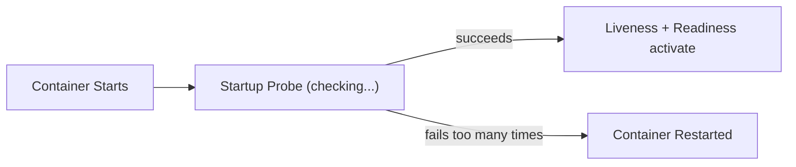

# Startup Probe

You've learned about liveness and readiness probes. But there's a problem: what happens when your application takes a long time to start? A Java application with Spring Boot might need 60 seconds to initialize. A service running database migrations on startup could take even longer.

If the liveness probe runs during this slow startup, it sees an unresponsive application and kills it — triggering a restart loop. The application never gets a chance to finish starting.

**Startup probes** solve this by giving your container extra time to initialize.

## The Problem Without Startup Probes

Consider a liveness probe configured to check every 10 seconds with 3 failures allowed. That gives the application 30 seconds to respond. If your app takes 90 seconds to start, the liveness probe kills it three times before it ever becomes healthy.

You could increase the liveness probe's `initialDelaySeconds` — but then you lose fast detection of actual failures after the app is running.

## How Startup Probes Work

A startup probe runs **before** liveness and readiness. While the startup probe is active, the other probes are disabled. The flow is:

1. Container starts → startup probe begins checking
2. Startup probe succeeds → liveness and readiness take over
3. If startup probe fails beyond `failureThreshold` → container is restarted



## Configuring a Startup Probe

The startup window is calculated as `failureThreshold × periodSeconds`:

```yaml
containers:
  - name: app
    image: myapp
    startupProbe:
      httpGet:
        path: /healthz
        port: 8080
      failureThreshold: 30
      periodSeconds: 10
    livenessProbe:
      httpGet:
        path: /healthz
        port: 8080
      periodSeconds: 10
    readinessProbe:
      httpGet:
        path: /ready
        port: 8080
      periodSeconds: 5
```

In this example:

- **Startup window**: 30 × 10 = **300 seconds (5 minutes)** to become healthy
- Once the startup probe succeeds, the liveness probe takes over with its 10-second interval
- The readiness probe also activates, controlling traffic flow

The startup probe uses the same mechanisms as liveness — `httpGet`, `tcpSocket`, or `exec`. You often use the same endpoint for both.

:::info
Startup probes run once to completion, then hand off to liveness and readiness. They don't keep running after succeeding — they only need to succeed **once** to indicate the application has finished initializing.
:::

## When to Use Startup Probes

Use a startup probe when:

- Your application has a **long initialization** phase (JVM warmup, migrations, data loading)
- You want aggressive liveness checks **after** startup but need patience **during** startup
- The startup and liveness endpoints are the same but need different timing

When you **don't** need one:

- Fast-starting containers (nginx, simple Go binaries) that are ready within seconds
- Applications where a generous `initialDelaySeconds` on liveness is sufficient

## Calculating the Right Values

Start by measuring your application's worst-case startup time, then add buffer:

| Scenario       | Startup Time | failureThreshold | periodSeconds | Window |
| -------------- | ------------ | ---------------- | ------------- | ------ |
| Fast app       | 10s          | 5                | 2             | 10s    |
| Medium app     | 60s          | 12               | 10            | 120s   |
| Slow app (JVM) | 180s         | 30               | 10            | 300s   |

:::warning
If `failureThreshold × periodSeconds` is shorter than your app's startup time, the container will be killed before it finishes starting — causing an infinite restart loop. Always add buffer for variability (cold caches, slow I/O, resource contention).
:::

---

## Hands-On Practice

### Step 1: Create a Pod with a startup probe

Create `startup-pod.yaml`:

```yaml
apiVersion: v1
kind: Pod
metadata:
  name: startup-demo
spec:
  containers:
    - name: app
      image: nginx
      startupProbe:
        httpGet:
          path: /
          port: 80
        failureThreshold: 30
        periodSeconds: 10
```

Apply it:

```bash
kubectl apply -f startup-pod.yaml
```

### Step 2: Check probe status

```bash
kubectl describe pod startup-demo | grep -A 10 "Startup"
```

The startup probe runs before liveness and readiness. nginx starts quickly, so it should succeed within the first few checks (30 × 10 = 300 second window).

### Step 3: Clean up

```bash
kubectl delete pod startup-demo
```

## Wrapping Up

Startup probes give slow-starting containers time to initialize without being killed by aggressive liveness probes. They run first, holding off liveness and readiness until the application is ready. Calculate your window as `failureThreshold × periodSeconds` and add buffer for worst-case scenarios. Fast-starting containers typically don't need them. Next: kubeconfig — how kubectl finds and authenticates to your cluster.
