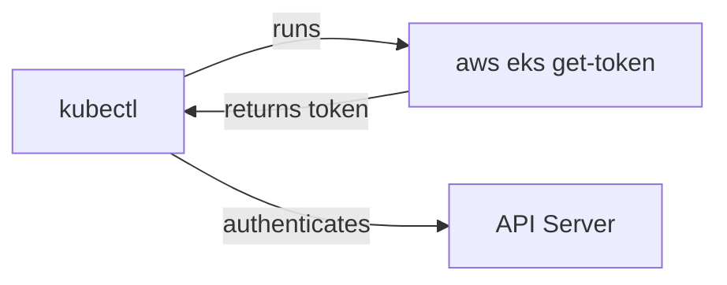

# Authentication Methods

The "user" section of your kubeconfig determines **how** you prove your identity to the cluster. Kubernetes supports several authentication methods, each suited to different environments. Understanding them helps you troubleshoot "unauthorized" errors and choose the right approach for your setup.

## Client Certificate Authentication

The most common method for self-managed clusters (kubeadm, k3s). Your kubeconfig contains a certificate and private key:

```yaml
users:
  - name: admin
    user:
      client-certificate-data: <base64-encoded-cert>
      client-key-data: <base64-encoded-key>
```

Or references to files:

```yaml
users:
  - name: admin
    user:
      client-certificate: /path/to/client.crt
      client-key: /path/to/client.key
```

The API server validates the certificate against its CA on every request. Certificate auth is **stateless:** no tokens to refresh, no sessions to maintain. The tradeoff: certificates have expiration dates, and you need to rotate them before they expire.

:::info
Client certificates are embedded in the kubeconfig or referenced as files. The certificate's Common Name (CN) becomes the username, and the Organization (O) field becomes the group. This is how RBAC knows who you are.
:::

## Token Authentication

Bearer tokens are simpler — a single string that proves your identity:

```yaml
users:
  - name: token-user
    user:
      token: eyJhbGciOiJSUzI1NiIs...
```

Tokens are common with managed Kubernetes services and ServiceAccount authentication. They can be:

- **Long-lived:** Static tokens that don't expire (less secure)
- **Short-lived:** Tokens with expiration (more secure, need refresh)

Static tokens in kubeconfig don't rotate automatically — you need to update them manually or use automation.

## Exec-Based Authentication

The recommended approach for cloud-managed clusters (EKS, GKE, AKS). Instead of storing credentials, kubeconfig runs a command that fetches fresh tokens at runtime:

```yaml
users:
  - name: eks-user
    user:
      exec:
        apiVersion: client.authentication.k8s.io/v1beta1
        command: aws
        args:
          - eks
          - get-token
          - --cluster-name
          - my-cluster
```

When kubectl needs to authenticate:

1. It runs the command (`aws eks get-token --cluster-name my-cluster`)
2. The command returns a short-lived token via stdout
3. kubectl uses that token for the API request



No credentials are stored in the kubeconfig file — they're generated on demand from your cloud provider session. This is the most secure approach for cloud environments.

## Which Method to Use?

| Environment                 | Recommended Method            | Why                                 |
| --------------------------- | ----------------------------- | ----------------------------------- |
| Self-managed (kubeadm, k3s) | Client certificates           | Standard, built-in                  |
| AWS EKS                     | Exec (aws eks get-token)      | Short-lived tokens, IAM integration |
| GCP GKE                     | Exec (gke-gcloud-auth-plugin) | Short-lived tokens, Google auth     |
| Azure AKS                   | Exec (kubelogin)              | Short-lived tokens, Azure AD        |
| CI/CD pipelines             | ServiceAccount token          | Scoped, automatable                 |

## Security Best Practices

- **File permissions:** `chmod 600 ~/.kube/config` to restrict access
- **Credential rotation:** Certificates expire; set reminders to rotate them
- **Prefer exec-based auth:** No long-lived credentials stored on disk
- **Never commit kubeconfig:** Use environment variables or secret managers in CI/CD

:::warning
kubeconfig files grant cluster access. A stolen kubeconfig with admin credentials gives full control of your cluster. Restrict file permissions, rotate credentials regularly, and prefer exec-based auth where possible.
:::

## Troubleshooting Auth Failures

When kubectl says "unauthorized" or "unable to connect", check which credentials are being used with `kubectl config view --minify`, test the connection with `kubectl cluster-info`, and for cert-based auth verify expiration with `openssl x509`. For exec-based auth, run the exec command manually (e.g. `aws eks get-token --cluster-name my-cluster`) to debug.

---

## Hands-On Practice

### Step 1: Inspect the auth section of your current context

```bash
kubectl config view --minify
```

The `--minify` flag shows only the configuration for the active context. Look at the `users` section — you'll see `client-certificate-data`, `token`, or `exec` depending on your authentication method. This helps you understand how kubectl authenticates to your cluster.

## Wrapping Up

kubeconfig supports client certificates (self-managed clusters), bearer tokens (simple setups), and exec-based authentication (cloud-managed clusters). Exec-based auth is the most secure because no credentials are stored on disk. Regardless of the method, protect your kubeconfig file, rotate credentials regularly, and always verify your current context before running commands.
