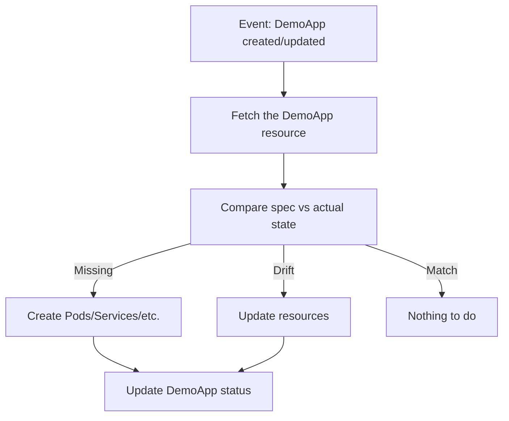

# Operator SDK and Frameworks

Building an Operator from scratch means writing a lot of plumbing: setting up API watchers, managing work queues, wiring up the reconciliation loop, generating CRD manifests, creating Dockerfiles... That's a lot of infrastructure code before you even start writing business logic.

The **Operator SDK** exists to take care of all that boilerplate. It scaffolds a complete Operator project for you, so you can focus on what matters: the reconciliation logic that makes your Operator smart.

## The Operator Framework Ecosystem

The Operator SDK is part of the broader <a target="_blank" href="https://operatorframework.io/">Operator Framework</a>, which includes:

- **Operator SDK:**  The CLI tool that scaffolds, builds, and tests Operators
- **Kubebuilder:**  The underlying Go library that provides the project structure and conventions
- **controller-runtime:**  The Go library that handles watchers, caches, informers, and the reconciliation loop
- **OLM:**  The Operator Lifecycle Manager for catalog-based installation (covered in the next lesson)

Think of it as a layered toolkit. The Operator SDK sits on top of Kubebuilder, which sits on top of controller-runtime. Each layer adds convenience — you can work at whichever level suits your needs.

:::info
The Operator SDK supports three approaches: **Go** (full control, best for complex Operators), **Helm** (wraps existing Helm charts as Operators), and **Ansible** (uses Ansible playbooks for reconciliation). Go is the most common for production Operators.
:::

## Scaffolding a New Operator

Creating a new Operator project takes two commands:

```bash
# Initialize the project
operator-sdk init --domain example.com --repo github.com/example/my-operator

# Add a new API (CRD) and controller
operator-sdk create api --group apps --version v1 --kind DemoApp --resource --controller
```

The first command creates the project structure — `go.mod`, `Makefile`, `Dockerfile`, and configuration directories. The second command generates your CRD types, a controller skeleton, and wires everything together.

## Understanding the Project Structure

After scaffolding, your project looks like this:

```
my-operator/
├── Dockerfile              # Build the Operator image
├── Makefile                # Common tasks (install CRDs, run, deploy)
├── config/
│   ├── crd/                # Generated CRD manifests
│   ├── manager/            # Operator Deployment manifest
│   └── rbac/               # RBAC rules for the Operator
├── api/
│   └── v1/
│       └── demoapp_types.go    # Your custom resource types (spec, status)
├── controllers/
│   └── demoapp_controller.go   # Your reconciliation logic goes here
└── main.go                 # Entry point
```

The two files you'll spend the most time in are:

- `api/v1/demoapp_types.go` — Where you define the fields of your custom resource (the `Spec` and `Status` structs)
- `controllers/demoapp_controller.go` — Where you write the `Reconcile()` function that brings your resources to life

## The Reconcile Function

The heart of every Operator is the `Reconcile()` function. It receives an event (a resource was created, updated, or deleted) and your job is to make the cluster match the desired state:



The framework takes care of watching resources, queuing events, and calling your function. You focus on the logic: "If the resource says 3 replicas but only 2 exist, create one more."

## The Development Workflow

Here's the typical cycle when building an Operator:

```bash
# 1. Install CRDs into your cluster
make install

# 2. Run the Operator locally (outside the cluster, for fast iteration)
make run

# 3. Create a test resource
kubectl apply -f config/samples/apps_v1_demoapp.yaml

# 4. Watch what happens
kubectl get demoapp
kubectl get pods
```

For production, you build a container image and deploy the Operator into the cluster:

```bash
make docker-build docker-push IMG=my-registry/my-operator:v1
make deploy IMG=my-registry/my-operator:v1
```

:::warning
Always make your `Reconcile()` function **idempotent**. It may be called multiple times for the same state — on network retries, after restarts, or when related resources change. Running reconcile twice should produce the same result as running it once.
:::

## A Note About Generated CRDs

The SDK generates CRD manifests from your Go types using markers (comments like `// +kubebuilder:validation:Required`). Review the generated CRDs before deploying — you may want to add validation rules, default values, or printer columns that make `kubectl get` output more readable.

## Common Pitfalls

- **Forgetting to run `make manifests`** after changing your types — the CRD won't reflect your changes
- **Non-idempotent reconciliation:**  If your controller creates a Pod every time it reconciles (instead of checking if one already exists), you'll end up with hundreds of Pods
- **Missing RBAC rules:**  The controller needs permission to create the resources it manages. Use `// +kubebuilder:rbac` markers to declare them

## Wrapping Up

The Operator SDK and Kubebuilder dramatically reduce the effort of building Operators. Two commands give you a complete project scaffold; from there, you define your types and implement `Reconcile()`. The framework handles watchers, queues, caching, and API interactions. In the next lesson, we'll look at OLM — a system for distributing and managing Operators across clusters.
