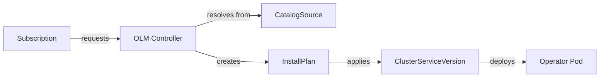

# Operator Lifecycle Manager (OLM)

Installing an Operator by hand means applying CRDs, creating RBAC rules, deploying the controller, and then manually checking for updates. It works, but it doesn't scale well — especially when you're managing a dozen Operators across multiple clusters.

The **Operator Lifecycle Manager (OLM)** takes a different approach. Think of it as an app store for Operators: you browse a catalog, pick what you need, and OLM handles installation, dependency resolution, and upgrades for you.

## Why OLM Exists

Without OLM, every Operator has its own installation process. Some use Helm, others use raw manifests, and each has different upgrade procedures. OLM standardizes this by introducing a catalog-based model:

- **Browse:**  Discover Operators from curated catalogs (like <a target="_blank" href="https://operatorhub.io/">OperatorHub.io</a>)
- **Subscribe:**  Tell OLM which Operator you want and which update channel to follow
- **Install:**  OLM resolves dependencies, generates an installation plan, and applies everything
- **Upgrade:**  When a new version appears in the channel, OLM handles the upgrade automatically

This is particularly valuable in enterprise environments where you need consistent, auditable Operator management across many clusters.

:::info
OLM is built into <a target="_blank" href="https://www.redhat.com/en/technologies/cloud-computing/openshift">OpenShift</a> by default. For vanilla Kubernetes clusters, you can install it using the <a target="_blank" href="https://operatorframework.io/">Operator Framework</a> project. It's optional — many teams manage Operators with Helm instead, and that's perfectly fine.
:::

## How OLM Works

OLM introduces a few custom resources that work together:



- **CatalogSource:**  Points to a catalog of available Operators (like a package repository)
- **Subscription:**  Declares "I want this Operator from this catalog, on this channel"
- **InstallPlan:**  A list of everything OLM needs to apply (CRDs, RBAC, Deployments)
- **ClusterServiceVersion (CSV):**  Represents an installed version of an Operator, including its metadata and status

When you create a Subscription, OLM looks up the Operator in the catalog, resolves any dependencies (some Operators require other Operators), generates an InstallPlan, and applies the manifests. The Operator Pod starts running and begins watching for its custom resources.

## Installing an Operator with OLM

Here's what a Subscription looks like. It tells OLM: "Install `my-operator` from the `operatorhubio-catalog`, following the `stable` channel."

```yaml
apiVersion: operators.coreos.com/v1alpha1
kind: Subscription
metadata:
  name: my-operator
  namespace: operators
spec:
  channel: stable
  name: my-operator
  source: operatorhubio-catalog
  sourceNamespace: olm
```

Once you apply this, OLM takes over. It resolves the Operator, creates the InstallPlan, and applies everything needed. You don't have to manage CRDs or RBAC manually.

## Checking OLM Status

After creating a Subscription, you'll want to verify that everything installed correctly:

```bash
# List all Subscriptions — your requests for Operators
kubectl get subscriptions -A

# Check installed Operator versions and their health
kubectl get csv -A

# View pending or completed installation plans
kubectl get installplans -A
```

A healthy setup shows the CSV in `Succeeded` phase and the Operator Pod running. If something goes wrong, the CSV status will tell you what failed.

## Handling Upgrades

One of OLM's strengths is automated upgrades. When a new Operator version appears in the catalog channel, OLM detects it and creates a new InstallPlan. Depending on your configuration, upgrades can be:

- **Automatic:**  OLM applies the upgrade as soon as it's available
- **Manual:**  OLM creates the InstallPlan but waits for you to approve it

For production clusters, manual approval gives you control over when upgrades happen. You can review the InstallPlan, test in a staging environment first, and then approve.

:::warning
OLM adds significant complexity to your cluster. Evaluate whether you need catalog-based management before adopting it. For small teams or clusters with a few Operators, Helm or raw manifests are simpler and easier to debug. OLM shines when you manage many Operators across multiple clusters and need standardized lifecycle management.
:::

## Common Pitfalls

- **InstallPlan stuck:**  Usually a dependency resolution issue or a missing CatalogSource. Check OLM operator Pod logs for details.
- **Wrong namespace:**  Make sure the `sourceNamespace` matches where your CatalogSource is installed (often `olm`).
- **Catalog not refreshed:**  Catalogs cache their contents. If a new Operator version isn't showing up, check that the CatalogSource Pod is healthy and its index is up to date.

## Wrapping Up

OLM provides a standardized way to discover, install, upgrade, and manage Operators. It's catalog-based — you subscribe to an Operator and OLM handles the rest. While it adds complexity, it's invaluable for large-scale environments where consistent Operator management matters. For simpler setups, Helm or raw manifests remain perfectly valid alternatives.
