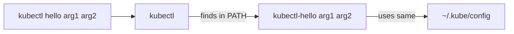

# What Are kubectl Plugins?

You've been using `kubectl` for a while now — `get`, `apply`, `delete`, `describe`. These commands cover the essentials, but what if you find yourself repeating the same sequence of commands every day? Or what if you wish `kubectl` had a command that doesn't exist?

That's exactly what **kubectl plugins** are for. They let you add custom subcommands to `kubectl`, extending it with new capabilities. And the best part? It's surprisingly simple.

## How Plugins Work

A kubectl plugin is just an executable file — a script or compiled binary — with a name that follows the pattern `kubectl-<name>`. Place it anywhere in your `PATH`, and kubectl will automatically discover it. When you type `kubectl <name>`, kubectl finds the matching executable and runs it.

No registration. No configuration file. No restart needed. If the file exists in your PATH and is executable, it works.

Think of it like browser extensions. Your browser has built-in features, but extensions add new capabilities that feel like they belong. kubectl plugins work the same way — they appear as native subcommands, but they're separate programs that you or the community have written.



:::info
Plugins inherit your `KUBECONFIG` and current context automatically. They interact with the same cluster you're already connected to, unless they explicitly override the configuration.
:::

## What Can Plugins Do?

Plugins can do anything a regular program can do. Some common use cases:

- **Switch contexts quickly:**  `kubectl ctx` (much faster than `kubectl config use-context`)
- **Clean up YAML output:**  `kubectl neat` removes managed fields from `kubectl get -o yaml`
- **View resource trees:**  `kubectl tree` shows owner relationships between resources
- **Manage secrets:**  `kubectl view-secret` decodes and displays secret values
- **Analyze costs:**  Community plugins that estimate resource costs

There's a rich ecosystem of community plugins — we'll explore how to discover them with Krew in a later lesson.

## Discovering Installed Plugins

To see which plugins are available on your system, run `kubectl plugin list`. This scans every directory in your `PATH` and lists all executables matching the `kubectl-*` pattern. If you see nothing, you simply don't have any plugins installed yet.

To find where a specific plugin lives:

```bash
which kubectl-ctx
```

## A Minimal Plugin Example

Let's create the simplest possible plugin — a Bash script that lists all namespaces:

```bash
#!/bin/bash
# Save this as kubectl-ns
echo "Namespaces in your cluster:"
kubectl get namespaces
```

Make it executable and place it in your PATH:

```bash
chmod +x kubectl-ns
mv kubectl-ns /usr/local/bin/
```

Now `kubectl ns` works as a new subcommand. That's all there is to it. The plugin can be written in any language — Bash, Python, Go, Rust — as long as the file is executable and named correctly.

## How kubectl Finds Plugins

When you type `kubectl myplugin`, kubectl:

1. Checks if `myplugin` is a built-in command (like `get`, `apply`, `delete`)
2. If not, scans `PATH` for an executable named `kubectl-myplugin`
3. If found, runs it and passes all remaining arguments

This means plugins **cannot override built-in commands**. You can't replace `kubectl get` with your own version — kubectl will always use the built-in one. Choose unique names for your plugins.

:::warning
Plugins run with **your credentials**. A plugin has the same access to the cluster as you do. Only install plugins from sources you trust, and be cautious with plugins that modify cluster state or handle secrets.
:::

---

## Hands-On Practice

### Step 1: List Installed Plugins

```bash
kubectl plugin list
```

Scans PATH for executables matching `kubectl-*`. If you see nothing, no plugins are installed yet.

### Step 2: Check Where Plugins Could Live

```bash
which kubectl-ctx 2>/dev/null || echo "kubectl-ctx not found"
echo $PATH | tr ':' '\n' | grep -E 'bin|krew'
```

Common plugin locations: `/usr/local/bin`, `~/.krew/bin`. If Krew is installed, you'll see its path.

## Common Pitfalls

- **Plugin not found:**  Make sure the file is in a directory listed in `PATH` and that it's executable (`chmod +x`)
- **Name collision with built-in:**  Plugins can't override built-in kubectl commands. If your plugin name matches one, kubectl will silently use the built-in
- **No shebang:**  For scripts, always include a shebang line (`#!/bin/bash` or `#!/usr/bin/env python3`). Without it, the system may not know how to execute the file

## Wrapping Up

kubectl plugins are a simple but powerful way to extend your command-line toolkit. Any executable named `kubectl-<name>` in your PATH becomes a new kubectl subcommand — no configuration needed. In the next lesson, we'll create a more useful plugin step by step, and after that, we'll explore Krew, the plugin manager that makes discovering and installing community plugins effortless.
