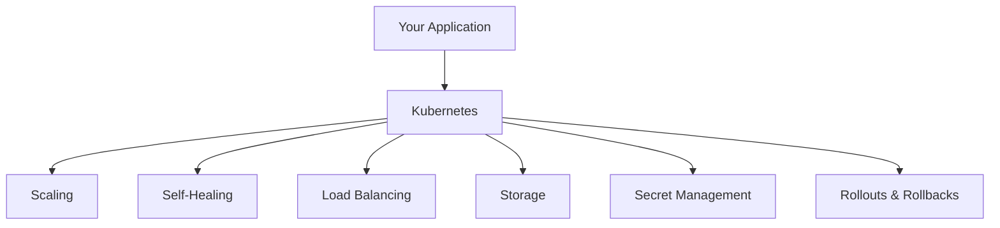

# What Is Kubernetes?

## The Problem: Managing Containers at Scale

Picture a busy shipping port. Hundreds of containers arrive every day, and someone needs to decide which ship carries each one, reroute cargo when a ship breaks down, and make sure nothing gets lost along the way. Now replace "shipping containers" with "software containers" and "ships" with "servers." That is the challenge Kubernetes was built to solve.

Without an orchestrator, running many containers across many servers becomes chaotic. You must manually decide where each container runs, restart failed ones yourself, and figure out how traffic reaches the right place. As the number of containers grows, this manual approach simply does not scale.

## Kubernetes: The Autopilot for Containers

**Kubernetes** (often abbreviated **K8s**, where the "8" stands for the eight letters between K and s) is an open-source platform for managing containerized workloads and services. Originally developed at Google and now maintained by the <a target="_blank" href="https://www.cncf.io/">Cloud Native Computing Foundation (CNCF)</a>, it provides a framework to run distributed systems reliably, even when individual components fail.

Here is the key idea: you tell Kubernetes _what_ you want (for example, "run three copies of my web app"), and it figures out _how_ to make that happen. If a container crashes, Kubernetes replaces it. If traffic spikes, it can scale up. You set the destination; Kubernetes handles the steering.

:::info
The name "Kubernetes" comes from Greek, meaning "helmsman" or "pilot." The wheel in the Kubernetes logo represents a ship's helm.

The **CNCF** (Cloud Native Computing Foundation) is the vendor-neutral foundation that governs Kubernetes itself. Throughout this course, you will encounter several of these tools; knowing they share the same foundation explains why they integrate so well together. You can browse the full ecosystem on the <a target="_blank" href="https://landscape.cncf.io/">CNCF Landscape</a>.
:::

## What Kubernetes Provides

- **Service discovery and load balancing**: Kubernetes gives each service a stable DNS name or IP address and distributes traffic across healthy instances.
- **Storage orchestration**: It can mount storage systems such as local disks, cloud volumes, or network file systems automatically.
- **Automated rollouts and rollbacks**: You can update your application gradually and roll back instantly if something goes wrong.
- **Self-healing**: Failed containers are restarted, unresponsive instances are replaced, and unhealthy workloads are hidden from traffic until they recover.
- **Automatic bin packing**: Kubernetes places containers on nodes to use CPU and memory efficiently, like a game of Tetris where the blocks are your workloads.
- **Secret management**: Sensitive data such as passwords and API keys can be stored and delivered to containers without baking them into images.



## What Kubernetes Is Not

Understanding boundaries is just as important as understanding features. Kubernetes is **not** a traditional Platform-as-a-Service (PaaS). It operates at the container level and provides building blocks rather than complete solutions:

- It does **not** build your application or deploy source code. That is the job of a CI/CD pipeline.
- It does **not** provide built-in databases, message brokers, or caching layers. You bring your own or install them as workloads.
- It does **not** dictate logging, monitoring, or alerting solutions. You choose the tools that fit your needs.

:::warning
Kubernetes is powerful but deliberately unopinionated. It gives you the building blocks; you decide how to assemble them. This flexibility is a strength, but it also means you have architectural choices to make.
:::

---

## Hands-On Practice

### Check Cluster Connectivity

```bash
kubectl cluster-info
```

This prints the API server address and confirms your `kubectl` can reach the cluster.

### List Your Nodes

```bash
kubectl get nodes
```

Every capability in Kubernetes is exposed through an API. This command shows the machines (nodes) that make up your cluster. If both commands succeed, your environment is ready to go.

## Wrapping Up

Kubernetes takes the burden of container orchestration off your shoulders. You describe a desired state, and it works continuously to make that state a reality through scheduling, scaling, healing, and balancing. Rather than a one-stop platform, it is a set of composable building blocks that give you control without the chaos. With this understanding in place, the next lesson explores how we got here: the evolution from physical servers to containers, and why that journey made orchestration necessary.
