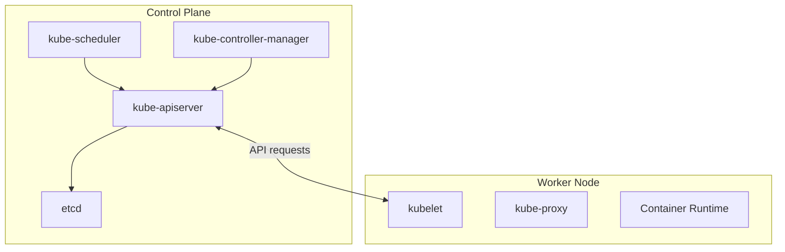

# Cluster Architecture

## The Big Question: Who Runs What?

When you tell Kubernetes "run three copies of my application," something has to decide *where* those copies go, *how* they are monitored, and *what happens* when one of them fails. That "something" is the cluster architecture: a carefully designed split between the components that make decisions and the components that carry them out.

Think of it like a restaurant. The **kitchen manager** (control plane) takes orders, decides which station prepares each dish, and monitors quality. The **cooks** (worker nodes) do the actual cooking. Both are essential, but they have very different responsibilities.

## Two Halves of a Cluster

Every Kubernetes cluster has two main parts:

1. **The Control Plane:** The brain of the cluster. It stores the desired state, makes scheduling decisions, and runs the reconciliation loops that keep everything aligned.
2. **Worker Nodes:** The muscle. Each node runs your actual application containers and reports back to the control plane.

Every cluster needs at least one worker node to run workloads. In production, the control plane typically runs on multiple machines for fault tolerance, and you can add worker nodes independently as demand grows.



## Control Plane Components

Let's explore each piece of the brain, don't worry, we will come back to each of these components in more detail later, this is just to give you a quick overview:

- **kube-apiserver:** The front door of the cluster. Every request, whether from users, internal components, or external tools, passes through the API server. It validates requests, enforces policies, and stores the results in etcd. If the API server is down, the cluster cannot accept new instructions.

- **etcd:** A highly available key-value store that holds all cluster data. It is the single source of truth. Every object you create, every Pod, every Deployment, lives here. Think of etcd as the filing cabinet where Kubernetes keeps its official records.

- **kube-scheduler:** Watches for newly created Pods that have no assigned node, then picks the best node for each one based on resource requirements, constraints, and policies. It is like a seating planner at a wedding: matching guests (Pods) to tables (nodes) based on preferences and capacity.

- **kube-controller-manager:** Runs a collection of controllers, each responsible for a specific reconciliation loop. The Node controller monitors node health, the Deployment controller manages rollouts, and the Job controller tracks batch tasks. Together, they ensure the actual state converges toward the desired state.

- **cloud-controller-manager** *(optional:)* Handles cloud-provider-specific logic, such as provisioning load balancers or managing cloud routes. Not needed for local or bare-metal clusters.

## Worker Node Components

And here are the components that do the heavy lifting on each node:

- **kubelet:** An agent that runs on every node. It receives PodSpecs (descriptions of what should run) from the API server and ensures the right containers are started and healthy. If a container crashes, the kubelet restarts it.

- **kube-proxy:** Maintains network rules that allow Pods to communicate with each other and with the outside world. Some advanced networking plugins replace kube-proxy entirely.

- **Container runtime:** The software that actually runs containers. Common choices include containerd and CRI-O. It must implement the Container Runtime Interface (CRI) so the kubelet can manage it.

:::info
In high-availability setups, etcd is often run on dedicated machines to improve performance and reliability, since it is sensitive to disk latency.
:::

## Why This Separation Matters

You might wonder: why not put everything on one machine? Separating the control plane from worker nodes brings real advantages. You can scale compute capacity (add more worker nodes) without touching the control plane. The control plane stays small and stable while the workers grow with demand. If a worker node goes down, the control plane notices and reschedules the affected workloads onto healthy nodes. This pattern, a small brain coordinating many workers, is a proven design in distributed systems.

:::warning
In production, avoid running user workloads on control plane nodes. Keep the brain focused on coordination, not application work. Use `kubectl describe node <name>` to inspect the details and conditions of any node.
:::

---

## Hands-On Practice

### List the Nodes

```bash
kubectl get nodes -o wide
```

This shows the machines in your cluster, both control plane and worker nodes, depending on your setup. The `-o wide` is used to get more information about the nodes.

### Step 2: Inspect System Components

```bash
kubectl get pods -n kube-system
```

These are the Pods that keep the cluster itself running: DNS, proxies, and other infrastructure components. Seeing them helps connect the architecture theory to what is actually running.

## Wrapping Up

A Kubernetes cluster is a partnership between a control plane that makes decisions and worker nodes that carry them out. The API server serves as the single entry point, etcd stores the truth, the scheduler places workloads, and controllers keep everything aligned. On each node, the kubelet drives containers while kube-proxy handles networking. Understanding this architecture helps you reason about where things run and what to check when something goes wrong. Next, we will look at the API server in more detail, the gateway through which every action in Kubernetes flows.
