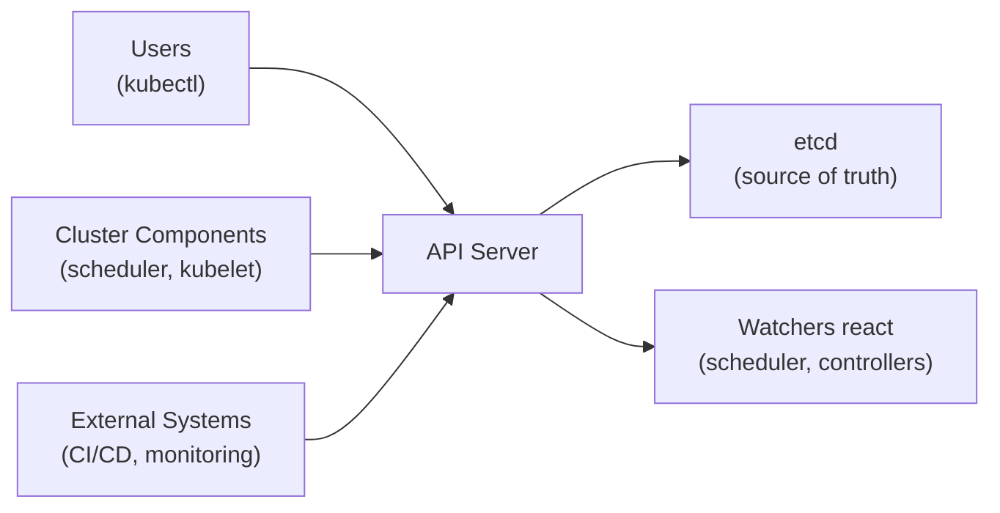

# The Kubernetes API

## Why a Single Entry Point?

Imagine a company where every department has its own mailroom, its own security desk, and its own set of rules for who gets in. Communication would be a nightmare. Kubernetes avoids that chaos by routing _everything_ through a single gateway: the **API server**. Creating a Pod, updating a Deployment, checking the health of a node: every action is an API call that passes through this one component.

This centralization is not a bottleneck; it is a deliberate design choice that makes security, validation, and auditing far simpler. One door means one lock to check, one log to review, and one set of rules to enforce.

## How the API Server Works

The **kube-apiserver** is the core of the Kubernetes control plane. When you run a command like `kubectl create deployment nginx --image=nginx`, here is what happens behind the scenes:

1. `kubectl` translates your command into an HTTP request.
2. The API server **authenticates** your identity (who are you?).
3. It **authorizes** your request (are you allowed to do this?).
4. It runs **admission controllers** that can validate or modify the request.
5. If everything passes, the object is stored in **etcd**.
6. Other components, like the scheduler and kubelet, watch for changes and react.

Think of the API server as a hotel front desk. Every guest (request) checks in, shows ID (authentication), confirms their reservation (authorization), and gets assigned a room (stored in etcd). Behind the scenes, housekeeping and room service (controllers, scheduler) spring into action.



Nothing bypasses the API server. If it is down, the cluster cannot accept new instructions, though existing workloads continue to run on their nodes.

## Three Ways to Talk to the API

You are not limited to `kubectl`. There are three common ways to interact with the Kubernetes API:

- **kubectl:** The command-line tool you have been using. It translates human-friendly commands into API requests. When you type `kubectl get pods`, it sends a GET request to the Pods endpoint and formats the response as a table.

- **REST calls:** You can use `curl` or any HTTP client to talk to the API directly. This is useful for automation scripts and custom integrations.

- **Client libraries:** Official SDKs exist for Go, Python, Java, and other languages. They handle authentication and request formatting, making it easier to build applications that interact with Kubernetes programmatically.

:::info
`kubectl` fetches and caches the API specification from the cluster, which is how it knows what resources and commands are available. When you type `kubectl get` and press Tab, the suggestions come from this cached specification.
:::

## Discoverability: The API Describes Itself

One of the most practical features of the Kubernetes API is that it is self-describing. The **Discovery API** publishes a list of all available resources, and the **OpenAPI document** provides detailed schemas. This means tools like `kubectl` can validate your manifests before sending them and offer tab completion for resource types and field names. You might wonder why this matters: it means you can explore the API without ever leaving your terminal.

## Common Errors and What They Mean

When working with the API, you may encounter a few common errors:

- **401 Unauthorized:** Your credentials are invalid or missing. Check your kubeconfig.
- **403 Forbidden:** You are authenticated, but you do not have permission. This is an RBAC (Role-Based Access Control) issue. Inspect the RoleBindings for your user or ServiceAccount.
- **Connection refused:** The API server is unreachable. Use `kubectl cluster-info` to verify connectivity.

:::warning
Never bypass the API server by modifying etcd directly or communicating with components outside the API. The API server enforces authentication, authorization, and admission. Skipping it means skipping your security controls.
:::

---

## Hands-On Practice

### Step 1: List API Versions

```bash
kubectl api-versions
```

This shows which API groups and versions (like `apps/v1`, `batch/v1`) your cluster supports. The API is self-describing — tools like `kubectl` use this to know what resources exist.

### Step 2: List API Resources

```bash
kubectl api-resources
```

This lists every type of object the API can manage.

### Step 3: Hit the API root directly

```bash
kubectl get --raw /
```

This returns the raw JSON of the API root — the list of all top-level paths the API server exposes. This is the Discovery API in action.

### Step 4: Query a specific API path

```bash
kubectl get --raw /api/v1/namespaces
```

This calls the REST endpoint for namespaces directly, bypassing `kubectl get namespaces` formatting. You see the raw JSON response exactly as the API server returns it — useful for understanding what `kubectl` does under the hood.

## Wrapping Up

The API server is the beating heart of a Kubernetes cluster. Every action, from `kubectl` commands to automated deployments, flows through it, ensuring consistent authentication, authorization, and validation. Understanding that every command you run is an API call under the hood gives you a clearer mental model of how Kubernetes operates. With this foundation, you are ready to explore the building blocks of that API: Kubernetes objects.
