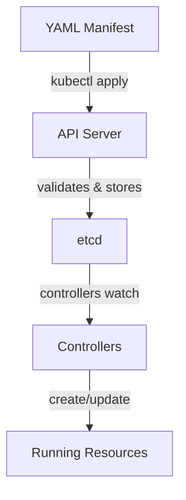

# Kubernetes Objects

## Why Objects?

Up to now, you have seen Kubernetes described as an orchestrator that schedules containers, heals failures, and balances traffic. But how does it know *what* you want it to do? The answer is **objects**. Every intention you express to Kubernetes, whether it is "run this container," "expose this service," or "store this config," is recorded as an object. Objects are persistent records stored in etcd, and Kubernetes continuously works to make reality match what those records describe.

Think of objects as entries in a to-do list that never gets lost. You write down "run three copies of my web app," and Kubernetes keeps checking that list, making sure all three copies are always running. If one disappears, it creates a replacement, because the to-do item still says "three."

## What Objects Describe

Kubernetes objects capture three main aspects of your cluster:

- **What is running:**  Which containerized applications are deployed and on which nodes.
- **What resources they have:**  CPU, memory, storage, and network configuration.
- **How they behave:**  Restart policies, update strategies, and fault-tolerance rules.

You create and change objects through the Kubernetes API. When you run a `kubectl` command or apply a YAML manifest, you are sending an API request that creates or modifies an object. The API server validates your input, stores the object in etcd, and controllers take action to bring the cluster in line with your intent.

## The Anatomy of a Manifest

Every Kubernetes object is described by a **manifest**, a YAML (or JSON) file with a consistent structure. Four fields are required in every manifest:

| Field | Purpose | Example |
|---|---|---|
| `apiVersion` | Which version of the API to use | `v1`, `apps/v1` |
| `kind` | The type of object | `Pod`, `Deployment`, `Service` |
| `metadata` | Identity: name, namespace, labels | `name: nginx-demo` |
| `spec` | The desired state you want | Containers, ports, replicas |

Here is a concrete example:

```yaml
apiVersion: v1
kind: Pod
metadata:
  name: nginx-demo
spec:
  containers:
    - name: nginx
      image: nginx:1.14.2
      ports:
        - containerPort: 80
```

This manifest says: "Create a Pod named `nginx-demo` that runs one container using the `nginx:1.14.2` image, listening on port 80." The `spec` section is where the real detail lives, and its structure varies depending on the `kind` of object. You might wonder whether you need to memorize all these fields. You do not. Kubernetes has a built-in reference you can query at any time (we will try it shortly).



:::info
When you create an object, Kubernetes assigns it a unique **UID** that never changes. Even if you delete and recreate an object with the same name, the new one gets a different UID. The name must be unique within a namespace, but the UID is unique across the entire cluster.
:::

:::warning
Resource names must be unique within a namespace. If you try to create a Pod with a name that already exists, the API server will reject the request. Use `kubectl get pods` to check what is already running before creating new objects.
:::

---

## Hands-On Practice

### Step 1: List all resource types in the cluster

```bash
kubectl api-resources
```

Each row is a different kind of Kubernetes object.

### Step 2: Examine a running object in YAML format

```bash
kubectl get pods -o yaml
```

Identify the four required fields: `apiVersion`, `kind`, `metadata`, and `spec`.

### Step 3: Use `kubectl explain` to discover object fields

```bash
kubectl explain pod.spec.containers
```

This shows the available fields and their descriptions — a built-in reference for writing manifests.

## Wrapping Up

Objects are the language you use to communicate with Kubernetes. Every manifest follows the same four-field structure, `apiVersion`, `kind`, `metadata`, and `spec`, whether you are creating a Pod, a Deployment, or a Service. You describe your intent in the `spec`, and Kubernetes works to make it real. In the next lesson, you will discover how Kubernetes tracks progress toward that intent through the `spec` and `status` pattern, the feedback loop at the heart of the system.
