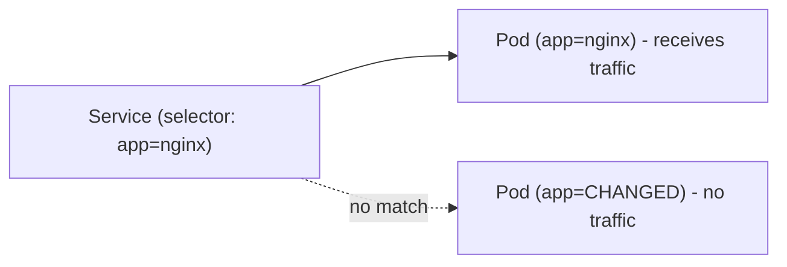

# Adding Labels

Labels are only useful if they're actually present on your resources — and present consistently. In this lesson, you'll learn how to add labels when creating resources, update them on existing objects, and remove labels you no longer need.

## Labels in Manifests

The most common way to add labels is in your YAML manifests, under `metadata.labels`:

```yaml
apiVersion: v1
kind: Pod
metadata:
  name: nginx-pod
  labels:
    app: nginx
    env: dev
    tier: frontend
spec:
  containers:
    - name: nginx
      image: nginx
```

When you `kubectl apply` this manifest, the Pod is created with all three labels. This is the recommended approach — labels in manifests are version-controlled and reproducible.

## Adding Labels to Existing Resources

Sometimes you need to label resources that already exist — maybe they were created without labels, or your labeling scheme has evolved. Use `kubectl label`. This is also useful for quick experiments or temporary tagging during debugging.

## Updating and Removing Labels

If a label already exists with a different value, kubectl refuses to overwrite it by default — a safety feature. Use `--overwrite` to change it. To remove a label entirely, append a hyphen (`-`) to the key name: the trailing hyphen is a kubectl convention that means "delete this key."

:::info
Use `--overwrite` when you intentionally want to change a label's value. Without it, kubectl protects you from accidental changes — especially important when labels control Service routing or controller behavior.
:::

## Be Careful with Selector Labels

Here's an important subtlety: some labels are used by **selectors:**  Services routing traffic, Deployments managing Pods. Changing or removing these labels can have real consequences:

- Removing a label that a Service selects means that Pod **stops receiving traffic**
- Changing a label that a Deployment uses means the Pod **becomes orphaned:**  the Deployment no longer manages it



This can actually be useful for debugging — temporarily removing a Pod from a Service's selector lets you inspect it without it receiving live traffic.

:::warning
Changing labels that Services or controllers rely on can break routing or orphan Pods. Always verify which selectors reference a label before modifying it. Use `kubectl get endpoints <service>` to check which Pods a Service currently selects.
:::

---

## Hands-On Practice

### Step 1: Create a Pod

```bash
kubectl run nginx-pod --image=nginx
kubectl get pods
```

Wait for the Pod to be Running. Replace `nginx-pod` with your Pod name if different.

### Step 2: Add a Label

```bash
kubectl label pod nginx-pod env=staging
```

### Step 3: Verify the Label

```bash
kubectl get pod nginx-pod --show-labels
```

You should see `env=staging` in the LABELS column.

### Step 4: Update and Remove a Label

```bash
kubectl label pod nginx-pod env=production --overwrite
kubectl label pod nginx-pod env-
```

The first command updates the value. The second removes the `env` label entirely (the trailing hyphen means "delete this key").

### Step 5: Clean Up

```bash
kubectl delete pod nginx-pod
```

## Wrapping Up

Adding labels in manifests ensures they're consistent and version-controlled. Use `kubectl label` to add or update labels on existing resources, `--overwrite` to change values, and `key-` to remove them. Always be mindful of selector labels — they control traffic routing and controller management. In the next lesson, we'll explore label selectors in detail — the mechanism that makes labels truly powerful.
