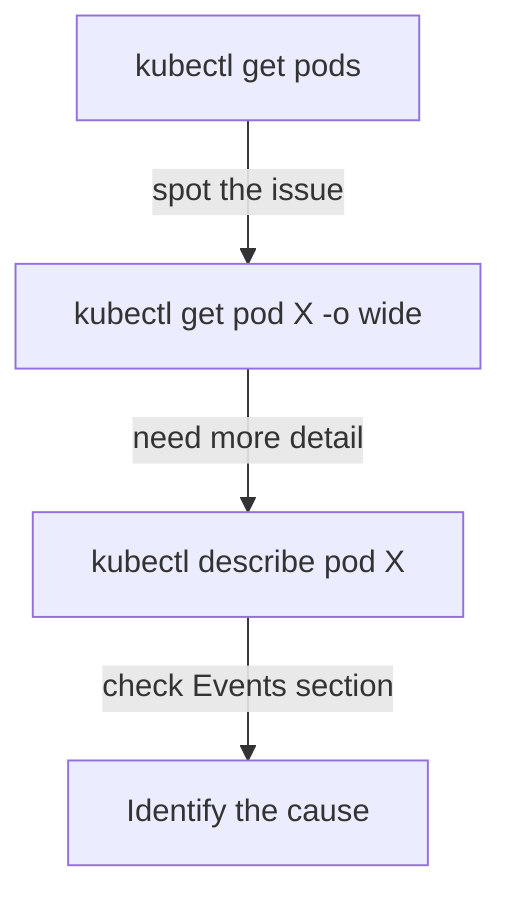

# Viewing Resources

Two kubectl commands will become your daily companions: `kubectl get` and `kubectl describe`. Together, they cover the vast majority of "What's happening in my cluster?" questions. Let's explore how to use them effectively.

## kubectl get — The Quick Overview

`kubectl get` shows resources in a concise table format. It's your first stop when you want to see what's running. The output is compact — name, status, age, and a few key fields. Perfect for scanning dozens of resources quickly.

## Making get More Useful

The basic output is just the beginning. Several flags transform `kubectl get` into a more powerful tool. The `-o wide` flag is particularly useful — it shows which node each Pod is running on and its IP address, essential for networking troubleshooting.

:::info
`kubectl get all` doesn't actually list **all** resource types — it covers Pods, Services, Deployments, ReplicaSets, and a few others. For a complete list of available resource types, use `kubectl api-resources`.
:::

## kubectl describe — The Full Picture

When you need to understand **why** something is happening (or not happening), `describe` is your go-to. The output includes everything `get` shows, plus:

- **Conditions:** Is the Pod scheduled? Are containers ready?
- **Events:** Recent activity: scheduling decisions, image pulls, restarts, errors
- **Full configuration:** All labels, annotations, volumes, resource requests

The **Events** section at the bottom is especially valuable. When a Pod is stuck in `Pending` or `CrashLoopBackOff`, the events tell you why — image pull failures, insufficient resources, scheduling conflicts.



## Discovering Resource Types

Kubernetes has many resource types beyond Pods and Deployments. Use `kubectl api-resources` to list what's available, or filter for specific types and namespaced vs cluster-scoped resources.

:::warning
If you run `kubectl get pods` and see nothing, check two things: Are you in the right **namespace**? (`kubectl config get-contexts`) And is the resource type correct? A common mistake is looking for Pods in `default` when they're in a different namespace. Use `-A` to search all namespaces.
:::

---

## Hands-On Practice

Ensure you have at least one Pod. Run `kubectl run nginx --image=nginx` or use resources from earlier lessons.

### Step 1: List Pods and Deployments

```bash
kubectl get pods
kubectl get deployments
kubectl get all
```

### Step 2: Add Extra Columns and Formats

```bash
kubectl get pods -o wide
kubectl get pods -A
kubectl get pod <pod-name> -o yaml
```

The `-o wide` flag shows node and IP. `-A` lists across all namespaces. `-o yaml` gives machine-readable output for debugging.

### Step 3: Describe a Pod

```bash
kubectl describe pod <pod-name>
```

Replace `<pod-name>` with a Pod name from Step 1. Check the Events section at the bottom — it explains scheduling, image pulls, and errors.

## Wrapping Up

`kubectl get` gives you fast, tabular overviews. `kubectl describe` gives you the full picture with events and conditions. Use `-o wide` for extra columns, `-A` for all namespaces, `-l` for label filtering, and `-o yaml` for machine-readable output. Together, these commands are your primary window into the cluster. In the next lesson, we'll look at `kubectl logs` and `kubectl exec` — the tools for looking inside running containers.
