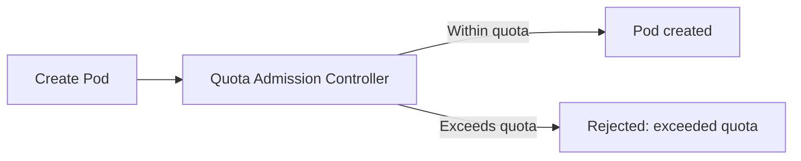

# What Are Resource Quotas?

Imagine a shared apartment building with a single water supply. If one tenant runs a pool-filling operation all day, the rest get a trickle. In a shared Kubernetes cluster, the same thing can happen: one namespace could consume all the CPU, memory, or create thousands of objects, leaving other teams struggling.

**ResourceQuotas** are the solution. They put a ceiling on what a namespace can consume — total CPU, memory, number of Pods, Services, PVCs, and more. Once a namespace hits its quota, any request that would exceed it is rejected.

## How ResourceQuotas Work

ResourceQuotas are enforced at **admission time:** the moment you try to create or update a resource. Here's the flow:

1. You run `kubectl apply` to create a Pod
2. The ResourceQuota admission controller checks: "Would this new Pod push the namespace over its quota?"
3. If yes, the request is **rejected** with a clear "exceeded quota" error
4. If no, the resource is created normally

An important detail: existing resources are not affected. If a namespace is already over quota (because the quota was added after resources existed), nothing is deleted — but no new resources can be created until usage drops below the limit.



## A Practical Example

Here's a quota that limits the `dev` namespace to 10 Pods, 2 CPU cores of requests, and 4Gi of memory requests:

```yaml
apiVersion: v1
kind: ResourceQuota
metadata:
  name: compute-quota
  namespace: dev
spec:
  hard:
    requests.cpu: '2'
    requests.memory: 4Gi
    limits.cpu: '4'
    limits.memory: 8Gi
    pods: '10'
```

This means the total `requests.cpu` across all Pods in the `dev` namespace can't exceed 2 cores. If there are already 8 Pods using 1.8 CPU cores and someone tries to create a Pod requesting 0.5 CPU, it will be rejected.

:::info
ResourceQuotas apply **per namespace**. Different namespaces can have different quotas, making them ideal for multi-tenant clusters where teams share the same infrastructure but need isolation.
:::

## Checking Quota Usage

To troubleshoot quota issues, use `kubectl describe resourcequota <name> -n <namespace>` — it shows `Hard` (the limit) and `Used` (current consumption) for each metric. When `Used` equals `Hard`, no more resources of that type can be created. To list all quotas across the cluster, use `kubectl get resourcequota -A`.

## When Quotas Cause Confusion

Quotas can surprise you. Here are the common scenarios:

**Pod stuck in Pending:** You might think it's a scheduling issue, but it's actually a quota issue. The Pod's requests would push the namespace over the limit. Check `kubectl describe resourcequota` before digging into scheduling.

**"Exceeded quota" error:** You need to either delete unused resources to free up quota, or ask an admin to increase the quota.

**Pods without requests/limits:** When a namespace has a compute quota (like `requests.cpu`), every Pod in that namespace **must** specify requests and limits. Otherwise, Kubernetes can't calculate quota usage, and the Pod is rejected. This often catches developers off guard.

:::warning
When a namespace has a compute ResourceQuota, all Pods in that namespace must specify `requests` and `limits` for the quoted resources. A Pod without them will be rejected — even if the namespace is well under quota. Combine ResourceQuotas with LimitRanges (covered in the next chapter) to automatically inject defaults.
:::

---

## Hands-On Practice

### Step 1: Check Existing ResourceQuotas

```bash
kubectl get resourcequotas -A
```

You may see quotas in namespaces like `kube-system` or custom namespaces. If the cluster has none, the output will be empty.

### Step 2: Create a ResourceQuota Manifest

Create a file `quota.yaml` with a simple quota (ensure you have a `dev` namespace, or use `default`):

```bash
cat <<'EOF' > quota.yaml
apiVersion: v1
kind: ResourceQuota
metadata:
  name: compute-quota
  namespace: dev
spec:
  hard:
    requests.cpu: "2"
    requests.memory: 4Gi
    pods: "10"
EOF
```

If needed, create the namespace first: `kubectl create namespace dev`

### Step 3: Apply and Verify the ResourceQuota

```bash
kubectl apply -f quota.yaml
kubectl describe resourcequota compute-quota -n dev
```

The `describe` output shows `Hard` (limits) and `Used` (current consumption) for each metric.

### Step 4: Clean Up

```bash
kubectl delete resourcequota compute-quota -n dev
kubectl delete -f quota.yaml 2>/dev/null || rm -f quota.yaml
```

## Wrapping Up

ResourceQuotas are your namespace-level budget. They cap total CPU, memory, and object counts, preventing any single namespace from monopolizing cluster resources. They're enforced at admission time, they require Pods to declare requests/limits, and they pair naturally with LimitRanges (which set per-Pod defaults). In the next lessons, we'll explore quota scopes — which let you apply different limits to different classes of workloads.
