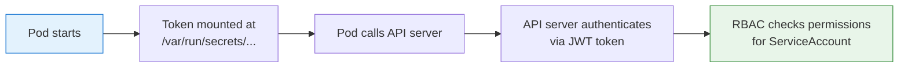

# What is a ServiceAccount?

When you interact with the Kubernetes API, you identify yourself — usually through a kubeconfig file with certificates or tokens. But what about the applications running _inside_ your cluster? When a Pod needs to list other Pods, create a ConfigMap, or watch for changes, it also needs an identity. That identity is a **ServiceAccount**.

Think of a ServiceAccount as a name badge for your workload. It does not grant any powers on its own — it simply tells the API server "this is who I am." Permissions come separately, through RBAC.

## Why ServiceAccounts Exist

Imagine a large company where every employee needs a badge to enter the building. Some employees only need access to the lobby; others need access to the server room. The badge identifies who they are; the access policy determines where they can go.

ServiceAccounts work the same way. They separate **identity** (who the workload is) from **authorization** (what the workload is allowed to do). This separation is a core security principle — it means you can change permissions without changing the workload's identity, and vice versa.

## The Default ServiceAccount

Every namespace in Kubernetes automatically has a ServiceAccount named `default`. If you create a Pod without specifying a ServiceAccount, Kubernetes assigns the `default` one from the Pod's namespace. The `default` ServiceAccount typically has minimal permissions — by design.

:::info
The `default` ServiceAccount exists for convenience, but relying on it for production workloads is not a best practice. Create dedicated ServiceAccounts for each application so you can grant precise permissions and maintain clear audit trails.
:::

## How It Works Under the Hood

When you create a Pod, several things happen behind the scenes:

1. If the Pod spec does not include `serviceAccountName`, the **ServiceAccount admission controller** sets it to `default`.
2. A token is mounted into the Pod at `/var/run/secrets/kubernetes.io/serviceaccount/`. This directory contains three files: `token` (a JWT), `ca.crt` (the cluster CA certificate), and `namespace` (the Pod's namespace).
3. Environment variables `KUBERNETES_SERVICE_HOST` and `KUBERNETES_SERVICE_PORT` are set so the application knows where to reach the API server.

The token is a JSON Web Token (JWT) that identifies the Pod as:

```
system:serviceaccount:<namespace>:<name>
```

For example, a Pod using the `app-sa` ServiceAccount in the `production` namespace would be identified as `system:serviceaccount:production:app-sa`. The API server validates this token during the authentication stage we covered earlier.



## Specifying a ServiceAccount

To assign a specific ServiceAccount to a Pod, use the `serviceAccountName` field. The ServiceAccount must exist in the same namespace as the Pod:

```yaml
apiVersion: v1
kind: Pod
metadata:
  name: my-pod
spec:
  serviceAccountName: my-service-account
  containers:
    - name: app
      image: myapp
```

If the ServiceAccount does not exist when the Pod is created, the Pod will stay in `Pending` status until you create it.

## Common Use Cases

ServiceAccounts come into play whenever a workload needs to interact with the Kubernetes API:

- **In-cluster tools:** a monitoring agent that lists Pods to discover targets
- **Controllers and operators:** a custom controller that watches and reconciles custom resources
- **CI/CD agents:** a pipeline runner that creates Deployments as part of a release process
- **Sidecar containers:** a service mesh proxy that needs to read configuration from the API

In each case, the workload needs a stable, auditable identity so that RBAC policies can be applied consistently.

:::warning
If a Pod is stuck in `Pending`, check whether the specified ServiceAccount exists. If API calls from inside a Pod return `403 Forbidden`, the ServiceAccount likely lacks RBAC permissions — check its RoleBindings. If the token is not mounted, verify that `automountServiceAccountToken` is not set to `false`.
:::

---

## Hands-On Practice

### Step 1: List ServiceAccounts

```bash
kubectl get serviceaccounts -n default
```

Every namespace has at least the `default` ServiceAccount. You will see it listed here.

### Step 2: Inspect the default ServiceAccount YAML

```bash
kubectl get sa default -o yaml -n default
```

The output shows the ServiceAccount resource — its name, namespace, and any attached tokens or secrets. Most fields are auto-managed by Kubernetes.

### Step 3: Describe the default ServiceAccount

```bash
kubectl describe sa default -n default
```

The describe output provides a human-readable summary: creation metadata, mounted secrets, and token details.

## Wrapping Up

ServiceAccounts give your workloads a verifiable identity within the cluster. They answer the question "who is this Pod?" so that RBAC can answer "what is it allowed to do?" — and audit logs can record who did what. In the next lesson, we will create ServiceAccounts ourselves and see how to wire them into Pods.
