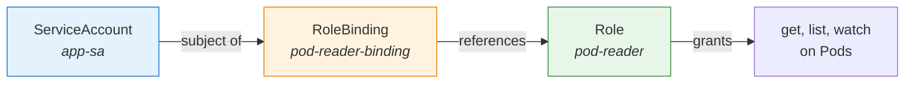

# ServiceAccount Tokens and RBAC

You have created a ServiceAccount and assigned it to a Pod. The Pod now has an identity — but identity alone does not unlock any doors. A hotel key card identifies you as a guest, but it only opens the doors you have been authorized to access. In Kubernetes, that authorization comes from **RBAC:**  specifically, from RoleBindings that connect your ServiceAccount to the permissions defined in a Role.

Let's see how identity and authorization work together.

## The Identity String

Every ServiceAccount token carries an identity in this format:

```
system:serviceaccount:<namespace>:<name>
```

For example, a ServiceAccount named `app-sa` in the `app` namespace is identified as `system:serviceaccount:app:app-sa`. This string is what the API server uses during the authorization stage. When you create an RBAC binding, you are telling Kubernetes: "grant these permissions to this identity."

## Connecting the Pieces

The relationship between ServiceAccounts, Roles, and RoleBindings follows a clear pattern:



The **Role** defines what actions are allowed (for example, `get`, `list`, and `watch` on Pods). The **RoleBinding** links a subject (the ServiceAccount) to that Role. Without the RoleBinding, the ServiceAccount has no extra permissions — even if the Role exists.

## Creating the Binding

Here is a RoleBinding that grants the `pod-reader` Role to the `app-sa` ServiceAccount in the `app` namespace:

```yaml
apiVersion: rbac.authorization.k8s.io/v1
kind: RoleBinding
metadata:
  name: pod-reader-binding
  namespace: app
subjects:
  - kind: ServiceAccount
    name: app-sa
    namespace: app
roleRef:
  kind: Role
  name: pod-reader
  apiGroup: rbac.authorization.k8s.io
```

A few important details:

- The **RoleBinding** and the **Role** must be in the same namespace.
- The `subjects` section can include multiple ServiceAccounts, users, or groups.
- The `roleRef` is immutable — if you need to change the referenced Role, you must delete and recreate the RoleBinding.

:::info
Keep ServiceAccount permissions minimal and namespace-scoped whenever possible. If a workload only needs to read Pods in its own namespace, a namespace-scoped Role and RoleBinding are the right choice. Cluster-wide access should be the exception, not the rule.
:::

## Verifying Permissions

The `kubectl auth can-i` command with the `--as` flag lets you test ServiceAccount permissions without performing actions. When troubleshooting, use `kubectl get rolebinding,clusterrolebinding -A` and `kubectl describe rolebinding` to find which RoleBindings reference a particular ServiceAccount.

:::warning
Binding a ServiceAccount to a broad ClusterRole (like `cluster-admin`) gives it unrestricted access across the entire cluster. This is almost never the right choice for application workloads. If you need cross-namespace access, consider a more targeted ClusterRole with specific permissions.
:::

## A Common Pitfall: Namespace Mismatch

One of the most frequent RBAC issues is a namespace mismatch. The RoleBinding must be in the **same namespace** where you want permissions to apply. If your Pod is in the `app` namespace and the RoleBinding is in `default`, the permissions will not take effect. Similarly, the `namespace` field in the `subjects` section must match the ServiceAccount's actual namespace.

---

## Hands-On Practice

For these steps, ensure you have a ServiceAccount named `my-sa` in the default namespace (create it with `kubectl create serviceaccount my-sa -n default` if needed).

### Step 1: Create a token for the ServiceAccount

```bash
kubectl create token my-sa -n default
```

Outputs a short-lived JWT that authenticates as `system:serviceaccount:default:my-sa`. Copy the token if you want to inspect it.

### Step 2: Inspect the token (optional)

The token is a JWT with three base64-encoded parts separated by dots. You can decode the middle (payload) part with:

```bash
kubectl create token my-sa -n default | cut -d. -f2 | base64 -d 2>/dev/null
```

The payload contains the ServiceAccount identity and expiration. Do not share tokens — they grant access.

### Step 3: Test RBAC permissions for the ServiceAccount

```bash
kubectl auth can-i list pods --as=system:serviceaccount:default:my-sa -n default
```

Returns `yes` or `no`. By default, `my-sa` has no extra permissions, so this typically returns `no` unless you have created a RoleBinding for it.

## Wrapping Up

A ServiceAccount provides identity; RBAC provides authorization. The RoleBinding is the bridge between them — without it, a ServiceAccount is recognized but powerless. By keeping bindings namespace-scoped and permissions minimal, you follow the principle of least privilege. In the next chapter, we will explore RBAC in depth — looking at how Roles, ClusterRoles, and their bindings give you fine-grained control over every action in your cluster.
