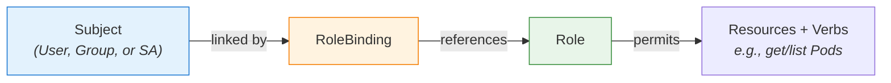

# Roles and RoleBindings

In the previous chapter, we saw that ServiceAccounts provide identity and that RBAC provides authorization. Now let's look at how RBAC actually works. The system revolves around two fundamental objects: **Roles** and **RoleBindings**. Together, they answer two questions: "What permissions exist?" and "Who gets them?"

Think of it like a library card system. A Role is like a borrowing policy — it defines what someone can do (borrow books, access the archive, use the study rooms). A RoleBinding is the act of issuing a library card that grants a specific person those privileges. The policy and the card are separate objects, and both are needed for access to work.

## How Roles and RoleBindings Relate

A **Role** defines a set of permissions — which actions (called verbs) are allowed on which resources. A **RoleBinding** connects that Role to one or more **subjects:**  users, groups, or ServiceAccounts. The subject receives the permissions described in the Role.

Both Roles and RoleBindings are **namespace-scoped**, which means they only apply within a single namespace. This is an important design choice: it lets you grant different permissions in different namespaces without risk of cross-contamination.



## Defining a Role

Here is a Role that grants read-only access to Pods and their logs in the `default` namespace:

```yaml
apiVersion: rbac.authorization.k8s.io/v1
kind: Role
metadata:
  namespace: default
  name: pod-reader
rules:
  - apiGroups: [""]
    resources: ["pods"]
    verbs: ["get", "list", "watch"]
  - apiGroups: [""]
    resources: ["pods/log"]
    verbs: ["get"]
```

Let's break down the key fields:

- **apiGroups:**  the API group the resource belongs to. Core resources (Pods, Services, ConfigMaps) use `""` (an empty string). Other resources use their group name, like `apps` for Deployments.
- **resources:**  which resource types this rule applies to. Subresources like `pods/log` or `pods/status` must be listed separately.
- **verbs:**  the actions allowed. Common verbs include `get`, `list`, `watch`, `create`, `update`, `patch`, and `delete`.

## Creating a RoleBinding

This RoleBinding assigns the `pod-reader` Role to a ServiceAccount named `my-sa`:

```yaml
apiVersion: rbac.authorization.k8s.io/v1
kind: RoleBinding
metadata:
  namespace: default
  name: read-pods
subjects:
  - kind: ServiceAccount
    name: my-sa
    namespace: default
roleRef:
  kind: Role
  name: pod-reader
  apiGroup: rbac.authorization.k8s.io
```

The `subjects` list can include multiple entries — users, groups, and ServiceAccounts. The `roleRef` points to the Role being granted. One important detail: **roleRef is immutable**. If you need to change which Role is referenced, you must delete the RoleBinding and create a new one.

:::info
A RoleBinding can also reference a **ClusterRole** instead of a Role. When it does, the ClusterRole's permissions are granted **only within the RoleBinding's namespace**. This is a common pattern: define reusable permissions once as a ClusterRole, then bind them per-namespace with RoleBindings.
:::

After creating a Role and RoleBinding, always verify that the permissions work as expected. The `kubectl describe rolebinding` command shows you the subjects, the referenced Role, and the namespace — a complete picture of the authorization chain.

## Common Pitfalls

**Namespace mismatch.** The RoleBinding, the Role, and the subject's namespace must all align correctly. A RoleBinding in the `staging` namespace does not affect Pods in `production`.

**Immutable roleRef.** You cannot edit the `roleRef` field in an existing RoleBinding. If you need to point to a different Role, delete the binding and create a new one.

**Missing subject namespace.** When the subject is a ServiceAccount, the `namespace` field in the subject entry must match the ServiceAccount's actual namespace. Omitting it can lead to confusing "permission denied" errors.

:::warning
RBAC denies everything by default — there are no "allow all" defaults. If a subject has no RoleBinding, it has no permissions. This is by design and is a security strength, but it can surprise newcomers when freshly created ServiceAccounts cannot do anything.
:::

---

## Hands-On Practice

### Step 1: Create a Role

```bash
nano pod-reader-role.yaml
```

```yaml
apiVersion: rbac.authorization.k8s.io/v1
kind: Role
metadata:
  name: pod-reader
rules:
  - apiGroups: [""]
    resources: ["pods"]
    verbs: ["get", "list", "watch"]
```

```bash
kubectl apply -f pod-reader-role.yaml
```

### Step 2: Create a ServiceAccount and RoleBinding

```bash
kubectl create serviceaccount test-sa
```

```bash
nano pod-reader-binding.yaml
```

```yaml
apiVersion: rbac.authorization.k8s.io/v1
kind: RoleBinding
metadata:
  name: read-pods-binding
subjects:
  - kind: ServiceAccount
    name: test-sa
    namespace: default
roleRef:
  kind: Role
  name: pod-reader
  apiGroup: rbac.authorization.k8s.io
```

```bash
kubectl apply -f pod-reader-binding.yaml
```

### Step 3: Verify the binding

```bash
kubectl get roles
kubectl get rolebindings
```

### Step 4: Test the permissions

```bash
kubectl auth can-i list pods --as system:serviceaccount:default:test-sa
kubectl auth can-i delete pods --as system:serviceaccount:default:test-sa
```

The first should return `yes`, the second `no`.

### Step 5: Clean up

```bash
kubectl delete rolebinding read-pods-binding
kubectl delete role pod-reader
kubectl delete serviceaccount test-sa
```

## Wrapping Up

Roles define what is allowed; RoleBindings define who gets those permissions. Both are namespace-scoped, which keeps access tightly controlled. This separation of "what" and "who" makes RBAC flexible and auditable. In the next lesson, we will expand our view beyond a single namespace — exploring ClusterRoles and ClusterRoleBindings for cluster-wide permissions.
