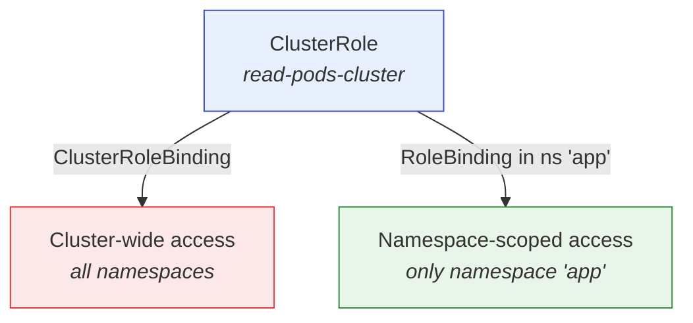

# ClusterRoles and ClusterRoleBindings

In the previous lesson, we learned that Roles and RoleBindings are namespace-scoped — they grant permissions within a single namespace. But what about actions that span the entire cluster? Listing nodes, watching events across all namespaces, or managing PersistentVolumes — these are cluster-wide operations that a namespace-scoped Role simply cannot express.

That is where **ClusterRoles** and **ClusterRoleBindings** come in.

## The Key Difference

Imagine a company with multiple offices (namespaces). A regular Role is like a building access card that works in one office. A ClusterRole is like a universal policy that can be applied anywhere — either to one office at a time or to the entire company at once.

Here is the critical distinction:

- A **ClusterRole** is a cluster-scoped set of permissions. It is not bound to any namespace and can reference both namespaced resources (like Pods) and cluster-scoped resources (like Nodes).
- A **ClusterRoleBinding** grants a ClusterRole **cluster-wide:** the subject gets those permissions in every namespace.
- A **RoleBinding** that references a ClusterRole grants those permissions **only in the RoleBinding's namespace**.

This flexibility makes ClusterRoles the most reusable permission object in RBAC.



## Defining a ClusterRole

Here is a ClusterRole that grants read access to Pods across the cluster. Notice there is no `namespace` field — ClusterRoles are not namespaced:

```yaml
apiVersion: rbac.authorization.k8s.io/v1
kind: ClusterRole
metadata:
  name: read-pods-cluster
rules:
  - apiGroups: ['']
    resources: ['pods']
    verbs: ['get', 'list', 'watch']
```

ClusterRoles can also reference cluster-scoped resources that Roles cannot, such as Nodes, PersistentVolumes, and Namespaces themselves.

## Binding Cluster-Wide

A ClusterRoleBinding grants the ClusterRole to a subject across all namespaces. Here is how to create one with `kubectl`:

```bash
kubectl create clusterrolebinding read-pods-binding \
  --clusterrole=read-pods-cluster \
  --serviceaccount=app:app-sa
```

After this, the `app-sa` ServiceAccount in the `app` namespace can list Pods in every namespace in the cluster.

## Binding to a Single Namespace

You can also use a regular RoleBinding to reference a ClusterRole. This grants the ClusterRole's permissions only within the RoleBinding's namespace:

```bash
kubectl create rolebinding read-pods-in-staging \
  --clusterrole=read-pods-cluster \
  --serviceaccount=app:app-sa \
  -n staging
```

Now `app-sa` can list Pods in the `staging` namespace, but not in `production` or any other namespace. This pattern — define once as a ClusterRole, bind per-namespace — is extremely common and keeps your RBAC configuration DRY (Don't Repeat Yourself).

:::info
When you see a ClusterRole, the scope of its effect depends entirely on **how it is bound**. A ClusterRoleBinding makes it cluster-wide; a RoleBinding limits it to one namespace. The ClusterRole itself is just a reusable permission template.
:::

## Built-in ClusterRoles

Kubernetes ships with several built-in ClusterRoles. The most notable ones:

- **`cluster-admin`:** unrestricted access to everything in the cluster. Use this sparingly and only for administrative purposes.
- **`view`:** read-only access to most resources in a namespace (when used with a RoleBinding).
- **`edit`:** read-write access to most resources in a namespace, but no ability to modify Roles or RoleBindings.
- **`admin`:** full access within a namespace, including the ability to manage Roles and RoleBindings.

You can list all ClusterRoles with `kubectl get clusterrole`. Prefer creating custom ClusterRoles with the specific permissions your workload needs, rather than binding to `cluster-admin`.

:::warning
ClusterRoleBindings grant permissions across **all namespaces**, including namespaces that will be created in the future. Audit them regularly — a single overly broad ClusterRoleBinding can silently undermine the isolation you have built with namespace-scoped Roles.
:::

---

## Hands-On Practice

### Step 1: List ClusterRoles

```bash
kubectl get clusterroles
```

Shows all ClusterRoles, including built-in ones like `view`, `edit`, `admin`, and `cluster-admin`.

### Step 2: Describe a built-in ClusterRole

```bash
kubectl describe clusterrole view
```

The `view` ClusterRole grants read-only access to most resources. The output lists the rules — which API groups, resources, and verbs it allows.

### Step 3: List ClusterRoleBindings

```bash
kubectl get clusterrolebindings
```

Shows which subjects (users, groups, ServiceAccounts) are bound to ClusterRoles cluster-wide. Each binding grants its ClusterRole's permissions to the listed subjects.

## Wrapping Up

ClusterRoles are the reusable building blocks of RBAC. Bind them cluster-wide with ClusterRoleBindings when you need cross-namespace access, or bind them per-namespace with RoleBindings for scoped reuse. The built-in ClusterRoles cover common patterns, but custom ClusterRoles with minimal permissions are always the safer choice. In the next lesson, we will look more closely at **verbs and resources:** the specific actions and objects that RBAC rules control.
