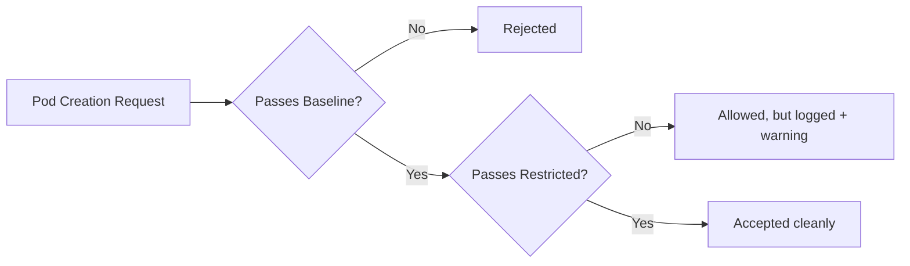

# Pod Security Enforcement Modes

You know the three Pod Security Standards levels — Privileged, Baseline, and Restricted. But how do you actually apply them? The answer is **enforcement modes:** labels on namespaces that tell Kubernetes how strictly to enforce each level.

The key insight: you don't have to go from zero to full enforcement overnight. Kubernetes gives you a gradual rollout path.

## The Three Modes

Each mode handles violations differently:

| Mode        | Violation Behavior                    | Use Case                 |
| ----------- | ------------------------------------- | ------------------------ |
| **enforce** | Rejects the Pod — it won't be created | Production enforcement   |
| **audit**   | Allows the Pod but logs the violation | Discovery and monitoring |
| **warn**    | Allows the Pod but warns the user     | Developer feedback       |

Think of it like a new traffic law. First, you post warning signs (warn), then install cameras that record violations (audit), and finally start issuing tickets (enforce). This progression lets everyone adapt before consequences kick in.

## Configuring Modes with Labels

You set modes by labeling the namespace. Each mode has its own label, and you can use different security levels for each:

```yaml
apiVersion: v1
kind: Namespace
metadata:
  name: app-production
  labels:
    pod-security.kubernetes.io/enforce: baseline
    pod-security.kubernetes.io/enforce-version: latest
    pod-security.kubernetes.io/audit: restricted
    pod-security.kubernetes.io/audit-version: latest
    pod-security.kubernetes.io/warn: restricted
    pod-security.kubernetes.io/warn-version: latest
```

This is a common production pattern: **enforce Baseline** (block the most dangerous configurations) while **auditing and warning on Restricted** (track what would break if you tightened further).



:::info
You can use different security levels for each mode. This is the recommended rollout strategy: enforce a lower level while auditing a stricter one, giving you visibility into what would break before you tighten enforcement.
:::

## The Gradual Rollout Strategy

Here's a practical approach for tightening security in an existing cluster:

**Phase 1 — Discovery**: Set audit and warn to your target level. No workloads are blocked. Review logs and warnings to identify violations.

```yaml
labels:
  pod-security.kubernetes.io/audit: restricted
  pod-security.kubernetes.io/warn: restricted
```

**Phase 2 — Baseline enforcement**: Enforce Baseline to block the most dangerous configurations. Continue auditing Restricted.

```yaml
labels:
  pod-security.kubernetes.io/enforce: baseline
  pod-security.kubernetes.io/audit: restricted
  pod-security.kubernetes.io/warn: restricted
```

**Phase 3 — Full Restricted**: Once workloads are compliant, enforce Restricted.

```yaml
labels:
  pod-security.kubernetes.io/enforce: restricted
```

## Version Labels

The `-version` suffix controls which version of the Pod Security Standard is applied:

```yaml
pod-security.kubernetes.io/enforce-version: latest
```

Use `latest` for the current behavior (recommended for most clusters). Pinning a specific version (like `v1.28`) ensures behavior doesn't change on upgrades, which can be useful for compliance.

:::warning
Keep version labels consistent across enforce, audit, and warn. Mixing versions can produce confusing behavior — a Pod might pass enforce but fail audit because they reference different rule sets.
:::

---

## Hands-On Practice

### Step 1: Create a namespace with mixed modes

Create `namespace.yaml`:

```yaml
apiVersion: v1
kind: Namespace
metadata:
  name: pss-modes
  labels:
    pod-security.kubernetes.io/enforce: baseline
    pod-security.kubernetes.io/enforce-version: latest
    pod-security.kubernetes.io/audit: restricted
    pod-security.kubernetes.io/audit-version: latest
    pod-security.kubernetes.io/warn: restricted
    pod-security.kubernetes.io/warn-version: latest
```

Apply it:

```bash
kubectl apply -f namespace.yaml
```

### Step 2: Deploy a Pod and observe behavior

```bash
kubectl run test --image=nginx -n pss-modes
```

If the Pod violates the warn level (Restricted) but passes enforce (Baseline), it will be created — but you may see a warning. Check events:

```bash
kubectl get events -n pss-modes --sort-by='.lastTimestamp'
```

### Step 3: Try a privileged Pod (optional)

```bash
kubectl run privileged-test --image=nginx -n pss-modes --overrides='{"spec":{"containers":[{"name":"privileged-test","image":"nginx","securityContext":{"privileged":true}}]}}'
```

This should be rejected — Baseline blocks privileged containers. The admission error explains which rule was violated.

## Wrapping Up

Enforcement modes let you roll out Pod Security Standards gradually: **warn** for developer feedback, **audit** for logging and monitoring, **enforce** for blocking violations. Start with audit and warn to discover issues, enforce Baseline to catch the biggest risks, and work toward Restricted as your workloads comply. This progressive approach lets you tighten security without breaking existing applications.
