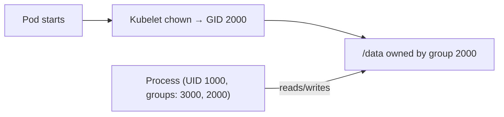

# fsGroup and File Permissions

You've configured your container to run as non-root — great. But now it mounts a volume, and suddenly: **permission denied**. The volume's files are owned by root, and your non-root user can't access them.

This is one of the most common issues when hardening Pods, and `fsGroup` is the solution.

## The Problem

When a volume is mounted into a Pod, the files on it typically belong to root (UID 0, GID 0). If your container runs as UID 1000, it doesn't have permission to read or write those files — standard Linux file permissions apply inside containers too.

Think of it like moving into a new apartment where all the closets are locked. You have your own key (your UID), but the locks are set to a different owner. `fsGroup` changes the locks to match your key.

## What fsGroup Does

`fsGroup` is a Pod-level securityContext field that:

1. Sets the **group ownership** of all mounted volumes to the specified GID
2. Adds this GID as a **supplementary group** for all processes in the Pod
3. The kubelet performs a recursive `chown` on the volume when the Pod starts

```yaml
spec:
  securityContext:
    runAsUser: 1000
    runAsGroup: 3000
    fsGroup: 2000
  containers:
    - name: app
      image: myapp
      volumeMounts:
        - name: data
          mountPath: /data
  volumes:
    - name: data
      persistentVolumeClaim:
        claimName: my-pvc
```

With this configuration:

- The container process runs as **UID 1000**, primary group **3000**
- The volume `/data` is owned by **group 2000**
- The process has **2000 as a supplementary group**, so it can access the volume



## When to Use fsGroup

Use `fsGroup` when:

- Your container runs as non-root and needs to write to a volume
- Multiple containers in a Pod share a volume
- Volume contents are owned by root after provisioning

`fsGroup` works with most volume types: `emptyDir`, `persistentVolumeClaim`, `configMap`, `secret`, and others.

Without `fsGroup`, `ls -la` on a mounted volume would show root ownership. With `fsGroup` set, the group column reflects the specified GID.

:::info
Setting `fsGroup` causes kubelet to recursively `chown` the volume at Pod startup. For large volumes with many files, this can add significant startup time. For read-only ConfigMaps or Secrets, `fsGroup` is usually unnecessary — they're already readable.
:::

## fsGroupChangePolicy

For large volumes where recursive `chown` is too slow, Kubernetes offers `fsGroupChangePolicy`:

```yaml
spec:
  securityContext:
    fsGroup: 2000
    fsGroupChangePolicy: 'OnRootMismatch'
```

- **Always** (default): Recursively chown every time the Pod starts
- **OnRootMismatch**: Only chown if the root directory's ownership doesn't match — much faster for subsequent Pod restarts

## Troubleshooting

**Permission denied on volume:** Most likely `fsGroup` is not set, or it doesn't match the expected GID. Add `fsGroup` to the Pod's securityContext.

**Slow Pod startup:** Recursive `chown` on a large volume. Use `fsGroupChangePolicy: OnRootMismatch` to speed things up.

**NFS volumes:** NFS may handle ownership differently. You might need `supplementalGroups` instead of `fsGroup`, or configure NFS exports with the correct GID.

:::warning
Not all storage drivers support `fsGroup`. NFS and some CSI drivers may handle ownership differently. Check your storage provider's documentation if `fsGroup` doesn't seem to take effect.
:::

---

## Hands-On Practice

### Step 1: Create a Pod with fsGroup and a volume

Create `fsgroup-pod.yaml`:

```yaml
apiVersion: v1
kind: Pod
metadata:
  name: fsgroup-test
spec:
  securityContext:
    runAsUser: 1000
    runAsGroup: 3000
    fsGroup: 2000
  containers:
    - name: app
      image: nginx
      volumeMounts:
        - name: data
          mountPath: /data
  volumes:
    - name: data
      emptyDir: {}
```

Apply it:

```bash
kubectl apply -f fsgroup-pod.yaml
```

### Step 2: Wait for the Pod to be Running

```bash
kubectl wait --for=condition=Ready pod/fsgroup-test --timeout=60s
```

### Step 3: Verify group ownership inside the container

```bash
kubectl exec fsgroup-test -- id
kubectl exec fsgroup-test -- ls -la /data
```

The `id` output should show `groups=2000,3000`. The `ls -la /data` output should show the directory owned by group `2000`.

### Step 4: Clean up

```bash
kubectl delete pod fsgroup-test
```

## Wrapping Up

`fsGroup` solves the volume permission problem for non-root containers by setting group ownership on mounted volumes and adding that group to all processes. Use it whenever a non-root container needs volume access. For large volumes, use `fsGroupChangePolicy: OnRootMismatch` to avoid slow startup. In the next lesson, we'll bring all the securityContext settings together into a comprehensive hardening example.
