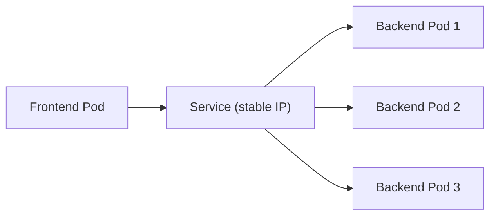

# What Is a Service?

Imagine your web application has three backend Pods. Each Pod gets its own IP address when it starts. But Pods are ephemeral — they crash, restart, scale up, scale down. Every time a Pod is recreated, it gets a **new IP address**. If your frontend needs to talk to the backend, how does it know where to connect?

Hard-coding Pod IPs is fragile and impossible to maintain at scale. This is exactly the problem **Services** solve.

## Services: A Stable Front Door

A Service is like the reception desk of a hotel. Guests (clients) don't need to know which room (Pod) they'll be assigned to — they just go to the reception desk, and the hotel handles the rest. Rooms change, guests check in and out, but the reception desk always stays in the same place.

In Kubernetes terms, a Service provides:

- A **stable IP address** that never changes, even when Pods are recreated
- A **DNS name** so your applications can connect by name instead of IP
- **Automatic load balancing** across all healthy Pods that match the selector
- **Service discovery** without modifying your application code



## How Services Connect to Pods

Services don't directly know about specific Pods. Instead, they use **label selectors** to find them. You tell the Service "send traffic to all Pods with these labels," and Kubernetes continuously tracks which Pods match.

```yaml
apiVersion: v1
kind: Service
metadata:
  name: backend-api
spec:
  selector:
    app: api
    tier: backend
  ports:
    - protocol: TCP
      port: 80
      targetPort: 8080
```

This Service:

- Targets all Pods with labels `app: api` AND `tier: backend`
- Listens on port **80** (the Service port — what clients connect to)
- Forwards traffic to port **8080** on the Pods (the targetPort — where your application listens)

When a new Pod appears with matching labels, it automatically starts receiving traffic. When a Pod disappears, it's removed from the rotation. No manual configuration needed.

:::info
Services decouple frontends from backends. Your frontend connects to a stable Service name; Kubernetes handles which Pods receive the traffic. This works the same whether you have 1 Pod or 100 — your application code doesn't change.
:::

## Verifying Your Service

After creating a Service, check that it's correctly connected to your Pods. The **endpoints** list shows the actual Pod IPs backing the Service. If it's empty, no Pods match the selector — double-check your labels.

## Common Pitfalls

**Empty endpoints:** The Service selector doesn't match any Pod labels. Verify with `kubectl get pods --show-labels` and compare against the Service's selector.

**Connection refused:** The `targetPort` doesn't match the port your container actually listens on. The Service is routing traffic to the right Pod but the wrong port.

**No encryption:** Services don't provide TLS by default. Traffic between Services travels unencrypted within the cluster. For encrypted communication, use a service mesh (like Istio or Linkerd) or configure TLS at the application level.

:::warning
Services provide networking and load balancing, not encryption. ClusterIP traffic is unencrypted by default. For sensitive data, add TLS at the application level or use a service mesh.
:::

---

## Hands-On Practice

If you have a cluster with existing Services (e.g., from previous lessons or `kubernetes`), try these quick verification commands.

### Step 1: List Services

```bash
kubectl get services
```

**Observation:** You see all Services in the current namespace with their cluster IPs and ports.

### Step 2: Get Wide View

```bash
kubectl get svc -o wide
```

**Observation:** The wide output shows selectors and additional details for each Service.

### Step 3: Check Endpoints for a Service

```bash
kubectl get endpoints <service-name>
```

Replace `<service-name>` with an actual Service (e.g., `kubernetes` or one you've created). **Observation:** The endpoints list shows the Pod IPs backing the Service. Empty means no Pods match the selector.

## Wrapping Up

Services give your applications a stable, discoverable entry point in a world where Pods come and go constantly. They use label selectors to find matching Pods and automatically load-balance traffic across them. In the next lesson, we'll dive into the default Service type — **ClusterIP:** and how it provides internal cluster communication.
