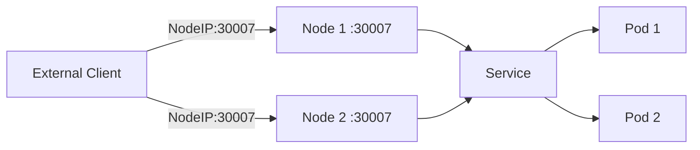

# NodePort Service

ClusterIP Services are only accessible from within the cluster. But what if you need external access — from your browser, a load balancer, or a testing tool outside the cluster?

**NodePort** is the simplest way to open a Service to the outside world. It opens the same port on **every node** in your cluster, making the Service reachable from any node's IP address.

## How NodePort Works

Think of it like this: your cluster is a building with multiple doors (nodes). A NodePort Service installs the same lock on every door, all with the same number. Anyone who knows the building's address and the door number can walk in.

When you create a NodePort Service, Kubernetes:

1. Assigns a port from the range **30000-32767**
2. Opens that port on **every node** in the cluster
3. Forwards traffic arriving on that port to the matching Pods



A NodePort Service also includes all ClusterIP functionality — it has a cluster IP and works internally too.

## Creating a NodePort Service

```yaml
apiVersion: v1
kind: Service
metadata:
  name: my-service
spec:
  type: NodePort
  selector:
    app.kubernetes.io/name: MyApp
  ports:
    - name: http
      protocol: TCP
      port: 80          # Service port (internal access)
      targetPort: 80    # Pod port (where the app listens)
      nodePort: 30007   # External port on every node (optional)
```

If you omit `nodePort`, Kubernetes automatically assigns one from the 30000-32767 range. Specifying it gives you a predictable port number.

## Three Ports, One Service

NodePort introduces a third port to remember:

| Port | What It Does | How to Access |
|------|-------------|---------------|
| `port: 80` | Service port | `my-service:80` from within the cluster |
| `targetPort: 80` | Pod port | Where your container listens |
| `nodePort: 30007` | Node port | `<any-node-IP>:30007` from outside |

## Accessing the Service

From outside the cluster, use any node's IP with the NodePort: `curl http://<NodeIP>:30007`. All nodes expose the same port.

:::info
NodePort is useful for development, testing, and bare-metal environments where cloud load balancers aren't available. It works anywhere Kubernetes runs, without any cloud provider integration.
:::

## Limitations

NodePort has real tradeoffs for production:

- **Security:**  Every node exposes the port; you need firewall rules to control access
- **Port range:**  Limited to 30000-32767, which are non-standard ports clients need to know
- **No single entry point:**  If a node goes down, clients connecting to that specific IP fail
- **No TLS termination:**  You handle TLS yourself

For production external access, **LoadBalancer** or **Ingress** are better choices. NodePort is often used as a building block — an Ingress controller typically sits behind a NodePort or LoadBalancer Service.

:::warning
Ports 30000-32767 must be open in your firewall rules. Many cloud security groups and on-premises firewalls block these by default. If you get "connection refused" from outside, check your firewall before debugging the Service.
:::

---

## Hands-On Practice

### Step 1: Create a NodePort Service

Create `nodeport-svc.yaml`:

```yaml
apiVersion: v1
kind: Service
metadata:
  name: nodeport-demo
spec:
  type: NodePort
  selector:
    app: nodeport-demo
  ports:
    - port: 80
      targetPort: 80
```

Create backing Pods and the Service:

```bash
kubectl create deployment nodeport-demo --image=nginx --replicas=1
kubectl label deployment nodeport-demo app=nodeport-demo --overwrite
kubectl apply -f nodeport-svc.yaml
```

**Observation:** The Service is created with a NodePort from the 30000-32767 range.

### Step 2: Verify the Service

```bash
kubectl get svc nodeport-demo
```

**Observation:** The PORT(S) column shows `80:3xxxx/TCP` — the second number is the allocated NodePort.

### Step 3: Describe the Service

```bash
kubectl describe service nodeport-demo
```

**Observation:** Output confirms NodePort type, port mappings, and endpoints.

### Step 4: Clean Up

```bash
kubectl delete deployment nodeport-demo
kubectl delete service nodeport-demo
```

## Wrapping Up

NodePort opens the same port on every node, making your Service accessible from outside the cluster at `<NodeIP>:<NodePort>`. It's the simplest form of external access, ideal for development and bare-metal environments. For production, combine it with an external load balancer, or use LoadBalancer/Ingress for better security and management. Next up: LoadBalancer Services.
