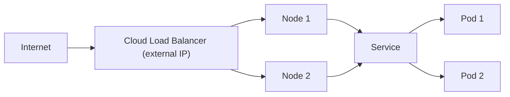

# LoadBalancer Service

NodePort works, but it requires clients to know individual node IPs and use non-standard ports. In a cloud environment, there's a better option: let the cloud provider handle external access with a **LoadBalancer Service**.

Think of it as hiring a professional doorman. Instead of giving visitors directions to every door in the building, you give them one address — the doorman's. The doorman knows which doors are open and routes visitors automatically.

## How LoadBalancer Works

When you create a LoadBalancer Service, Kubernetes:

1. Creates a **NodePort** Service (with all its functionality)
2. Asks the cloud provider to provision an **external load balancer**
3. Configures the load balancer to forward traffic to the node ports
4. Reports the external IP in the Service's status

The result: a single, stable external IP that routes traffic to your Pods.



The cloud provider handles health checks, distributes traffic across nodes, and gives you a public IP or hostname. On **AWS**, this creates an ELB or NLB. On **GCP**, a Network Load Balancer. On **Azure**, an Azure Load Balancer.

## Creating a LoadBalancer Service

```yaml
apiVersion: v1
kind: Service
metadata:
  name: my-service
spec:
  type: LoadBalancer
  selector:
    app.kubernetes.io/name: MyApp
  ports:
    - name: http
      protocol: TCP
      port: 80
      targetPort: 9376
```

That's it. The cloud provider does the rest.

## Watching It Provision

Load balancer provisioning is **asynchronous:**  it takes 30 seconds to a few minutes. You'll see `<pending>` until the cloud provider finishes, then the external IP appears. Once assigned, you can access the Service via that IP.

:::info
LoadBalancer Services are the standard way to expose applications on cloud platforms. They include all ClusterIP and NodePort functionality — you can also access the Service internally via its cluster IP.
:::

## When EXTERNAL-IP Stays Pending

If the IP never appears, common causes are:

- **No cloud controller manager:**  Your cluster doesn't have cloud provider integration (common on bare metal or local clusters like minikube)
- **Quota limits:**  Your cloud account has reached its load balancer quota
- **Missing permissions:**  The cloud controller needs IAM permissions to create load balancers

For local development, tools like `minikube tunnel` or MetalLB simulate LoadBalancer behavior.

## Cost Considerations

Each LoadBalancer Service provisions a cloud resource — and cloud load balancers cost money. If you have 20 microservices, creating 20 LoadBalancer Services means 20 load balancers on your cloud bill.

The common solution: use **one LoadBalancer** that fronts an **Ingress controller**, which then routes to many ClusterIP Services based on hostnames and paths. Much more cost-effective.

:::warning
Each LoadBalancer Service typically creates a billable cloud resource. For multiple Services, use an Ingress controller behind a single LoadBalancer to reduce costs.
:::

---

## Hands-On Practice

Load balancers require a cloud provider — on local clusters (minikube, kind), EXTERNAL-IP will stay Pending. This exercise demonstrates the behavior.

### Step 1: Create a LoadBalancer Service Manifest

Create `lb-svc.yaml`:

```yaml
apiVersion: v1
kind: Service
metadata:
  name: lb-demo
spec:
  type: LoadBalancer
  selector:
    app: lb-demo
  ports:
    - port: 80
      targetPort: 80
```

### Step 2: Apply and Observe

```bash
kubectl create deployment lb-demo --image=nginx --replicas=1
kubectl label deployment lb-demo app=lb-demo --overwrite
kubectl apply -f lb-svc.yaml
kubectl get svc lb-demo
```

**Observation:** EXTERNAL-IP shows `<pending>` without a cloud provider — the Service exists but no external LB is provisioned.

### Step 3: Describe the Service

```bash
kubectl describe service lb-demo
```

**Observation:** Confirms LoadBalancer type and that it still has a ClusterIP and NodePort.

### Step 4: Clean Up

```bash
kubectl delete deployment lb-demo
kubectl delete service lb-demo
```

## Wrapping Up

LoadBalancer Services provision an external load balancer from your cloud provider, giving you a stable public IP with automatic traffic distribution. They're the production standard for external access on cloud platforms. Watch for cost — use Ingress to expose multiple Services through a single LoadBalancer when possible. Next: ExternalName Services, which solve a completely different problem.
