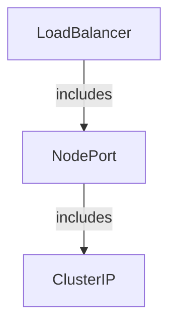
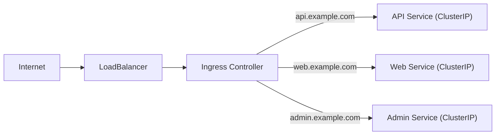

# Choosing a Service Type

You now know four Service types. But when you sit down to write a Service manifest, which one should you pick? The answer depends on **who needs to reach your Service** and **where your cluster runs**.

## The Decision Framework

Here's a simple mental model:

| Question | Service Type |
|----------|-------------|
| Only Pods in the cluster need access? | **ClusterIP** |
| External access on cloud? | **LoadBalancer** |
| External access without cloud LB? | **NodePort** |
| Pointing to an external resource? | **ExternalName** |

Most of your Services will be ClusterIP. You add NodePort or LoadBalancer only when you need external exposure.

## The Nesting Principle

Service types are **nested:**  each layer builds on the previous:



A **LoadBalancer** Service also has a NodePort and a ClusterIP. A **NodePort** Service also has a ClusterIP. This means a LoadBalancer Service can be accessed three ways: externally via the load balancer, via any node's IP and node port, or internally via the cluster IP.

## ClusterIP — The Default Choice

Use ClusterIP when:
- Services communicate internally (microservices, databases, caches)
- You'll use Ingress or Gateway API for external access
- You don't need direct external exposure

```yaml
apiVersion: v1
kind: Service
metadata:
  name: backend-api
spec:
  selector:
    app: backend
  ports:
    - port: 80
      targetPort: 8080
```

No `type` field needed — ClusterIP is the default.

:::info
Most Services in a typical cluster are ClusterIP. External access is usually handled by an Ingress controller (itself exposed via a single LoadBalancer), which routes to many internal ClusterIP Services. <a target="_blank" href="https://kubernetes.io/docs/concepts/services-networking/service/#type-clusterip">Learn more about ClusterIP</a>
:::

## NodePort — Simple External Access

Use NodePort when:
- Running on bare metal or on-premises without cloud integration
- Development and testing environments
- You want to put your own load balancer in front

Tradeoff: non-standard ports (30000-32767) and every node is exposed.

## LoadBalancer — Production External Access

Use LoadBalancer when:
- Running on a cloud provider (AWS, GCP, Azure)
- You need a stable, production-grade external IP
- The cloud handles health checking and traffic distribution

Tradeoff: each LoadBalancer costs money — don't create one per microservice.

## ExternalName — DNS Aliases

Use ExternalName when:
- Referencing external databases, APIs, or services outside the cluster
- You want to abstract external dependencies behind a Kubernetes Service name
- Gradual migration — some backends aren't containerized yet

Tradeoff: no proxying, hostname mismatches with HTTP/HTTPS.

## The Ingress Pattern

In practice, the most common production architecture is:

**One LoadBalancer → Ingress Controller → Many ClusterIP Services**



This gives you host-based and path-based routing, TLS termination, and costs only one load balancer — regardless of how many Services you have.

:::warning
Don't create a LoadBalancer Service for every microservice. Use one LoadBalancer with an Ingress controller, and route to internal ClusterIP Services. This saves money and gives you better traffic control.
:::

## Quick Reference

| Type | Access | Use Case | Cost |
|------|--------|----------|------|
| ClusterIP | Internal only | Default for all internal services | Free |
| NodePort | External via node IPs | Dev/test, bare metal | Free |
| LoadBalancer | External via cloud LB | Production on cloud | Per LB |
| ExternalName | DNS alias | External dependencies | Free |

## Wrapping Up

Choose ClusterIP for internal services (the vast majority), LoadBalancer for production external access on cloud, NodePort for external access without cloud integration, and ExternalName for DNS aliases to external resources. Remember the nesting: LoadBalancer includes NodePort, which includes ClusterIP. And for most production setups, one LoadBalancer with an Ingress controller is more cost-effective than many LoadBalancers. Next up: Kubernetes DNS — how Services and Pods get their DNS names.
