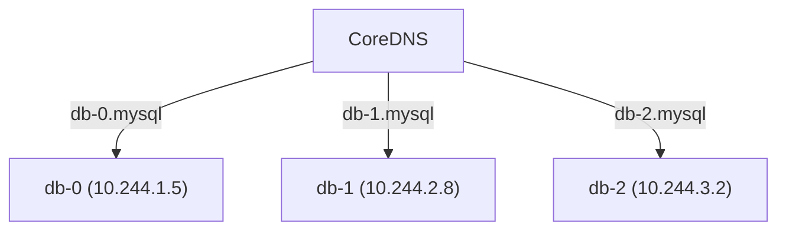

# Pod DNS Records

Regular Services resolve to a single virtual IP — the cluster IP. But sometimes you need to reach **specific Pods** by name. Database replicas that need to find each other, distributed systems where each member has a unique identity — these scenarios need individual Pod DNS records.

This is where **Headless Services** come in.

## The Problem with Regular Services

A regular ClusterIP Service gives you one IP shared across all Pods. That's perfect for stateless applications where any Pod can handle any request. But consider a database cluster:

- `db-0` is the primary — it handles writes
- `db-1` and `db-2` are replicas — they need to connect specifically to `db-0` for replication

A regular Service can't help here — you need to address each Pod individually.

## Headless Services Enable Pod DNS

A Headless Service is a Service with `clusterIP: None`. Instead of providing a single virtual IP, it tells the DNS server to return **individual Pod IPs**:

```yaml
apiVersion: v1
kind: Service
metadata:
  name: mysql
spec:
  clusterIP: None
  selector:
    app: mysql
  ports:
    - port: 3306
```

Combined with a StatefulSet, each Pod gets a **stable, predictable DNS name**:

```yaml
apiVersion: apps/v1
kind: StatefulSet
metadata:
  name: db
spec:
  serviceName: mysql    # Links to the Headless Service
  replicas: 3
  selector:
    matchLabels:
      app: mysql
  template:
    metadata:
      labels:
        app: mysql
    spec:
      containers:
        - name: mysql
          image: mysql:8
```



## Pod DNS Name Format

The DNS name follows this pattern:

```
<pod-name>.<headless-service>.<namespace>.svc.cluster.local
```

For our example:
- `db-0.mysql.default.svc.cluster.local`
- `db-1.mysql.default.svc.cluster.local`
- `db-2.mysql.default.svc.cluster.local`

From the same namespace, you can use the short form: `db-0.mysql`

This is why StatefulSets and Headless Services go together. StatefulSets give Pods **stable names** (`db-0`, `db-1`, `db-2` instead of `db-7x9kf`), and Headless Services give those names **DNS records**.

:::info
Regular Deployments create Pods with random suffixes (like `nginx-7x9kf2`). StatefulSets create Pods with ordinal indexes (`db-0`, `db-1`), making them predictable enough for DNS names.
:::

:::warning
A Pod must be **Ready** to appear in DNS. If readiness probes fail, the Pod is removed from the Headless Service's endpoints and won't resolve via DNS. This prevents routing traffic to unhealthy Pods.
:::

## When to Use Headless Services

- **Database clusters:**  Replicas need to find the primary by name
- **Distributed systems:**  Kafka, Elasticsearch, etcd members need stable identities
- **Any StatefulSet:**  When each Pod must be individually addressable

For stateless workloads, stick with regular ClusterIP Services — you don't need per-Pod DNS.

---

## Hands-On Practice

### Step 1: Create a Pod and Check DNS Config

```bash
kubectl run resolv-demo --image=busybox --restart=Never -- sleep 3600
kubectl exec resolv-demo -- cat /etc/resolv.conf
```

**Observation:** You'll see the nameserver (CoreDNS cluster IP), search domains like `default.svc.cluster.local`, and options such as `ndots: 5`.

### Step 2: Clean Up

```bash
kubectl delete pod resolv-demo
```

## Wrapping Up

Headless Services (`clusterIP: None`) combined with StatefulSets give each Pod a stable, predictable DNS name. This enables direct Pod addressing — essential for databases, distributed systems, and any workload where identity matters. Regular Services resolve to one IP; Headless Services resolve to individual Pod IPs. In the next lesson, we'll cover DNS configuration — how to customize DNS behavior for your Pods.
