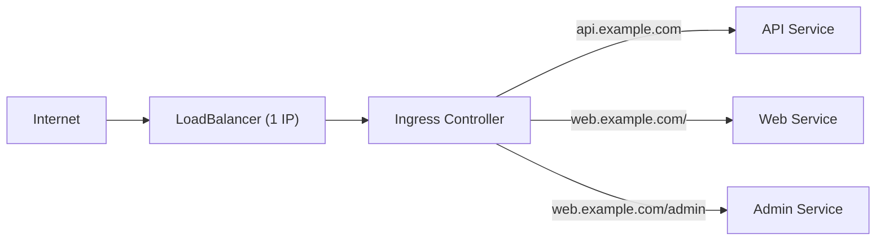

# What Is Ingress?

You've learned that LoadBalancer Services give you external access. But creating one LoadBalancer per Service gets expensive fast — 20 microservices means 20 cloud load balancers on your bill. And what about host-based routing (`api.example.com` vs `web.example.com`) or path-based routing (`/api` vs `/dashboard`)?

**Ingress** solves all of this. It's a single entry point that routes external HTTP/HTTPS traffic to the right Service based on rules you define.

## The Reverse Proxy Analogy

Think of Ingress as a smart receptionist at the front of a large office building. Every visitor (HTTP request) arrives at the same door. The receptionist looks at who they're here to see (the hostname and URL path) and directs them to the right office (Service).

Without Ingress, every office would need its own front door (LoadBalancer). With Ingress, one front door handles everything.



## Ingress = Rules, Controller = Implementation

An important distinction: **Ingress** is just a specification — a set of routing rules stored in Kubernetes. By itself, it does nothing. You need an **Ingress controller:** an actual reverse proxy that reads these rules and implements them.

Popular Ingress controllers include:

- **NGINX Ingress Controller:** The most widely used
- **Traefik:** Lightweight and auto-configuring
- **Cloud-provider controllers:** AWS ALB Ingress, GCP GCE Ingress

The controller runs as Pods in your cluster, typically exposed via a LoadBalancer or NodePort Service.

:::warning
Creating an Ingress resource without an Ingress controller installed does nothing. The Ingress sits there as a YAML object, but no reverse proxy reads it. Always install a controller first.
:::

## A Basic Ingress

```yaml
apiVersion: networking.k8s.io/v1
kind: Ingress
metadata:
  name: app-ingress
spec:
  rules:
    - host: app.example.com
      http:
        paths:
          - path: /
            pathType: Prefix
            backend:
              service:
                name: web
                port:
                  number: 80
          - path: /api
            pathType: Prefix
            backend:
              service:
                name: api
                port:
                  number: 8080
```

This Ingress routes:

- `app.example.com/` → `web` Service on port 80
- `app.example.com/api` → `api` Service on port 8080

## Path Types

Every path needs a `pathType`:

- **Prefix:** Matches the URL path prefix. `/api` matches `/api`, `/api/users`, `/api/v2/items`
- **Exact:** Matches exactly. `/api` only matches `/api`, not `/api/users`
- **ImplementationSpecific:** Behavior depends on the Ingress controller

## Host-Based Routing

You can route different hostnames to different Services:

```yaml
spec:
  rules:
    - host: api.example.com
      http:
        paths:
          - path: /
            pathType: Prefix
            backend:
              service:
                name: api-service
                port:
                  number: 80
    - host: dashboard.example.com
      http:
        paths:
          - path: /
            pathType: Prefix
            backend:
              service:
                name: dashboard-service
                port:
                  number: 80
```

:::info
Ingress supports both host-based and path-based routing — or both combined. This lets you expose dozens of internal Services through a single external IP, with clean URLs and hostnames.
:::

If the `ADDRESS` column is empty when listing Ingress, the Ingress controller hasn't assigned an IP — verify it's installed and running. If you get 503 errors, the backend Service has no ready Pods — check the Service selector and Pod readiness.

---

## Hands-On Practice

You need an Ingress controller (e.g., NGINX, Traefik) installed for the Ingress to receive an address. This creates the resource; routing will work when a controller is present.

### Step 1: Create a Simple Ingress Manifest

Create backend and `ingress.yaml`:

```bash
kubectl create deployment web --image=nginx --replicas=1
kubectl expose deployment web --port=80
```

```yaml
apiVersion: networking.k8s.io/v1
kind: Ingress
metadata:
  name: ingress-demo
spec:
  rules:
    - host: app.example.com
      http:
        paths:
          - path: /
            pathType: Prefix
            backend:
              service:
                name: web
                port:
                  number: 80
```

```bash
kubectl apply -f ingress.yaml
```

**Observation:** The Ingress resource is created. An Ingress controller must be installed for it to receive traffic.

### Step 2: List and Describe Ingress

```bash
kubectl get ingress
kubectl describe ingress ingress-demo
```

**Observation:** The Ingress exists with its rules. ADDRESS is populated if an Ingress controller is running.

### Step 3: Clean Up

```bash
kubectl delete ingress ingress-demo
kubectl delete deployment web
kubectl delete service web
```

## Wrapping Up

Ingress provides HTTP/HTTPS routing, host-based and path-based rules, and TLS termination — all through a single entry point. It requires an Ingress controller to work (the Ingress resource alone is just a specification). Combined with a single LoadBalancer, it's the most cost-effective way to expose multiple Services externally. In the next lesson, we'll cover TLS termination with Ingress — how to serve HTTPS traffic.
