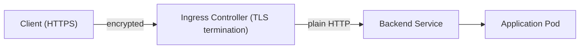

# Ingress and TLS

Your Ingress routes HTTP traffic — but production applications need **HTTPS**. Users expect that padlock icon in their browser, and regulatory requirements often mandate encrypted communication.

Ingress handles this through **TLS termination**: the Ingress controller handles the HTTPS connection, decrypts the traffic, and forwards plain HTTP to your backend Services. Your backend Pods don't need to know about TLS at all.

## How TLS Termination Works

Think of the Ingress controller as a security checkpoint. Visitors (requests) arrive encrypted, the checkpoint verifies their identity and decrypts the message, then passes the plain-text message to the right office (Service). The offices themselves don't need to deal with encryption.



## Storing the Certificate

TLS certificates are stored as Kubernetes **Secrets** of type `tls`. The Secret must be in the **same namespace** as the Ingress.

Use `kubectl create secret tls` to store your certificate and key, specifying the cert and key file paths. This creates a Secret with two keys:
- `tls.crt` — The certificate (or certificate chain)
- `tls.key` — The private key

## Configuring TLS on Ingress

Reference the Secret in your Ingress:

```yaml
apiVersion: networking.k8s.io/v1
kind: Ingress
metadata:
  name: tls-ingress
spec:
  tls:
    - hosts:
        - example.com
      secretName: example-tls
  rules:
    - host: example.com
      http:
        paths:
          - path: /
            pathType: Prefix
            backend:
              service:
                name: web
                port:
                  number: 80
```

The `tls` section specifies:
- **hosts:**  Which hostnames this certificate covers (must match the cert's CN or SAN)
- **secretName:**  Which Secret contains the certificate and key

When a client connects to `https://example.com`, the Ingress controller uses the certificate from `example-tls` to establish the TLS connection, then forwards the decrypted request to the `web` Service.

:::info
The certificate's Common Name (CN) or Subject Alternative Names (SAN) must match the hostname in the Ingress rules. A certificate for `*.example.com` covers `api.example.com` and `web.example.com`, but not `example.com` itself.
:::

## Automatic Certificates with cert-manager

Manually managing certificates is tedious. **cert-manager** automates the entire lifecycle — requesting, issuing, and renewing certificates from providers like Let's Encrypt:

```yaml
metadata:
  annotations:
    cert-manager.io/cluster-issuer: "letsencrypt-prod"
```

With cert-manager, you add an annotation, and it handles creating the TLS Secret automatically. This is the standard approach for production clusters.

If TLS doesn't work: verify the Secret is in the same namespace as the Ingress, check that the certificate's CN/SAN matches the hostname, and ensure the Ingress controller supports TLS (most do by default).

:::warning
The TLS Secret must exist in the same namespace as the Ingress. If it's missing or in a different namespace, the Ingress controller may fall back to its default certificate or reject the connection.
:::

## Multiple Certificates

For different hostnames with different certificates, add multiple entries to the `tls` section:

```yaml
spec:
  tls:
    - hosts:
        - api.example.com
      secretName: api-tls
    - hosts:
        - web.example.com
      secretName: web-tls
```

Or use a wildcard certificate that covers all subdomains.

---

## Hands-On Practice

### Step 1: Create a TLS Secret

Generate a self-signed cert for testing and create the Secret:

```bash
openssl req -x509 -nodes -days 365 -newkey rsa:2048 \
  -keyout tls.key -out tls.crt -subj "/CN=example.com"
kubectl create secret tls example-tls --cert=tls.crt --key=tls.key
```

**Observation:** The Secret is created with `tls.crt` and `tls.key` keys.

### Step 2: Create an Ingress with TLS Config

```bash
kubectl create deployment tls-web --image=nginx --replicas=1
kubectl expose deployment tls-web --port=80
kubectl apply -f - <<EOF
apiVersion: networking.k8s.io/v1
kind: Ingress
metadata:
  name: tls-ingress
spec:
  tls:
    - hosts:
        - example.com
      secretName: example-tls
  rules:
    - host: example.com
      http:
        paths:
          - path: /
            pathType: Prefix
            backend:
              service:
                name: tls-web
                port:
                  number: 80
EOF
```

### Step 3: Verify

```bash
kubectl get secret example-tls
kubectl describe ingress tls-ingress
```

**Observation:** The Ingress references the TLS Secret. With an Ingress controller, HTTPS would be served for the configured host.

```bash
kubectl delete ingress tls-ingress
kubectl delete deployment tls-web
kubectl delete service tls-web
kubectl delete secret example-tls
```

## Wrapping Up

TLS termination at the Ingress layer centralizes certificate management and keeps your backend Pods simple. Store certificates as TLS Secrets, reference them in Ingress, and use cert-manager for automatic issuance and renewal. With Services, DNS, and Ingress with TLS, you now have a complete foundation for Kubernetes networking — from internal Pod-to-Pod communication to secure external access.
