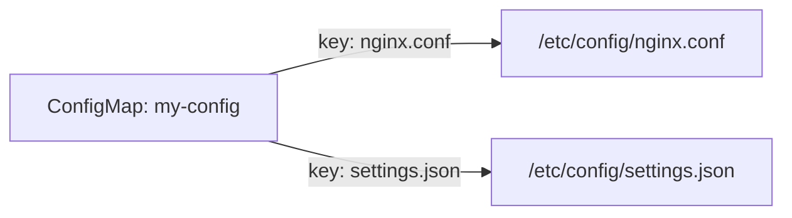

# ConfigMap and Secret Volumes

Many applications expect their configuration as files — a `nginx.conf`, an `application.yaml`, or a `tls.crt`. Rather than baking these files into your container image (which would require rebuilding the image every time config changes), Kubernetes lets you store configuration in ConfigMaps and Secrets and mount them as volumes.

The result? Configuration files appear inside your container at the path you choose, managed entirely through the Kubernetes API.

## How It Works

When you mount a ConfigMap or Secret as a volume, Kubernetes turns each **key** into a **filename** and each **value** into the **file's content**. The files appear in a read-only directory at the mount path you specify.

Think of it like a file server. You store your config in the Kubernetes API (the server), and each container gets a read-only mount of the files it needs. If you update the ConfigMap, the kubelet eventually syncs the new content into the running container — no restart required (though your application may need to detect the change).



## Mounting a ConfigMap as a Volume

First, make sure the ConfigMap exists. Then reference it in the Pod's volume spec:

```yaml
apiVersion: v1
kind: Pod
metadata:
  name: app-with-config
spec:
  containers:
    - name: app
      image: nginx
      volumeMounts:
        - name: config-vol
          mountPath: /etc/config
          readOnly: true
  volumes:
    - name: config-vol
      configMap:
        name: my-configmap
```

If your ConfigMap has keys `nginx.conf` and `settings.json`, the container will see:
- `/etc/config/nginx.conf`
- `/etc/config/settings.json`

:::info
ConfigMap and Secret volumes are **read-only** by default. Containers cannot modify the mounted files, which prevents accidental changes to your configuration at runtime.
:::

## Mounting a Secret as a Volume

Secret volumes work the same way, but with one important addition: you can (and should) restrict file permissions for sensitive data:

```yaml
volumes:
  - name: secret-vol
    secret:
      secretName: my-tls-secret
      defaultMode: 0400
```

The `defaultMode: 0400` sets owner-read-only permissions on every file. This is important for files like TLS private keys, where restrictive permissions are a security requirement.

You can create a ConfigMap from literal values, files, or directories — using `kubectl create configmap --from-literal`, `--from-file`, or `--from-dir`. After creating the Pod, you can verify the files appear at the expected mount path with `kubectl exec`.

## Mounting a Single File with subPath

By default, mounting a volume replaces the entire directory at the mount path. If you want to mount just one file without affecting the rest of the directory, use `subPath`:

```yaml
volumeMounts:
  - name: config-vol
    mountPath: /etc/nginx/nginx.conf
    subPath: nginx.conf
```

This places only the `nginx.conf` key from the ConfigMap at `/etc/nginx/nginx.conf`, leaving any other files in `/etc/nginx/` untouched.

:::warning
When using `subPath`, the file is **not automatically updated** when the ConfigMap changes. Only full directory mounts receive live updates from the kubelet. If you need hot-reloading, mount the entire directory instead.
:::

## Common Issues

**Pod stuck in Pending:**  The ConfigMap or Secret referenced in the volume doesn't exist yet. Kubernetes waits for it before starting the Pod. Always create ConfigMaps and Secrets before the Pods that use them.

**Permission denied:**  The default file mode may not match what your application expects. Use `defaultMode` in the volume definition, or adjust `runAsUser` and `fsGroup` in the Pod's security context.

**Stale data after update:**  ConfigMap updates propagate to mounts, but with a delay (the kubelet sync period, typically up to a minute). Applications that cache config files at startup won't see the change until they're restarted or reloaded.

---

## Hands-On Practice

### Step 1: Create a ConfigMap

```bash
kubectl create configmap my-configmap \
  --from-literal=key1=value1 \
  --from-literal=app.conf='log_level=info'
kubectl get configmap my-configmap -o yaml
```

Each key becomes a filename in the mounted volume. Verify the ConfigMap exists and has the expected keys.

### Step 2: Create a Pod that mounts the ConfigMap as a volume

```bash
cat <<'EOF' | kubectl apply -f -
apiVersion: v1
kind: Pod
metadata:
  name: app-with-config
spec:
  containers:
    - name: app
      image: nginx
      volumeMounts:
        - name: config-vol
          mountPath: /etc/config
          readOnly: true
  volumes:
    - name: config-vol
      configMap:
        name: my-configmap
EOF
kubectl wait --for=condition=Ready pod/app-with-config --timeout=60s
```

The Pod mounts the ConfigMap at `/etc/config`. The volume is read-only by default.

### Step 3: Verify the mounted files exist

```bash
kubectl exec app-with-config -- ls -la /etc/config/
kubectl exec app-with-config -- cat /etc/config/key1
```

You should see the keys as filenames and `value1` when reading `key1`. Configuration is injected as files without baking them into the image.

### Step 4: Clean up

```bash
kubectl delete pod app-with-config
kubectl delete configmap my-configmap
```

## Wrapping Up

ConfigMap and Secret volumes are the standard way to inject configuration and credentials into containers as files. Keys become filenames, values become content, and the mount is read-only by default. Use ConfigMaps for non-sensitive data and Secrets for passwords, certificates, and keys. In the next chapter, we'll move beyond ephemeral volumes to PersistentVolumes and PersistentVolumeClaims — the foundation for data that needs to outlive any individual Pod.
