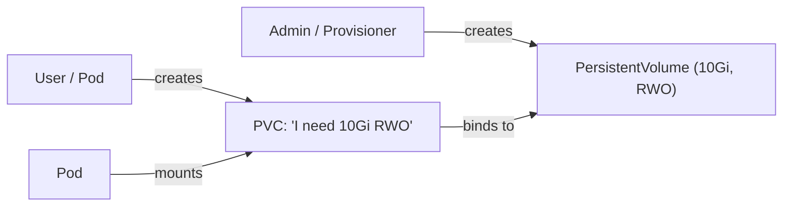

# What Are PersistentVolumes and PersistentVolumeClaims?

So far, we've looked at volumes that live and die with the Pod — `emptyDir`, ConfigMaps, Secrets. But what about data that needs to survive? A database's files, uploaded user content, application state — this data must persist even if the Pod crashes, restarts, or moves to a different node.

That's what the **PersistentVolume (PV)** and **PersistentVolumeClaim (PVC)** system is built for.

## The Big Idea: Separation of Concerns

Kubernetes separates the "providing storage" concern from the "using storage" concern:

- A **PersistentVolume (PV)** is a piece of actual storage — a cloud disk, an NFS export, a local SSD — that has been made available to the cluster. Typically, a cluster administrator or an automated provisioner creates PVs.
- A **PersistentVolumeClaim (PVC)** is a request from a user: "I need 10Gi of storage with read-write access." The user doesn't need to know *where* the storage comes from.

Think of it like renting an apartment. The building owner (admin) makes apartments (PVs) available. Tenants (users) submit rental applications (PVCs) specifying their needs — size, location preferences. The system matches each application to an available apartment.



:::info
The PV/PVC pattern decouples storage provisioning from consumption. Users don't need to know about NFS servers or cloud disk IDs — they just request storage through a PVC, and Kubernetes handles the binding.
:::

## Access Modes

When requesting storage, you specify how it should be accessible. Kubernetes supports three access modes:

- **ReadWriteOnce (RWO):**  The volume can be mounted as read-write by a single node. This is the most common mode, used by block storage like AWS EBS or GCE Persistent Disks.
- **ReadOnlyMany (ROX):**  The volume can be mounted read-only by multiple nodes simultaneously. Useful for shared configuration or static assets.
- **ReadWriteMany (RWX):**  The volume can be mounted read-write by multiple nodes. Fewer backends support this (NFS, CephFS, some CSI drivers).

The access mode must match between the PV and the PVC for binding to succeed.

## A Quick Example

Here's what a PV looks like — this one uses `hostPath` (suitable for development only):

```yaml
apiVersion: v1
kind: PersistentVolume
metadata:
  name: pv-example
spec:
  capacity:
    storage: 10Gi
  accessModes:
    - ReadWriteOnce
  persistentVolumeReclaimPolicy: Retain
  hostPath:
    path: /mnt/data
    type: DirectoryOrCreate
```

And a PVC that would bind to it:

```yaml
apiVersion: v1
kind: PersistentVolumeClaim
metadata:
  name: my-claim
spec:
  accessModes:
    - ReadWriteOnce
  resources:
    requests:
      storage: 5Gi
```

The PVC requests 5Gi with RWO access. The PV offers 10Gi with RWO — it matches, so Kubernetes binds them together. The binding is exclusive: once a PV is bound to a PVC, no other PVC can use it.

## The Reclaim Policy

What happens to the PV when the PVC is deleted? That depends on the **reclaim policy**:

- **Retain:**  The PV keeps its data and stays in a "Released" state. An admin must manually clean it up. Safe for important data.
- **Delete:**  The PV and its underlying storage are deleted automatically. Common with dynamic provisioning.

## Checking PVs and PVCs

To inspect storage in your cluster, use `kubectl get pv` to list all PersistentVolumes (they're cluster-scoped, so no namespace is needed) and `kubectl get pvc -A` to list PersistentVolumeClaims across all namespaces. For more detail, `kubectl describe pv <name>` and `kubectl describe pvc <name>` show capacity, access modes, binding status, and events.

Look at the `STATUS` column: `Available` means the PV is waiting for a PVC, `Bound` means it's matched.

:::warning
A PVC stuck in `Pending` means no PV matches its requirements — check capacity, access modes, and StorageClass. This is one of the most common storage issues in Kubernetes.
:::

---

## Hands-On Practice

### Step 1: List PersistentVolumes and PersistentVolumeClaims

```bash
kubectl get pv
kubectl get pvc
```

PVs are cluster-scoped (no namespace column). PVCs are namespaced — use `kubectl get pvc -A` to see all namespaces. Check the `STATUS` column: `Available` means a PV is waiting for a PVC, `Bound` means it's matched.

### Step 2: Explore PV and PVC API resources

```bash
kubectl api-resources | grep -i persistent
```

This shows the `persistentvolume` and `persistentvolumeclaim` resource types, their API group, and whether they're namespaced. PVs are cluster-scoped; PVCs are namespaced.

### Step 3: Inspect an existing PV or PVC (if any exist)

```bash
# Pick a PV name from Step 1, then:
kubectl describe pv <pv-name>

# Or a PVC (include namespace if not default):
kubectl describe pvc <pvc-name> -n <namespace>
```

If your cluster has PVs or PVCs (e.g., from other workloads), you'll see capacity, access modes, and binding details. On a fresh cluster with no PVs or PVCs, skip this step — that's expected.

## Wrapping Up

PersistentVolumes and PersistentVolumeClaims form the foundation of persistent storage in Kubernetes. PVs represent actual storage resources; PVCs are user requests for storage. Kubernetes matches them based on capacity, access mode, and StorageClass. In the next lessons, we'll walk through creating PVs and PVCs step by step, and then move on to StorageClasses — which automate the entire process through dynamic provisioning.
