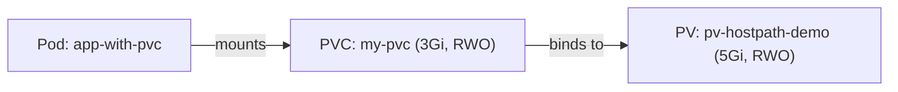

# Creating a PersistentVolumeClaim

You've created a PersistentVolume — storage is available in the cluster. Now let's claim it. A **PersistentVolumeClaim (PVC)** is how users request storage. You specify what you need (size, access mode, optionally a StorageClass), and Kubernetes finds a matching PV and binds them together.

## What a PVC Spec Includes

A PVC is straightforward:

- **accessModes:**  How you want to access the storage (`ReadWriteOnce`, `ReadOnlyMany`, `ReadWriteMany`)
- **resources.requests.storage:**  How much storage you need (e.g., `3Gi`)
- **storageClassName:**  Which class of storage you want (must match a PV's class or trigger dynamic provisioning)

That's it. The PVC doesn't need to know about NFS servers, cloud disk IDs, or node paths. It just says "I need this much storage, accessible in this way."

## Example: PVC and Pod Together

Here's a complete example — a PVC that requests 3Gi of storage, and a Pod that mounts it:

```yaml
apiVersion: v1
kind: PersistentVolumeClaim
metadata:
  name: my-pvc
spec:
  accessModes:
    - ReadWriteOnce
  resources:
    requests:
      storage: 3Gi
  storageClassName: manual
---
apiVersion: v1
kind: Pod
metadata:
  name: app-with-pvc
spec:
  containers:
    - name: app
      image: nginx
      volumeMounts:
        - name: data
          mountPath: /data
  volumes:
    - name: data
      persistentVolumeClaim:
        claimName: my-pvc
```

The Pod references the PVC by name in `persistentVolumeClaim.claimName`. The PVC must exist and be in `Bound` status before the Pod can mount it. If the PVC is still `Pending`, the Pod will wait.



:::info
PVCs are **namespaced:**  they must be in the same namespace as the Pod that uses them. PVs are cluster-scoped and can be bound by a PVC from any namespace.
:::

## The Binding Process

When you create a PVC, Kubernetes starts looking for a match:

1. It searches for a PV with enough capacity (PV must be >= PVC request)
2. It checks that access modes are compatible
3. It matches the StorageClass (if specified)
4. If a match is found, the PVC is bound to the PV — exclusively. No other PVC can use that PV.
5. If no match is found, the PVC stays in `Pending`

If the StorageClass has a dynamic provisioner, Kubernetes creates a new PV automatically instead of waiting for a manual one. We'll cover dynamic provisioning in the StorageClass chapter.

The PVC must be bound before the Pod can mount it. Once bound, you can verify the mount with `kubectl exec` and confirm data persists across Pod restarts.

## Common Issues

**PVC stuck in Pending:**  No PV matches the request. Check:

```bash
kubectl describe pvc my-pvc
kubectl get pv
```

The events section of `describe` will tell you what's wrong — capacity mismatch, access mode mismatch, or no available PVs.

**Pod stuck in Pending:**  The PVC exists but isn't bound yet. Check the PVC status first.

**StorageClass mismatch:**  The PVC specifies a `storageClassName` that doesn't match any PV. Either create a PV with the matching class or adjust the PVC.

:::warning
Remember that PVC binding is **exclusive:**  one PVC per PV. If a PV is already bound to another PVC, it's unavailable. Check `kubectl get pv` to see which PVs are free (status `Available`).
:::

---

## Hands-On Practice

### Step 1: Create and apply a PV

First, create a PV that the PVC can bind to. Use the same `storageClassName: manual` as in the previous lesson:

```bash
cat <<'EOF' | kubectl apply -f -
apiVersion: v1
kind: PersistentVolume
metadata:
  name: pv-hostpath-demo
spec:
  capacity:
    storage: 5Gi
  accessModes:
    - ReadWriteOnce
  persistentVolumeReclaimPolicy: Retain
  storageClassName: manual
  hostPath:
    path: /mnt/pv-data
    type: DirectoryOrCreate
EOF
```

### Step 2: Create and apply the PVC and Pod

```bash
cat <<'EOF' | kubectl apply -f -
apiVersion: v1
kind: PersistentVolumeClaim
metadata:
  name: my-pvc
spec:
  accessModes:
    - ReadWriteOnce
  resources:
    requests:
      storage: 3Gi
  storageClassName: manual
---
apiVersion: v1
kind: Pod
metadata:
  name: app-with-pvc
spec:
  containers:
    - name: app
      image: nginx
      volumeMounts:
        - name: data
          mountPath: /data
  volumes:
    - name: data
      persistentVolumeClaim:
        claimName: my-pvc
EOF
```

### Step 3: Verify the binding

```bash
kubectl get pv,pvc
```

The PVC should show status `Bound` and the PV should show the same. The `CLAIM` column on the PV indicates which PVC is using it.

### Step 4: Verify the Pod mounted the volume

```bash
kubectl wait --for=condition=Ready pod/app-with-pvc --timeout=60s
kubectl exec app-with-pvc -- df -h /data
kubectl exec app-with-pvc -- sh -c 'echo "hello" > /data/test.txt'
kubectl exec app-with-pvc -- cat /data/test.txt
```

You should see `hello`. The Pod mounted the PVC, which is bound to the PV — data is now on persistent storage.

### Step 5: Clean up

```bash
kubectl delete pod app-with-pvc
kubectl delete pvc my-pvc
kubectl delete pv pv-hostpath-demo
```

Delete the Pod first, then the PVC, then the PV. With `Retain` reclaim policy, the PV moves to `Released`; deleting it removes the object from the cluster.

## Wrapping Up

Creating a PVC is how users request storage in Kubernetes. Specify size, access mode, and optionally a StorageClass, and Kubernetes handles the matching. The PVC must be bound before a Pod can mount it. Data persists as long as the PVC and PV exist — even across Pod restarts. In the next chapter, we'll explore StorageClasses, which automate the entire PV creation process through dynamic provisioning.
